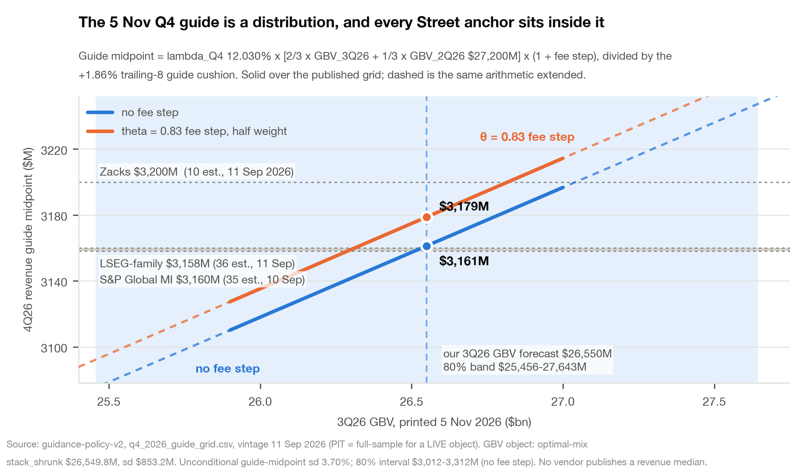

# Airbnb (ABNB) — the guide is a different object from the print

**Rating: [LONG / SHORT — pending the 3Q26 printed take rate, 5 Nov 2026].** The flip is pre-registered: a printed
3Q26 take rate **≥ 18.10 %** *together with* a 4Q26 nights guide reiterated at "low double digit" ⇒ **cover and go
long**; a reversion to "high single digit" with a flat-to-down take rate ⇒ **stay short**. **Price $181.94** (4 Sep
close, the model's anchor; 9 Sep spot $174.54 — refresh before submission). **Horizon 3–12 months. Catalysts:** 5
Nov 2026 (3Q26 print + 4Q26 guide); Feb 2027 (4Q26 print + FY27/1Q27 guide); May 2027 (1Q27 print).

**Airbnb's revenue is not forecast, it is converted.** Two-thirds of a quarter's revenue comes from the prior
quarter's already-printed Gross Booking Value and one-third from the quarter before, at a seasonal conversion of
12.0 / 12.1 / 12.0 % for three straight fourth quarters: `revenue_q = λ_season × [⅔·GBV_{q−1} + ⅓·GBV_{q−2}]`, λ_Q4
= 12.030 %, within-season range 0.171pp (measured). GBV_2Q26 has printed; GBV_3Q26 prints the *same morning*
management guides Q4 — so **the 4Q26 guide carries no GBV forecast error at the moment it is set.** That is why the
cushion over it is small and shrinking: 19 of 19 midpoints beaten, by a trailing-8 mean **+1.86 %, sd 1.006pp**
(measured, PIT) against +3.04 % over the first eleven. Those beats are arithmetic, not conservatism, and the
corollary is our most useful negative result: **once a quarter is guided, guide midpoint × (1 + cushion) IS the
forecast, and nothing we built beats it** (RMSE ratio to the seasonal naive **0.377 W1 / 0.319 W2**, strict PIT, n =
14 / 10). So we claim no level edge on a guided quarter: we claim the *guide*, which no sell-side model forecasts
separately, and the composition underneath it.

**None of the FY26→FY27 growth halving (+17 % → +9.2–11.5 %) is demand.** *A dollar lap:* booking-date FX is carried
*through* the kernel, inside the lagged USD GBV base, never applied to revenue — ≈ **+2.9pp in 3Q26 and +1.0pp in
4Q26, as an output** (Φ × 0.851, spot held 4 Sep 2026; 95 % lag CS +0.3 to +2.2pp), a −1.9pp step. The popular
**−3.4pp step — our own bridge's included — double counts**: it comes off a guide-anchored walk already containing
management's stated +3.0pp, and off a GBV base already in booking-date dollars (table). *A product-bundle lap:*
management's "+3 points of nights, +4 points of GBV" is the whole bundle — Reserve Now Pay Later, the cancellation
redesign, total-price display — US lap 3Q26, ex-NA lap 1Q27, and the 2Q26 10-Q now confirms in MD&A that RNPL
bookings carry "higher cancellation rates." Re-based for the tail, pull-forward and lap we carry **3Q26 nights +9.3
%, 4Q26 +7.6 %** — below the 10.0 % floor of "low double digits." *A mix identity, not a lever:* geographic mix is
an output of `ADR_blend = Σ_r s_r·ADR_r` — **−1.48pp in 2025, −1.43pp measured on the 3Q26-to-date split** —
deepening as North America's nights share slides. Bedroom Nights +12 % vs nights +10 % is worth **+0.5 to +0.8pp at
a measured bedroom elasticity of 0.23**, not the ~+2pp a 1:1 read implies; seats and hotel dilution take −0.5pp off
reported ADR and **net to zero in revenue**. Both narratives are wrong: our reviews-index stays series — the one
alternative-data series that beats naive out of sample (RMSE 1.48pp vs 2.16, **ratio 0.68**; NTTO I-94 arrivals
corroborate at 0.72–0.74×) — reads **3Q26 nights +9.5 to +10.0 %**: no acceleration, and nothing measured says
demand is cracking.

**The 4Q26 guide is a coin toss; the take rate is the asymmetry.** On our own 3Q26 GBV forecast ($26,550M ± $853M)
the 5 Nov guide midpoint centres on **$3,161M with no fee step, $3,179M with the primitives fee step at θ = 0.83**,
80 % interval **$3,012–3,312M**. It lands below **Zacks $3,200M** (10 est., 11 Sep 2026) with **P = 0.63**, but
below **LSEG-family $3,158M** (36 est., 11 Sep) and **S&P Global MI $3,160M** (35 est., 10 Sep) with **P = 0.49 /
0.50** — the apparent edge is the $42M the vendors disagree by. The real asymmetry is **the 3Q26 printed take rate
against 18.10 %** (+22bp y/y). Reconciled in a block where GBV ≡ nights × ADR holds exactly, it is **18.14 %, sd
0.46pp, P(≥ 18.10 %) = 0.53** — a probability that depends on the GBV view, not the fee: at Krish's $25.9bn GBV the
same arithmetic gives 18.60 %, **P = 0.85**. Both are pre-registered as a *pair*, frozen before 2 Oct and scored 6
Nov. **Bull (P 0.35):** ≥ 18.10 % and Q4 nights "low double digit" ⇒ FY27 marked up ~2pp of growth, ~+1 turn ⇒
**$205–215**. **Bear (P 0.30):** high-single-digit nights guide, flat take rate ⇒ **$140–152**. **Base (P 0.35):
$170–185.** We say in advance that we change our mind on 5 November if that line prints, and which way.

**What we are not claiming.** No level edge on a guided quarter. FY27 is **exploratory**: +11.5 % at the published
kernel weight, band **+9.18 % to +11.52 %**, with a growth edge over the Street of **+0.09pp at w = ⅔ and −2.25pp at
w = 0.33** (Zacks, 4 Sep 2026). At +0.48 EV/EBITDA turns per point of forward growth that edge is **+0.04 turns**
against **±1.12 turns** of kernel-weight indeterminacy — our own unidentified parameter is worth ~25× our edge. That
is why the pitch is composition, not level. On FX the full-sample effective lag is **0.50 quarters (95 % CS
0.00–1.19)** and Φ is rejected (LR 10.2, p 0.017), yet the last three quarters favour the lagged kernel (MAE 0.22pp
vs 1.20pp) on **n = 3**. The stated 3Q26 FX on 5 Nov resolves it: **+3 backs the kernel; 0 or +1 backs the short
lag; +2 is ambiguous** — and will be reported as such.

**Risks, each with its pre-registered tell.** (1) *The take rate clears and we are short the flip.* Tell: printed
take rate ≥ 18.10 % with a reiterated "low double digit" nights guide; we cover and reverse. (2) *GBV prints high
and the guide clears the panels.* The test resolves on a 0.22 % move in GBV: clearing 18.10 % needs revenue ≥
$4,805M, above the top of management's own $4,690–4,770M range. Tell: 3Q26 GBV above **$26,608M**, where it flips
against us on arithmetic alone. (3) *The dollar.* Under ±1sd parallel paths FY27 FX is +2.8 / −1.8pp = **$657M**,
more than the whole four-way method disagreement. Tell: the revenue-weighted basket on FRED H.10, weekly, plus the 5
Nov FX integer. Two balance-sheet tells we score rather than assume: **funds payable y/y** (+5–11 % = deferral on
schedule; below +3 % = a larger unpaid book) — *not* unearned fees, which the single-fee migration confounds from
4Q25 — and whether the bundle-contribution figure returns on the call.

**Exhibit 2 — the four-way FX reconciliation, 4Q26.** $27.8M of revenue per pp.

| Source | Level, pp | Step in a walk | vs adopted | Why it differs | Verdict |
|---|---:|---:|---:|---|---|
| repo `29_q4_fy27_bridge` FX step | −0.4 | **−3.4** | −$39M | The −3.4pp is that level subtracted from a guide-anchored walk already containing management's +3.0pp, and from a GBV base already in booking-date USD. Double subtraction, twice over | REJECTED |
| repo `05_fx_schedule` fit | −0.4 | — | −$39M | A reduced-form fit on lagged EURUSD / broad USD. EURUSD is not the basket (EUR ran +11.1 → −1.5pp while LatAm +6.5 and APAC +1.7 held it up), and it re-applies a lag already inside the lagged GBV base | REJECTED |
| M6 forward schedule (after hedge) | +0.4 | — | −$16M | A contemporaneous two-index construction (λ = 0.75) that misses a nearly observed 3Q26 by ~2pp | REJECTED |
| Guide-anchored (hold +3.0pp flat) | +2.6 | — | +$45M | Holds the 3Q26 tailwind into 4Q26; the basket has already rolled over (1Q26 +5.7 → 2Q26 +2.3 → 3Q26 +0.4 QTD) | REJECTED |
| **Kernel-implied: Φ × 0.851, spot held 4 Sep** | **+1.0** | 0.0 | — | Booking-date FX is already inside the lagged USD GBV base; the pp is an **output**, never applied to a revenue forecast (Φ × 0.653 gives +0.75pp; 95 % CS +0.3 to +2.2) | **ADOPTED** |

Spread on levels **3.0pp = $84M**; with the bridge step, **6.0pp = $167M** — our internal disagreement about FX
alone exceeds our gap to the Street, and we say so first.

**Appendix** (page 2): score sheet **ABNB-INT-v1** — every 5 Nov line pre-registered with its threshold, frozen 26
Sep, scored 6 Nov: take rate vs 18.10 % *paired with* GBV vs $26,608M; the Q4 nights bucket; stated 3Q26 FX (0/+1 vs
+3); funds-payable y/y; the reviews-index read against the print. Plus the four-way FX reconciliation and the 28-row
Q4 guide grid behind the chart.

---

*Stamps and conventions.* Backtests are **strict point-in-time** unless marked full-sample; W1 = 14 guide dates from
1Q23, W2 = 10 from 1Q24. Every consensus number carries its vendor and the vendor's own date; LSEG-family and Yahoo
are **one panel**, counted once. Guide-midpoint interval is unconditional (sd 3.70 %, GBV integrated out).
**Measured / assumed / unidentified:** the lagged-GBV kernel, λ, the cushion, the geographic-mix and party-size
(+0.8pp) terms and the bedroom elasticity are measured; the fee step (θ = 0.83 is a histogram bin midpoint from a
voluntary sub-sample, not a measurement), the seats ticket prices, the regulatory drag and FY27 flat-spot FX are
assumed; the **+2.8pp of like-for-like price and sub-regional mix is a jointly unidentified 2-d ridge and we refuse
to split it** — Airbnb discloses no country-level ADR. The FY27 build's own geographic-mix output is −1.09pp and
observed 1H26 is −0.34pp; we assume the 2025 drag persists and label it. Valuation outputs are **12-month targets**
to a ~30 Sep 2027 date, at +0.48 EV/EBITDA turns per point of forward growth; at $174.54 the stock trades at 16.1×
FY27E adj. EBITDA against an independently derived fair band of 13.5–18.5×, base 16.5× — roughly fair, not
stretched. Stated tension: the six-lens football field, discounted to the same date, means **$154–157**, below our
base branch. *Research, not investment advice.*