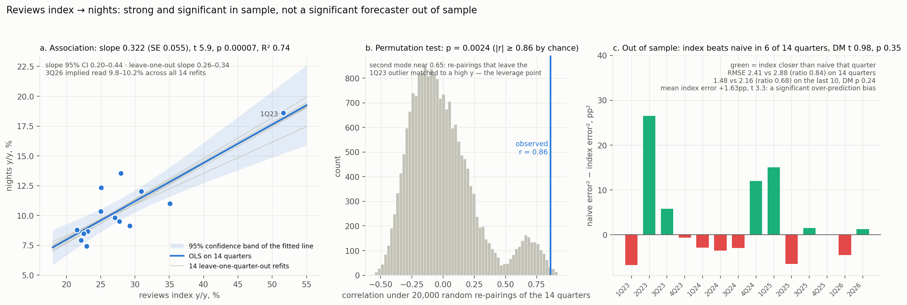
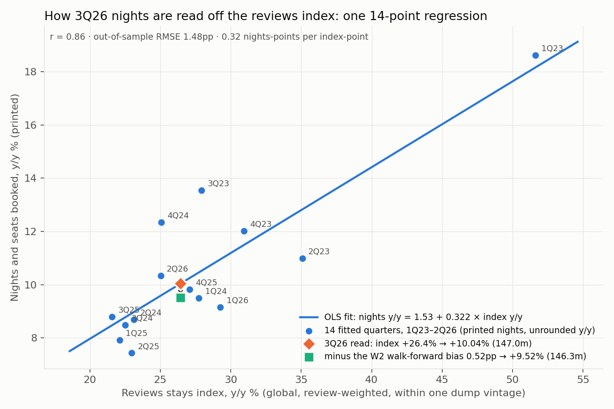
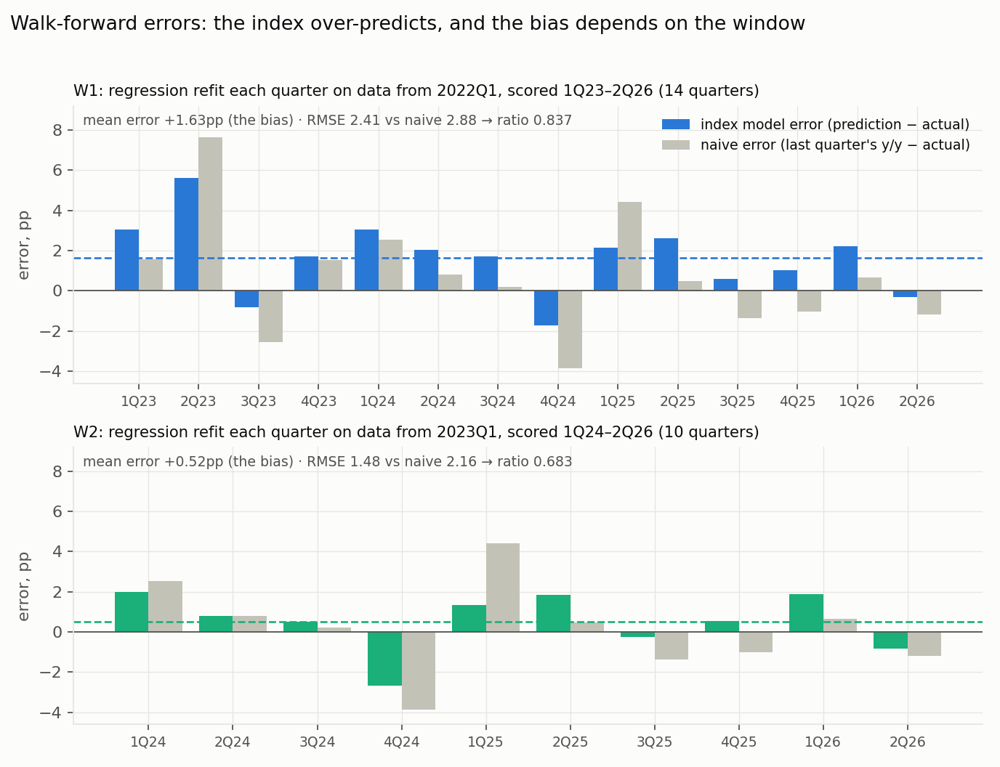
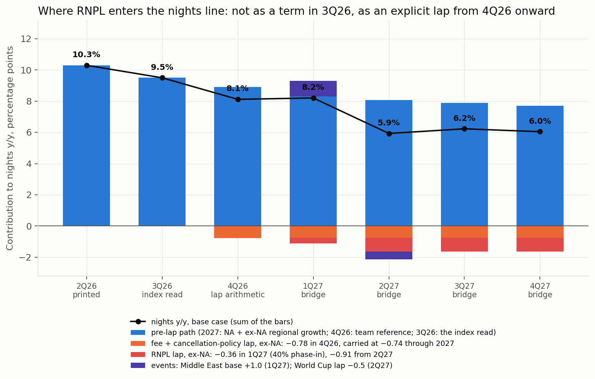
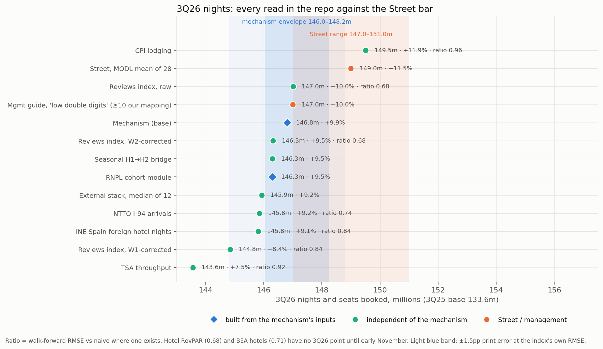

# Final line — NIGHTS (Nights and Seats Booked)

**Version 2 — 18 September 2026.** *(v2, 18 Sep: this version supersedes v1's 3Q26 base. Under **DEC-0028**
the nights line is a disclosed-mechanism build, not a regression of printed nights on an alt-data index, and
under **DEC-0029** the 3Q26 base is the mechanism's own output **146.8m / +9.89%**, replacing the
reviews-index bias-corrected read of 146.3m / +9.5% that DEC-0004 and DEC-0024 adopted. The governing
construction is [`nights_v2_design.md`](nights_v2_design.md); where that file and this one disagree, the
design governs and the disagreement is named in place. 4Q26 (DEC-0019) and 2027 (DEC-0025) are unchanged in
level. Bands are now shown per DEC-0030. Every change from v1 is marked with an italic note like this one, so
a reader can see what moved. Corrections filed the same day, including the restated 1Q27 falsifier, are in
[`corrections_2026-09-18.md`](corrections_2026-09-18.md).)*

Rationale file for the first settled line of the pitch model v2, written per **DEC-0026** ("every settled
line gets `docs/pitch-model-v2/lines/final_<line>.md` explaining word by word why the base number stands,
the git data and model behind it, every alternative, and how the thesis catalysts enter that number").

Scope: **base scenario only**, per **DEC-0020** (Theo: build and discuss the base first; short and breaker
rows are deferred). Short and breaker values exist in the dossiers and are quoted here only where they are
needed to explain why something is *not* in the base.

Standing rule for everything below, **DEC-0016**: scenarios are mechanical consequences of stated
assumptions. No input on this line was chosen to match a price, a target, or the memo's downside.

Branch `theo/pitch-model-v2`, HEAD `c82b968`. Dossier commits: H0/D1/V1 at `e39d9e4`, D2/D3 at `e6d9832`.
Web fetches: zero. Every number below is in this repository, except the Bloomberg MODL aggregate, which is
licensed and quoted only as a dated aggregate.

---

## 1. The line at a glance

| period | base nights (m) | y/y | band (m) | how the number is constructed | decision id |
|---|---:|---:|---|---|---|
| 1Q23 | 121.1 | — | — | printed, 10-Q filed 2023-05-09 | DEC-0003 |
| 2Q23 | 115.1 | — | — | printed, 10-Q 2023-08-03 | DEC-0003 |
| 3Q23 | 113.2 | — | — | printed, 10-Q 2023-11-01 | DEC-0003 |
| 4Q23 | 98.8 | — | — | printed, FY23 10-K 2024-02-16 | DEC-0003 |
| 1Q24 | 132.6 | +9.50% | — | printed, 10-Q 2024-05-08 | DEC-0003 |
| 2Q24 | 125.1 | +8.69% | — | printed, 10-Q 2024-08-06 | DEC-0003 |
| 3Q24 | 122.8 | +8.48% | — | printed, 10-Q 2024-11-07 | DEC-0003 |
| 4Q24 | 111.0 | +12.35% | — | printed, FY24 10-K 2025-02-13 | DEC-0003 |
| 1Q25 | 143.1 | +7.92% | — | printed | DEC-0003 |
| 2Q25 | 134.4 | +7.43% | — | printed | DEC-0003 |
| 3Q25 | 133.6 | +8.79% | — | printed | DEC-0003 |
| 4Q25 | 121.9 | +9.82% | — | printed | DEC-0003 |
| 1Q26 | 156.2 | +9.15% | — | printed | DEC-0003 |
| 2Q26 | 148.3 | +10.34% | — | printed — the naive carry-forward the 3Q26 forecast is scored against | DEC-0003 |
| **3Q26** | **146.8** | **+9.89%** | envelope **146.0–148.2**; judge band **~144.2–150.4** | **mechanism** (`nights_v2_design.md` §2): 0.288 × NA +5.60 + 0.712 × ex-NA +11.62 = **+9.886%**, × 133.6m | **DEC-0029** |
| **4Q26** | **131.8** | **+8.12%** | envelope **131.6–132.9** | team reference **+8.90%** (PR #32), less a **0.78pt** ex-NA fee-and-cancellation lap (case B), × 121.9m | DEC-0019 |
| **1Q27** | **169.02** | **+8.21%** | envelope **166.9–170.9** | bridge path: NA +2.31 (0.291 weight) + ex-NA +10.773 (0.709), lap −0.742 − 0.363, event +1.0 | DEC-0025 |
| **2Q27** | **157.10** | **+5.93%** | envelope **156.3–160.2** | same, ex-NA +10.452, lap −0.742 − 0.907, World Cup lap −0.5 | DEC-0025 |
| **3Q27** | **155.96** | **+6.23%** | envelope **154.7–159.4** | same, ex-NA +10.131, lap −0.742 − 0.907, no event | DEC-0025 |
| **4Q27** | **139.77** | **+6.05%** | envelope **139.1–142.7** | same, ex-NA +9.810, lap −0.742 − 0.907, no event | DEC-0025 |
| **FY27** | **621.84** | **+6.64%** | envelope **617.1–633.1** | sum of the four quarters ÷ FY26 sum **583.11m** | DEC-0025 |

*(v2, 18 Sep: three changes to this table. **(a)** The 3Q26 row moves from 146.3m / +9.5% ("reviews stays
index raw read less the index's own W2 bias", DEC-0004 / DEC-0024) to the mechanism's own **146.8m /
+9.89%** per **DEC-0029**; the arithmetic is in the new §3.0 and the index read becomes the cross-check that
§3.1–§3.10 documents. **(b)** A **band column** is added per **DEC-0030**: the "envelope" is the mechanism's
eight-parameter envelope from `nights_v2_design.md` §4.1, and the "judge band" for 3Q26 widens it by WS10's
ex-NA bear/bull demand spread of ±1.6pp of total nights — the dominant uncertainty, which is a demand
forecast and not a disclosure, so it is shown around the envelope rather than inside it. **(c)** 4Q26 and the
2027 rows are **unchanged in level** (DEC-0019, DEC-0025); only their envelopes are new. Where v1's
construction text disagrees with the design, the design governs: the 4Q26 lap is quoted here as v1's 0.78pt
because that is the committed route, and the design's own identity route gives −0.742pt and +8.157% —
the same 131.8m to the 0.1m the company discloses, `nights_v2_design.md` §2.3.)*

*(v2, 18 Sep — the judge band arithmetic, because DEC-0030 states it rounded. One point of growth is 1.336m
nights on the fixed 133.6m 3Q25 denominator, so ±1.6pp is **±2.14m**: 146.04 − 2.14 = **143.90m** and
148.23 + 2.14 = **150.37m**. DEC-0030 quotes "~144.2–150.4"; the high edge agrees and the low edge is 0.3m
tighter than the arithmetic on the envelope edges. §2a carries the computed numbers, 143.90 and 150.37.)*

The y/y column for 1Q24–2Q26 is computed in this file from the printed levels (Airbnb discloses the level,
not the growth rate, in the KPI box); every level is a filing number.

Two mechanical warnings about that table, both real and both sourced in §5:

1. ~~The 2027 y/y figures are computed against the **bridge's own FY26**, which still carries 3Q26 at
   **146.813m**, not the adopted 146.3m~~ — **withdrawn.** *(v2, 18 Sep: DEC-0029 removes this warning
   rather than answering it. The mechanism's own 3Q26 is **146.813m**, which is exactly the number
   `06_revenue_path_3q26_4q27_v2b.csv` already carries, so the FY26 denominator and the adopted base are now
   the same object: FY26 = 156.2 + 148.3 + 146.813 + 131.798 = **583.111m**, FY27 = **621.841m**,
   **+6.642%**. The "+6.73% rather than +6.64%" correction and the cross-lane re-run request are both moot,
   and §7.4 item 5 is closed. `nights_v2_design.md` §9.1 point 1.)*
2. The path is not monotone: 1Q27 (+8.21%) is **above** 4Q26 (+8.12%). That is the +1.0pt Middle East event
   term and the fact that the ex-NA RNPL lap is only 40% phased in 1Q27. `06_pass_line.csv` tests exactly
   this ("1Q27 nights growth within 2 points of the 4Q26 exit unless a named lap explains it", gap 0.09,
   pass). *(v2, 18 Sep: unchanged as arithmetic, and it is now also the reason the 11 February falsifier had
   to be restated on an event-adjusted basis — §7.1 and `corrections_2026-09-18.md` entry 1.)*
3. *(v2, 18 Sep — a third warning, new.)* The 3Q26 band is **asymmetric upward** (−0.77m / +1.41m around
   146.81m), because the two 3Q26-specific unquantified terms — the July 2026 eligibility expansion and the
   partiality of the US lap — are both carried at **zero** in the base. The mechanism is the conservative
   reading of its own inputs, not the middle of them (`nights_v2_design.md` §4.1).

Alternatives carried beside each decided number (all in §3–§5):

| period | base | shown beside it |
|---|---|---|
| 3Q26 | **146.8 (+9.89%)** *(v2)* | raw index 147.0 (+10.0%) · W2-corrected 146.3 (+9.52%) · W1-corrected 144.8 (+8.4%) · external stack 145.9 (+9.2%) · RNPL cohort module 146.3 (+9.49%) · H1–H2 bridge 146.3 (+9.49%) · Street 149.0 (+11.5%) |
| 4Q26 | 131.8 (+8.12%) | case A 132.7 (+8.86%) · β=0.5 carry 131.6 (+7.93%) · Street 134.0 (+9.93%) |
| FY27 | 621.84 (+6.64%) | lap-schedule 1Q27 167.1 / 2Q27 157.8 (D2) · RNPL global lap +6.42% (alt_rnpl) · lap-treatment flip +8.17% |

*(v2, 18 Sep: the 3Q26 row is inverted. In v1 the base was the index's W2-corrected read and 146.8 was
listed as the alternative "team baseline"; under DEC-0029 the mechanism is the base and the three reads that
land at 146.3 — the W2-corrected index, the RNPL cohort module and the H1–H2 seasonal bridge — are
cross-checks. The numbers themselves did not move; which one is the line did. The β = 0.5 carry row for 4Q26
is retained but is now closed rather than open: see §7.4 item 3.)*

### 2a. Model inputs (machine-readable)

*(v2, 18 Sep: new. This file is now a provenance source for the model, so the decided points are carried in
the machine-readable table `analysis/src/pitch_model_v2/qa.py` parses. The heading is the literal string
`MACHINE_READABLE_HEADING`, not a section number in this document's sequence. Numeric points only; every
number is the one the design's own §2a carries, so the two files cannot drift. Verified with:*
`PYTHONPATH=analysis/src python3 -c "import pathlib; from pitch_model_v2 import qa; m=[]; p=qa._dossier_points(pathlib.Path('docs/pitch-model-v2/lines/final_nights.md'),'D1v2',m); print(len(p), m)"`*)*

| item | scenario | period | point | unit | note |
|---|---|---|---|---|---|
| nights_m | base | 3Q26 | 146.8 | m | mechanism output, DEC-0029; 133.6m times 1.09887. Design 2a row nights_m base 3Q26 |
| nights_yoy_pct | base | 3Q26 | 9.89 | pct | 0.288 times 5.60 plus 0.712 times 11.621 = 9.887, rounded by nights_quarterly.py to 9.89 |
| nights_m_low | base | 3Q26 | 146.04 | m | parameter envelope low, all eight parameters adverse; n2_band.csv ENVELOPE_levels_m 3Q26 |
| nights_m_high | base | 3Q26 | 148.23 | m | parameter envelope high; same row. The band is asymmetric upward because two 3Q26 terms are carried at zero |
| nights_m_judge_low | base | 3Q26 | 143.90 | m | DEC-0030. Envelope low 146.04 less 1.6pp of total nights growth. One growth point is 1.336m on the 133.6m base so 1.6pp is 2.14m. 146.04 less 2.14 = 143.90. DEC-0030 quotes about 144.2 |
| nights_m_judge_high | base | 3Q26 | 150.37 | m | DEC-0030. Envelope high 148.23 plus 2.14 = 150.37. DEC-0030 quotes about 150.4. The widener is WS10 ex-NA bear and bull, plus or minus 2.2pp of ex-NA which is plus or minus 1.6pp of total |
| nights_m | base | 4Q26 | 131.80 | m | DEC-0019 case B; the mechanism identity exit is 8.157 pct which gives 131.84m, the same 131.8m to the 0.1m disclosed |
| nights_yoy_pct | base | 4Q26 | 8.12 | pct | DEC-0019; 8.90 PR 32 reference less the 0.78pt ex-NA fee and cancellation lap |
| nights_m_low | base | 4Q26 | 131.57 | m | parameter envelope low |
| nights_m_high | base | 4Q26 | 132.94 | m | parameter envelope high; still 1.06m below the Street 134.0m |
| nights_m | base | 1Q27 | 169.02 | m | bridge path, DEC-0025; 06_revenue_path_3q26_4q27_v2b.csv row 1Q27 base nights_mm 169.0178 |
| nights_yoy_pct | base | 1Q27 | 8.206 | pct | 06_nights_build.csv base. Ex-event this is 7.206 pct or 167.46m; see section 7.1 |
| nights_m | base | 2Q27 | 157.10 | m | DEC-0025; 148.3m times 1.05934 |
| nights_yoy_pct | base | 2Q27 | 5.934 | pct | 06_nights_build.csv base; includes the minus 0.5pt World Cup lap |
| nights_m | base | 3Q27 | 155.96 | m | DEC-0025; 146.813m times 1.06229 |
| nights_yoy_pct | base | 3Q27 | 6.229 | pct | 06_nights_build.csv base |
| nights_m | base | 4Q27 | 139.77 | m | DEC-0025; 131.798m times 1.06045 |
| nights_yoy_pct | base | 4Q27 | 6.045 | pct | 06_nights_build.csv base |
| nights_m | base | FY27 | 621.84 | m | sum of the four 2027 quarters; 06_annual_fy26_fy28_v2b.csv row FY27 base |
| nights_yoy_pct | base | FY27 | 6.642 | pct | 621.8414 over FY26 583.1113. The FY26 denominator now matches the 06 build under DEC-0029 |
| nights_m_low | base | FY27 | 617.07 | m | parameter envelope low, 6.007 pct on its own FY26 |
| nights_m_high | base | FY27 | 633.14 | m | parameter envelope high, 8.106 pct; compare D3 lap-treatment flip 8.17 pct from a different route |

---

## 2. History: what the filings say and how the file was built

**What the number is.** "Nights and Seats Booked" is a disclosed Key Business Metric. It is not a derived
figure and there is no basis choice to make on it.

**Which files.** Five files in this repo carry it, and H0 checked them against each other cell by cell:

- `data/processed/abnb_driver_history_quarterly.csv` — the file D1 and D2 recompute their forecast levels
  from (3Q25 = 133.6m, 4Q25 = 121.9m are read from here).
- `data/processed/margin_build/02_financial_panel/02_panel_quarterly.csv` — the superset panel (nights,
  GBV, ADR, take rate, cash-basis cost lines, SBC by function, D&A, diluted shares).
- `data/processed/airbnb_quarterly_kpis.csv` — the shareholder-letter KPI box.
- `data/processed/abnb_edgar_quarterly_kpis.csv` — raw XBRL facts with filed dates.
- `data/processed/abnb_quarterly_costlines.csv` — GAAP revenue and cost lines.

**The XBRL fetch.** `analysis/src/abnb_costlines_from_xbrl.py` pulls
`https://data.sec.gov/api/xbrl/companyfacts/CIK0001559720.json` and derives Q4 as FY − 9M. H0 re-ran it on
18 Sep 2026: exit 0, wall 0.4s, max absolute difference against the committed file **0.0**, all 26 quarters
(receipt `data/processed/pitch_model_v2/receipts/H0/receipt.json`). That receipt covers the **GAAP P&L
layer**, not nights — nights is not an XBRL tag on this filer. Nights is first public in the same-day 8-K
Ex. 99.1 shareholder letter KPI box and then restated in the 10-Q/10-K MD&A "Key Business Metrics" table.
H0 stamps every row with the 10-Q/10-K filed date rather than the letter date, which is 0–2 days
conservative (H0 §8 open choice 4); nothing on this line depends on that.

**The one basis choice that matters for nights: there is none.** DEC-0003's three documented basis choices
are all cost-side or share-side — G&A on `ga_cash_ex_lodging` (adding back the 4Q23 ≈ $931M lodging /
withholding / transactional-tax reserve), SBC at 4Q23/4Q25 taken at the panel's $290M/$411M rather than the
driver-history $270M/$400M, and diluted shares at 4Q23/4Q25 taken at 640.0m/614.0m rather than
653.0m/613.0m. **None of them touches nights.** H0 §4's first row and §6's third row record the test: across
1Q23–2Q26, nights, GBV, ADR, revenue, take rate, Adj. EBITDA and the four GAAP cost lines agree **exactly
(max abs diff 0.0)** across all five files, with exactly two named exceptions, SBC and diluted shares at
4Q23 and 4Q25. So the 14 printed nights values are not a reconciliation outcome; they are one number that
five files copy.

**What did not reproduce, and why it does not matter here.**
`analysis/src/margin_build/02_financial_panel/run.py` exits 1 in this clone with
`FileNotFoundError: data/raw/xbrl/ABNB_companyfacts.json` — the raw store is gitignored and absent
(receipt `receipt_panel_attempt.json`). That failure blocks a fresh re-derivation of the **cash-basis cost
lines, D&A and the two corrected SBC/share cells**. It does not touch nights, which is already exact across
five independent files.

**The identity.** Airbnb defines ADR as GBV ÷ nights and seats booked, so `nights × ADR ≡ GBV` is an
identity, not a fit. D6 reproduced it independently:
`data/processed/pitch_model_v2/receipts/D6/d6_history_identity.csv`, max |deviation| **0.2703%**, worst
quarter **4Q24** (17,552.43 implied vs 17,600 printed). That matches
`05_backtests/B1_TAKE_RATE_RECONCILIATION.md` §3's independently-stated **0.270%** to the third decimal.
The residue is pure disclosure rounding: GBV is disclosed to the nearest $0.1bn (±0.25%) and nights to the
nearest 0.1M, so the identity is only checkable to about **0.32%**. It holds to the rounding. This matters
for the forward line because D6's GBV is built as our nights × our ADR (DEC-0018), so every nights
disagreement with the Street lands in GBV undiluted: at 146.3m × $176.9 the 3Q26 GBV is ~$25.88bn against
the Street's $26.35bn (D1 §7).

**Grade.** H0 is **B** (DEC-0003 "grade B accepted").

---

## 3. 3Q26: why 146.8m, and what the reviews index now is

*(v2, 18 Sep: this section is retitled and re-ordered, not rewritten. §3.0 below is new and is the
construction of the base. Everything from §3.1 to §3.10 is kept **word for word** as the record of the
reviews stays index — how it is counted, what its survivorship correction is, what its walk-forward scores
are and what the re-vintaging did to them — because under DEC-0028 that index is the line's most-scored
independent cross-check and the memo has to be able to answer for it. What changed is its job: it is no
longer the base. §3.6's closing and §3.11 are amended below to say so.)*

### 3.0 The mechanism: 0.288 × 5.60 + 0.712 × 11.62 = 9.886 → 146.81m

*(v2, 18 Sep: new, per DEC-0029. The base is the mechanism's own output and nothing about it is a nowcast.)*

The committed line is **146.8m, +9.89%**. It is one equation on four numbers, every one of them named in
`nights_v2_design.md` §2:

```
NA 3Q26      =  3.31 (underlying)  +  2.29 (fee + cancellation still in window)  +  0.00 (US RNPL lapped)  =  +5.60%
ex-NA 3Q26   =  ( WS10 TOTAL 10.29  −  0.288 × WS10 NA 7.00 )  /  0.712                                    = +11.621%
total 3Q26   =  0.288 × 5.60  +  0.712 × 11.621  =  1.613 + 8.274                                          =  +9.886%
level        =  133.6m × 1.09887                                                                           =  146.81m
```

Where each of the four numbers comes from, cell by cell:

| number | what it is | where it comes from |
|---|---|---|
| **0.288** | the **prior-year** North America share of nights, the correct y/y weight | WS10's estimated share, `data/processed/overnight/10_regional_panel_quarterly.csv` `na_nights_share_est_pct`. `nights_v2_design.md` §2.1 (3Q26 row, "NA share s") and §2a row `na_share_3q26`. **Estimated, not disclosed** — the FY2025 10-K gives 29.6%, and the design states the 0.12–0.18pp upward bias that follows (§2.1 point 2) |
| **+5.60** | North America's 3Q26 growth with the US product leg lapped out | **3.31** is the choice model's pre-product run rate for 2026 (`data/processed/na_nights_lap_scenarios.csv`, row "base: no product lever"), which agrees with the FY25 10-K's NA +2.597%; **+2.29** is the fee-plus-cancellation leg, fitted in PR #32 on the 1Q26 bucket as (8.0 − 3.31) − 2.40; **0.00** is the RNPL leg, fitted on 3Q25 at +2.40 and removed in full because the US anniversary is inside the quarter. `nights_v2_design.md` §2.2 steps 1, 2 and 5; §2a rows `na_underlying_yoy_pct`, `bundle_na_feecancel_pts`, `bundle_na_rnpl_pts` |
| **0.712** | the rest of the world's share | 1 − 0.288, by construction |
| **+11.621** | the nights-weighted growth of EMEA + Latin America + Asia Pacific | backed out of WS10's own forward TOTAL (10.29) and NA (7.00) at WS10's own share, so it already contains WS10's −0.41pp calibration constant. `nights_v2_design.md` §2.2 step 5; §2a row `exna_underlying_yoy_pct` base 3Q26 |

`nights_quarterly.py` rounds 9.886 to **+9.89% / 146.8m**, and that is the number the bridge, the 06 FY27
build and DEC-0028 all carry. Two things the arithmetic is and is not saying. It does **not** claim demand is
weakening in 3Q26: it leaves the rest of the world growing at 11.6% and takes 1.4 points off North America
**because a product anniversary is inside the quarter**. And the step down from 2Q26's printed +10.342% is
only **−0.455pp**, of which the lap is −0.691pp of NA contribution, WS10's own ex-NA deceleration is
−0.783pp, and the calibration residual swinging from −1.059 to zero is **+1.059pp** — so the lap is the
largest identifiable piece but not the whole step, and an almost equal amount is a demand forecast, not
arithmetic (`nights_v2_design.md` §2.2).

**Two parameters are fitted and that is all.** +2.40 and +2.29 points of NA nights, fitted on two letter
bucket midpoints (3Q25 "mid-single digit" = 5.0, 1Q26 "high-single digit" = 8.0) and one annual 10-K anchor.
They are not error-bounded by any statistical procedure — D2's words, "a fitting error there passes straight
through my reproduction untouched" — which is why §4.1 of the design carries the bucket width as a band
parameter and why the band column exists in §1.

**146.3m is now the cross-check, not the base.** The reviews stays index's W2 bias-corrected read is
**+9.523% / 146.32m**; the unified RNPL cohort module is **+9.49% / 146.3m**; the H1–H2 seasonal bridge is
**+9.49% / 146.3m**. Three constructions with almost nothing in common land within 0.03pp of each other,
0.5m below the mechanism and 2.7m below the Street. That cluster is evidence about the level, and §3.1–§3.10
is the full account of the strongest member of it. It is not the line. `nights_v2_design.md` §5 carries the
whole constellation with each read's walk-forward ratio printed beside it.

### 3.1 From review dumps to review counts

Inside Airbnb publishes per-market dumps of the full review log for each listing. The team holds **363
market-vintages across 123 markets**, with review dates from 2018 to **17 Aug 2026**
(`docs/q3nowcast/SYNTHESIS.md` §2 row E). The raw dumps are not on this machine — they live in Krish's
`abnb_ia_capture` store — so the reproduction starts at the committed counted layer:

- `data/processed/q3nowcast/E/market_vintage_daily.csv` — **697,888 rows**, 123 markets, 363 vintages
- `data/processed/q3nowcast/E/market_vintage_monthly.csv`
- `data/processed/q3nowcast/E/market_geo.csv`

The scripts that produced them, `E1_inventory_and_discover.py` → `E2_download_reviews.py` →
`E3_review_counts.py`, **were not re-run** (D1 §5). That is a real limit, stated in the dossier: a counting
error inside E3/E4 would survive the D1 reproduction untouched.

### 3.2 What a "stay" is

The index counts **reviews**, grouped by listing and by review month, and reads their year-over-year change
as a proxy for stays. A review is written **after check-out**, so a review is a completed stay and it is
dated at the **stay**, not at the booking. Regions are assigned in `E4_build_index.py`'s
`REGION_OF_COUNTRY` map and aggregated with Airbnb's own FY25 regional nights shares — NAM 28.3, EMEA 41.6,
LatAm 17.9, APAC 12.3 (`E4_build_index.py`, `FY25_NIGHTS_SHARE`).

`E4_build_index.py` builds four y/y constructions, all inside one dump vintage unless stated:
`yoy_all` (every review, the primary and the one used; explicitly flagged in the docstring as "upward biased
by survivorship"), `yoy_mature` (both sides 12m+ old listings), `yoy_cohort` (identical listing set both
sides), and `yoy_vmatch` (2026 dump over a ~12-month-earlier dump, which removes the wedge).

### 3.3 The survivorship correction

A dump holds only the listings that are alive on the dump date. Reviews written by listings that have since
been delisted are gone from the file. So the year-ago side of a within-vintage y/y is systematically
missing reviews, and the y/y reads high.

The size of this is **measured, not assumed**. `E4_build_index.py`'s `wedges()` compares the same market and
the same review month in two different dump vintages and writes `survivorship_wedge.csv`;
`E7_report.py` converts the ratio to an annual attrition rate. The finding
(`docs/q3nowcast/SYNTHESIS.md` §2 row E, verbatim): "**15 to 16% of a month's reviews vanish per year of
dump age; within-vintage y/y runs ~20 pp high but the wedge is stable (20.7 vs 20.4 pp), which is why the
backtest works**."

That last clause is the whole design. The index does not try to remove a 20-point bias; it relies on the
bias being *stable*, so that the OLS mapping from index to nights absorbs it as an intercept. Which is
exactly what WPK-A later attacked — see §3.5.

Two more nuisances, both handled in `E6_nowcast.py`'s docstring: **truncation** (the August dumps stop on
their scrape date, so August is a part month) and **posting lag** (a review is written after check-out, so
the last days before a dump are incomplete). Both are handled by a **day-matched window** that ends *k*
days before the dump and is compared with the same calendar window **364 days earlier** — 52 weeks, so the
day-of-week mix matches. *k* comes from the posting-completeness curve measured on markets holding both a
June 2026 and an August 2026 dump.

Coverage caveat on the record: 111 markets, 88% of the base, have both July and August; **NYC, LA, SF and
Tokyo are absent from the August row** (SYNTHESIS §2 row E). And: same-listing review volume is **−3% to
−7%** y/y — all growth in the index is coming from listings under a year old.

### 3.4 The raw index read: +10.041%

`E6_nowcast.py`'s `implied_nights()` does three things and writes
`data/processed/q3nowcast/E/q3_2026_nowcast.csv`. The governing row is
`(measure = yoy_all, weighting = w_reviews, region = GLOBAL)`:

| cell | value |
|---|---:|
| `partial_index_3q26_pct` (1 Jul to dump minus *k*, day-matched) | 26.3462 |
| `gap_mean_pp` (partial-to-full-quarter gap, measured on 2023–2025) | +0.0872 |
| `full_index_3q26_pct` | 26.4335 |
| `n_fit` (quarters in the OLS, 1Q23–2Q26) | 14 |
| `slope` (nights points per index point) | **0.322138** |
| `intercept` | 1.525819 |
| `r` | 0.861819 |
| `wf_rmse_pp` (the band is the out-of-sample error, not the in-sample residual) | 1.4751 |
| **`implied_nights_yoy`** | **10.041046** |
| `lo` / `hi` | 8.5641 / 11.5179 |

**+10.041% on the printed 3Q25 base of 133.6m is 147.01m — rounded, 147.0m, which is exactly the Street's
lowest estimate.** That is the index's own headline. It is not our number, and D1's opening sentence says
so in terms.

The critical structural fact, stated in D1 §3: the index is a **stay-date** series mapped onto a
**booking-date** KPI by an OLS slope of **0.32 nights-points per index-point (r 0.86, 14 quarters)**. The
counting is the easy part. **The forecast lives in that mapping**, and the mapping absorbs the average
booking-to-stay lag historically but cannot see a late-quarter shift in *when* people book — which is
precisely where RNPL cancellations and any September demand shock would act.

### 3.5 The walk-forward backtest, and what 0.837 / 0.683 / 0.757 mean

`E5_backtest.py` runs an expanding-window walk-forward on the note-08 protocol: at each quarter *t* the OLS
of nights y/y on the index is **refit on data strictly before *t*** and scored against three baselines refit
the same way (naive `y[t−1]`, prior year `y[t−4]`, AR(1)). An RMSE **ratio below 1.0 means the feature
helped**; the team's pre-registered survivor hurdle is **≤ 0.75**.

Two windows are run (`E5_backtest.py` lines 132–145):

- **W1** = window `2022Q1+`, walk-forward scoring from **1Q23** → **14 scored quarters, 1Q23–2Q26**.
- **W2** = window `2023Q1+`, walk-forward scoring from **1Q24** → **10 scored quarters, 1Q24–2Q26**.

Recomputed from `data/processed/q3nowcast/E/backtest_wf_paths.csv` for feature
`GLOBAL|yoy_all|w_reviews`, lag 0, target `nights_yoy`:

| window | n | index RMSE (pp) | naive RMSE (pp) | **ratio** | mean error (pred − actual) |
|---|---:|---:|---:|---:|---:|
| W1 (`2022Q1+`, 1Q23–2Q26) | 14 | 2.4081 | 2.8766 | **0.8371** | **+1.631798** |
| W2 (`2023Q1+`, 1Q24–2Q26) | 10 | 1.4751 | 2.1591 | **0.6832** | **+0.518452** |

So **0.683** means: over the ten scored quarters, the index's out-of-sample error was 68% of what you would
have got by assuming next quarter's nights growth equals last quarter's. **0.837** means: over fourteen
quarters it was 84%. Both beat naive. **Only W2 clears the 0.75 hurdle.**

**The re-vintaging, which is why neither number is clean.**
`05_backtests/WPK_reviews-index-2023-vintage.md` (build A, 14 Sep 2026) bought a second Inside Airbnb
vintage — the Mar–May 2023 dumps, 114 files, 4.88 GB — and re-read the training quarters from fresh data
instead of from a stale dump. Three pre-registered tests, one pass and two fails:

- **T1, wedge constancy — FAILS.** The within-vintage y/y for Mar 2022–Feb 2023 is **+90.4%** read inside
  the fresh 2023 dumps and **+80.5%** read inside the same markets' Aug/Sep 2025 dumps: a **−10.0pp** global
  gap and **−6.6 to −15.4pp in every region**, on n = 114 markets / 1,357 market-months, against a pass line
  of ±2.0pp global and ±3.0pp regional. The wedge is **not flat in the age of the review month**: the
  2025/2023 ratio is 0.63 at 1–3 months of age, 0.71 at 36 months, 0.74 at 60. A within-vintage y/y read
  years after the fact is *lower* than the same y/y read fresh, and the gap grows with the y/y itself.
- **T2, attrition curve — FAILS its band**, pooled 2025/2023 ratio **0.660** at 26–40 months of age
  (n = 114 markets, 1,246 pairs) against a 0.75–0.90 band. WPK's own reading: **the band was mis-derived.**
  The E table's ~15%/yr hazard compounds to 0.68 over the actual 28.9-month gap, and the measured 0.660
  annualises to 15.8%/yr — consistent with the table. The disagreement is with the band, not the curve.
- **T3, NYC Local Law 18 — PASSES** (attrition-corrected NYC review flow −65.8% inside a −40 to −70 band,
  10pp below the CRA −56.1% guest-nights benchmark).

`analysis/src/q3nowcast_v2/E/V6_backtest_substituted.py` then re-runs the W2 walk-forward with the
2023-vintage reads substituted for the training quarters. D1 reproduced all four variants **byte-identical**
on this machine, without the raw mirror, because
`data/processed/q3nowcast_v2/E/market_vintage_monthly.csv` already holds the 2023-vintage counted months:

| variant | ratio |
|---|---:|
| as-is (no substitution) | 0.683 |
| **honest, 103-market variant** | **0.757** |
| literal rule | 0.841 |
| fourth variant | 0.713 |

**The honest re-vintaged W2 is 0.757.** WPK's verdict, verbatim: "after the re-run no separately measured
statistic keeps the stays index at survivor grade on either window."

`05_backtests/SR_QUARTER_SUBMISSION_READINESS_v1.md` (15 Sep) is the governing instruction on how this may
be said: "**Do not present the old 0.68x result as a current two-window validated forecast.**" DEC-0004
adopts the wording: "the three-ratio sentence (0.68 W2 / 0.84 W1 / 0.76 re-vintaged; clears 0.75 on
neither)". Memo v3 still prints the bare "walk-forward RMSE 0.68x the naive" and **must be changed before
submission** (D1 §7 conflict 1). That is a live open item on this line.

The honest two-sided statement, which D1 §6 spells out and the memo must keep both halves of: the index
**does** beat naive on both windows (0.683 and 0.837 are both below 1.0); what it fails is the stricter
0.75 survivor hurdle — on W1 outright, and on W2 once re-vintaged.

### 3.6 The bias correction: 10.041 − 0.518 = 9.523 → 146.32m

The same walk-forward paths carry a **mean error**, prediction minus actual. The index **over-predicts**:

- W2 (10 quarters): **+0.518452pp**
- W1 (14 quarters): **+1.631798pp**

`data/processed/pitch_model_v2/receipts/D1/d1_recompute.py` does the arithmetic:

```
10.041046  (index raw read, q3_2026_nowcast.csv)
−  0.518452  (mean walk-forward error, W2, backtest_wf_paths.csv, n = 10)
=  9.522594  ×  133.6m  =  146.32m      →  committed 146.3m   (|Δ| = 0.02m)
```

and the counterfactual that has to be said out loud:

```
10.041046  −  1.631798  (W1 bias, n = 14)  =  8.409248  ×  133.6m  =  144.84m  →  144.8m
```

**The choice of the W2 bias over the W1 bias is worth 1.5m nights.** The case for W2: it is the window on
which the index is a survivor by the pre-registered hurdle, and it is the window whose *scored* sample
(1Q24–2Q26) does not include the 2023 quarters whose vintage is the thing WPK-A found wrong. The honest
counter, which the memo should pre-empt rather than be shown: the re-vintaged W2 ratio is 0.757, above the
hurdle, so "W2 is the surviving window" is no longer strictly true; and W2's own training quarters are the
stale-vintage ones (WPK-A: "the scored statistic still moves because the walk-forward trains on the
substituted quarter").

**No script in the repo emits 9.5 or 146.3.** D1 §2 lists the point as *inherited*: "the *choice* of +9.5%
as the point (no script in my packages emits 9.5 or 146.3 — it is a judgement selection that the recompute
now shows is exactly the W2 bias correction)". The only file that states in the record that 146.3m is a bias
correction is
`docs/pitch-forecasts/questions/risk-q3-nights-meets-guide/datasets/adopted_print_states_v2.json` (A09
rev 2, 17 Sep): `centre_source` = "team nowcast +9.5% (reviews index 9.5-10.0 **bias-corrected 9.52**;
external stack 9.2; module 9.49)"; `sd_source` = the fresh-vintage W2 RMSE range 1.634–1.816; adopted object
**N(9.5, 1.70)**; P(≥147.0m) **0.386**, P(≥147.8m) **0.260**. **That object is the record of what the v1 base
was and of the distribution the 6 November print is scored against; it is no longer a statement about how the
line is built.**

*(v2, 18 Sep: the closing sentence changed. In v1 this subsection ended by identifying the base as the
index's bias-corrected read. Under **DEC-0029** the base is the mechanism's +9.89% / 146.8m (§3.0), and
+9.523% / 146.32m is one of the cross-checks. The arithmetic above is unchanged and still governs the
cross-check — 10.041046 − 0.518452 = 9.522594, and the W1 counterpart would subtract 1.631798 and give
144.8m, so the choice of window is still worth 1.5m nights **on the cross-check**. Two consequences of the
demotion, both in our favour and both worth saying: the base no longer depends on a bias correction
estimated on ten quarters whose training years fail their own vintage-constancy test, and the point and the
band now come from the same object, which is what PREREG D-02 said a point-plus-band from two different
objects could never do. For pre-registration and 6 Nov scoring, **DEC-0004's 8.5–11.0% band and the
N(9.5, 1.70) object still stand** — they are what INT-02 scores against, and the mechanism's envelope does
not replace them.)*

### 3.7 Three independent routes land at 146.3

DEC-0004's phrase "three routes agree at 9.49–9.52" means:

| route | y/y | level | source |
|---|---:|---:|---|
| bias-corrected reviews index | 9.5226 | 146.32 | `q3_2026_nowcast.csv` + `backtest_wf_paths.csv` |
| unified RNPL cohort module, base | 9.49 | 146.3 | `data/processed/rnpl_short_audit/rnpl_nights_module.csv` row (base, 3Q26) |
| H1–H2 seasonal bridge, pattern only | 9.49 | 146.3 | `nights_baseline_reconciliation.csv` row "H1-H2 bridge, pattern only"; `h2_bridge_v3_rebased_lines.csv` column `pattern_only` = 9.4917 |

The module's 9.49 is built as the PR #32 reference 9.89 plus four RNPL terms: **M1 level lap +0.304**
(the partial US lap, net of the July 2026 booking-type expansion), **M2 pull-forward −0.113**,
**M3 cancellation deferral −0.019**, **M4 propensity drag −0.568** — total **−0.396**. The bridge's 9.49 is
the 2023–25 seasonal transition applied to 2026 H1 with no lap and no event overlay at all. Three
constructions with almost nothing in common arrive within 0.03pp of each other.

### 3.8 The external stack: 12 series, median +9.23%

`analysis/src/q3nowcast/G2_external_backtests.py` → `data/processed/q3nowcast/G/G_nowcast_3q26_observable.csv`.
Twelve rows target nights (`target = nights_m_yoy_pct`); their predictions for 3Q26 have **median +9.2324%**,
range **6.753 to 11.961**, which on the 133.6m base is **145.93m ≈ 145.9m**. The twelve:

NTTO I-94 overseas arrivals (qtd 1 month) on two windows; NTTO Western Europe arrivals; five Spanish INE
series (hotel nights foreign, FRONTUR tourists, hotel travellers, hotel nights, FRONTUR visitors); TSA
throughput on two windows; CPI lodging SA and NSA.

Each carries its own walk-forward ratio in the same file — best **0.743** (NTTO overseas, W2), worst
**0.996** (TSA). The best external feature on this KPI overall is **hotel RevPAR at 0.665 (W2) / 0.755
(W1)** (D1 §6). Two honest limits: every fit in that file is labelled "in-sample fit on full window", and
SYNTHESIS §2 row G says the stack is "in-sample, not independent". It is corroboration of the level, not a
second forecast.

### 3.9 Why the team baseline 146.8 was retired

*(v2, 18 Sep: **reversed by DEC-0028 / DEC-0029** — 146.8m is the base again, and this subsection is kept as
the record of why it was set aside on 17 September and what had to be answered to bring it back. Its three
objections are answered in §3.11 and in `nights_v2_design.md` §8 and §9.2. One thing in it that stands
unchanged: the two fitted parameters really are fitted on two bucket midpoints and one annual anchor, and
nothing here pretends otherwise.)*

146.8m / +9.89% is **PR #32's NA-lap model, base** (`nights_baseline_reconciliation.csv`, row
"PR #32 NA-lap model, base", `q3_yoy_pct` 9.89, `q3_nights_mm` 146.8). It is a bridge with two fitted
product parameters (**RNPL +2.40** and **fee+cancellation +2.29 points of NA nights**) that lap in
**North America only**, with ex-NA carried unchanged from WS10.

Three reasons it lost, all on the record:

1. **It has no walk-forward score at all.** `PREREG_ABNB-INT-v1.md` D-02: "The index is the only team-built
   series that beats naive out of sample… **The team baseline is a bridge, not a scored object.**" The
   harness carries no team method on `nights_m`.
2. **Its fitted parameters cannot be error-bounded.** They live on `origin/krish/nights-quarterly`, are
   fitted on four WS10 NA estimates, and D2 §5 records: "A fitting error there passes straight through my
   reproduction untouched."
3. **PREREG D-02 also forbids the compromise.** Option (c), "index point with the baseline band", is called
   not defensible by the pre-registration itself, because it mixes a point and a band from different
   objects.

Cost of the switch, from PREREG D-02's own consequence line: nights 146.3 vs 146.8, GBV $25,816M vs
$25,906M, **5 bp of take rate**.

### 3.10 Why the Street is at 149.0, and what it assumes

**DEC-0005** sets the 3Q26 Street nights bar at **149.0m**: the value in the **Bloomberg MODL screenshot of
12 Sep 2026, n = 28**, low 147.0 / mean 149.0 / high 151.0. On the 133.6m base that is **+11.53%**.

Memo v3 prints **148.9m (+11.45%)**. V1 traced it: 148.9 does not reproduce from the 12-Sep MODL capture's
own transcription (which records 149.0); it matches a **different, earlier** "Bloomberg FA" capture of
**4 Sep 2026**, a single displayed level rather than a 28-name mean, used throughout
`research/notes/reverse_dcf/`. DEC-0005 resolves it at 149.0 and notes `E_positioning_card.py` already says
149.0. The headline "below the Street" therefore moves from 2.6m to **2.7m**.

**What the Street's number assumes.** Memo v3: the bar "is management's guide carried forward one-for-one
after the 2Q26 beat (same sign as the guide in 12 of 13 guided prints)", and it implies acceleration "for
only the fourth time in 16 prints". The 3Q26 guide itself is a **bucket, not a range**: "low double digits"
on nights (2Q26 shareholder letter, 6 Aug 2026, via `02_guidance_ledger.csv`). The **≥10.0% → 147.0m**
mapping is **ours**, not the company's (`nights_baseline_reconciliation.csv`, last row: "'low double
digits' mapped to >=10; not a company range").

**One thing the memo may not say.** There is **no Street nights baseline inside the harness**: the L0
vintage register's 19 `nights` rows are all `role=at_print` historical with `vendor_not_recorded`
(PREREG INT-02). The 149.0m bar is a Bloomberg MODL aggregate, not a scoreable consensus object. Every
"versus consensus" claim on this line is a **memo claim, not a harness claim**. Separately, PREREG INT-02
records that the "+10.2% consensus" circulating in older nights notes is **our own frozen WS20 card,
mislabelled** — it is not consensus and is not used here.

### 3.11 What would have to be true for each alternative

**147.0m (+10.0%) — the raw index read.** True if the index's over-prediction is noise rather than bias. The
mean error is +0.52pp on ten quarters with a walk-forward RMSE of 1.475pp, so the standard error of that
mean is roughly 0.47pp: the bias is about one standard error from zero. It is a real statistical position
to say "don't correct a bias you can't distinguish from zero". The cost of taking it is that you hand a judge
the Street's own lowest estimate as your number, and you have to explain why you measured the error and then
ignored it. Note that 147.0m is also management's "low double digits" floor, so at this level the breaker
case, the guide floor and the bottom of the sell-side range coincide exactly.

**144.8m (+8.4%) — the W1 bias correction.** True if the fourteen-quarter window is the right sample for
estimating the index's error. It is the more conservative reading and it has more data. The argument against:
W1's sample is dominated by the 2023 quarters, which are exactly the quarters WPK-A showed are read from a
stale vintage with a non-constant wedge, so W1's +1.63pp bias is partly an artefact of the measurement
problem rather than an estimate of the index's forward error. The argument for it is that W2's 0.757
re-vintaged ratio means W2 is not clean either. This is the single most defensible way for someone to say
our 146.3m is too high — we should say it first.

**145.9m (+9.2%) — the external stack median.** True if the twelve knowable macro series are a better read
than one purpose-built index. Its strength is that each series is public, each has its own walk-forward
score, and the hotel RevPAR family beats naive on W2 at 0.665. Its weaknesses are stated in its own note:
the fits are in-sample on the full window, the series are not independent of one another (five of the twelve
are Spanish INE), and the median of twelve fits is not a forecast object with a distribution. It is 0.3pt
below our point, which is corroboration, not a rival.

**146.8m (+9.9%) — the team baseline.** True if you prefer a structural bridge with fitted product
parameters to a scored alt-data series. It is what the rest of the model was still running on when D1 was
written, and the FY27 package is *still* anchored to it (§5). To adopt it you have to accept a point with no
walk-forward score at all, two fitted parameters that cannot be error-bounded, and a lap geography (North
America only) that two SEC-filed shareholder letters contradict (§4). PREREG D-02 and DEC-0004 both went the
other way.

*(v2, 18 Sep: **DEC-0028 reversed that**, and the three objections are answered rather than waved away.
(i) "No walk-forward score" is true and stays true — but the index that displaced it clears its own
pre-registered 0.75 hurdle on neither window once re-vintaged (§3.5), so the comparison was never
scored-versus-unscored. (ii) "Unbounded parameters" is now bounded: `nights_v2_design.md` §4.1 puts an
explicit range on all eight of them and prints the envelope. (iii) PREREG D-02's ban on mixing a point from
one object with a band from another is **moot**, because the point and the band now come from the same
object. The lap-geography objection was never against the mechanism as built here: this version laps the
global legs globally from 4Q26, which is what the letters say. The paragraph below states what has to be
true for it.)*

**149.0m (+11.5%) — the Street.** True if 3Q26 accelerates from 2Q26's +10.34%. That requires the product
bundle to still be adding in its lap quarter, September to have been strong enough to offset a hotel RevPAR
family that faded from +8.2% in July to about +4% by mid-August, and the booking-date KPI to run above a
stay-date series that reads +10.0% before correction. No measured series in this repository is accelerating
through August. The adopted distribution puts P(≥147.0m) at 0.386 and P(≥147.8m, a genuine acceleration) at
0.260. Our claim is not that the Street is irrational — it is that the Street's number is the guide carried
forward, and that management would have to hit a guide that no independent series supports.

**What would have to be true for 146.8** *(v2, 18 Sep: new — the base now needs its own entry in this list.)*
Five things, in descending order of how much they matter:

1. **The letter bucket midpoints have to be roughly right.** The whole fit is two of them: 3Q25 NA
   "mid-single digit" read as 5.0 and 1Q26 NA "high-single digit" read as 8.0. ±1 point of NA growth is
   ±0.288pp of total nights, about ±0.4m. WS27 finds North America has sat at the **bottom** of its bucket in
   five of the last six quarters, so the likelier error is that 1Q26 was 7 rather than 8 — which makes our
   number **lower**, not higher.
2. **WS10's ex-NA forecast has to hold at +11.6%.** This is the largest uncertainty in the line and it is not
   in the parameter envelope at all, because it is a demand forecast rather than a disclosure. WS10's own
   bear/bull for ex-NA is ±2.2pp, i.e. **±1.6pp of total nights** — bigger than all eight banded parameters
   combined. It is why DEC-0030 puts a wider judge band around the envelope (§1).
3. **The forward calibration constant has to be −0.41pp, not −1.06pp.** The printed quarters carry their own
   reconciliation residuals (−0.01, +0.20, −0.76, −1.06) while the forward quarters carry the four-quarter
   mean inside WS10's TOTAL. If 2Q26's −1.06 were the right forward constant, ex-NA would be 10.708% and
   3Q26 would be **+9.24% / 145.9m**, just below the bottom of the envelope. **That is the single cleanest
   way to argue our number is too high and we should say it first** (`nights_v2_design.md` §2.2).
4. **The US RNPL lap has to be full.** We take the entire +2.40 NA points out in 3Q26 on the call's
   "beginning of Q3". The 3Q25 letter says "In August", and on the letter reading roughly 6 of 13 weeks are
   not yet lapped, worth **+0.32pp**. This pushes **up** from the base.
5. **The July 2026 eligibility expansion has to be worth nothing.** Management named it (ledger D044) and did
   not size it or name the booking types; the unified module carries +0.1 to +0.3 points. We carry **zero**,
   worth up to **+0.30pp**. This also pushes **up**.

Items 4 and 5 are the reason the 3Q26 band is asymmetric upward: give both of them their top and you get
**148.2m**, which is still **0.8m below the Street's 149.0m**. Item 3 is the one that argues the other way,
and item 2 is larger than everything else on the list.

**Grade.** D1 is **B**. Its strongest known failure, verbatim from D1 §6: "**the index's central reading is
+10.0%, which is 147.0m — the Street's lowest estimate — and 146.3m exists only because we subtract the
index's own +0.52pp walk-forward bias, a correction estimated on ten quarters whose training years fail their
vintage-constancy test and whose W1 counterpart would subtract +1.63pp instead and put the line at 144.8m.**"

---

### 3.12 Statistical evidence for the index-to-nights relationship (added 18 Sep, discussion with Theo)

Recomputed in-session from `figures/nights_regression_points.csv` (the 14 fitted pairs, unrounded nights y/y from `abnb_driver_history_quarterly.csv`) and `data/processed/q3nowcast/E/backtest_wf_paths.csv`. Figure: `figures/nights_index_significance.png`.

| test | statistic | reading |
|---|---|---|
| OLS slope, n 14 | 0.322, SE 0.055, t 5.9, p 0.00007, 95% CI 0.20–0.44, R² 0.74 | the association is strong and not a chance fit |
| HAC(2) slope SE | 0.017, t 19 | serial correlation does not weaken it |
| Pearson r / Spearman ρ | 0.86 (p 0.00007) / 0.76 (p 0.0015) | holds on ranks, so not one outlier's doing |
| permutation, 20,000 re-pairings | p 0.0024 | fewer than 1 in 400 random pairings reach r 0.86; the second mode near 0.65 is 1Q23's leverage |
| leave-one-quarter-out | slope 0.26–0.34; 3Q26 implied 9.8–10.2% | dropping 1Q23 gives 9.99%; the read is stable |
| walk-forward vs naive, W1 (14 q) | RMSE 2.41 vs 2.88, ratio 0.84; index closer in 6/14; DM-style t 0.98, p 0.35 | the improvement is not statistically significant |
| walk-forward vs naive, W2 (10 q) | RMSE 1.48 vs 2.16, ratio 0.68; closer in 7/10; DM t 1.27, p 0.24 | same |
| mean walk-forward error, W1 / W2 | +1.63pp (t 3.3) / +0.52pp (t 1.1) | the over-prediction bias is significant on the long window |

**The method in three sentences.** Reviews are written after check-out, so a market's review count is a census of completed stays, and its year-over-year change is a stay-growth index that needs no sampling or survey. Because Airbnb reports nights *booked*, not stays, the index is mapped to the KPI by one regression whose slope absorbs the average booking-to-stay lag and the survivorship bias of within-dump counting. The regression is then walked forward, refit on earlier quarters only, so the ratio to naive and the mean error are out-of-sample facts, not in-sample fit.

**Why the correlation could be causal, in three sentences.** Every review is a stay that was first a booking, so the chain booking → stay → review is a physical sequence with a roughly constant review propensity, not two series responding to a common third factor. The slope of about a third is what that chain predicts once the survivorship inflation of the index is removed, so the coefficient has a mechanical interpretation rather than a fitted one. And the direction of time is fixed: bookings precede stays and stays precede reviews, so reverse causation from reviews to bookings is not available as an explanation.

**What the evidence does not say.** Significance of the association is not significance of the forecast: with 10 to 14 out-of-sample quarters the improvement over naive is inside noise, and the one significant out-of-sample fact is a positive bias. That is why the line's base is the mechanism (DEC-0029) and the index is a cross-check.



## 4. 4Q26: why 131.8m, word by word

The committed line is **131.8m, +8.12%**, band 131.7–132.7 (**DEC-0019**). It is one subtraction from one
reference on one printed base.

### 4.1 The arithmetic

```
4Q25 printed base            121.9m          (abnb_driver_history_quarterly.csv)
team reference growth        +8.90%          (PR #32 NA-lap model, base, = 132.7m)
ex-NA fee/cancellation lap   −0.78pt         (45% midpoint of a 40–50% split)
------------------------------------------------------------------
4Q26 base                    +8.12%   ×121.9m  =  131.8m
```

A rounding note, because a careful reader will find it. PR #32's own figure is **8.9**; 132.7m on a 121.9m
base is actually **+8.859%**. The adopted 8.12 = 8.90 − 0.78, so the base carries PR #32's rounding.
`06_pass_line.csv` records this explicitly: its sixth test re-derives the 4Q26 exit on the v2 decomposition
at **8.157** against bridge v3's 8.12 and passes it, with the note "(rounding of 132.7/121.9 in N memo)".
D2 §2's own band top is quoted as **8.86**, the un-rounded case A.

### 4.2 Where the 0.78 comes from

The lap is **one assumed parameter**: the share of the ex-North-America product bundle that the
**cancellation redesign and single-fee tranche 1** account for. `analysis/src/overnight2/D1_rnpl_cohort_scenarios.py`
writes `data/processed/overnight2/D/D1_exna_4q26_gap.csv`:

| ex-NA share of the ex-NA bundle | points missing from 4Q26 | adjusted 4Q26 | level | consistent with the 4Q25 disclosure? |
|---|---:|---:|---:|---|
| 40% | 0.70 | 8.20% | 131.9m | yes |
| **45% (the adopted midpoint)** | **0.78** | **8.12%** | **131.8m** | yes |
| 50% | 0.88 | 8.03% | 131.7m | yes |
| 70% | 1.22 | 7.68% | 131.3m | **no** — implies a 4Q25 bundle of 2.6–3.1 points against "over 200 basis points" |
| 100% | 1.75 | 7.15% | 130.6m | **no** — same reason |

**The CFO sentence that pins it.** 4Q25 call, ledger row **D014** (Mertz): "these three features delivered
**over 200 basis points** of growth in nights booked and roughly 300 basis points of growth in GBV in Q4."
In 4Q25 ex-NA RNPL was **zero** — it had not launched internationally — so the ex-NA bundle in that quarter
is the fee and cancellation legs **alone**. Requiring the model to reproduce "over 200bp" caps the split.
The out-of-sample check (D2 §6): 40% → 2.05pt, 50% → 2.23pt, both pass; 70% → 2.58pt and 100% → 3.10pt both
fail. 4Q25 is a quarter PR #32 was **not** fitted on, which is what makes it a check rather than a
calibration. (By contrast the 1Q26 agreement — bundle total 3.1pt against management's "approximately three
points" — is **agreement by construction**, because PR #32 is fitted on it.)

**The SEC-filed geography.** `analysis/src/overnight2/D0_rnpl_statement_ledger.py` builds
`rnpl_statement_ledger.csv` from the 3Q25 and 4Q25 shareholder letters
(`data/raw/letters/3Q25_d40503dex991.htm`, `4Q25_d58192dex991.htm`) and the 4Q25 / 1Q26 calls — 60 dated
statements, 57 verified verbatim. Rows **D012, D013, D024, D060** date the cancellation redesign and both
fee tranches to **October–December 2025** and describe them as **global**: "In October, we announced new
cancellation policies…"; PMS hosts to the 15.5% single fee **from October 2025**, most remaining single-fee
hosts **from December 2025**. PR #32 laps those two legs in **North America only**, on an assumption that is
**undated and unstated** in its own code.

**The provenance asymmetry, which must be said before a judge finds it.** The **dates** (D012, D024, D060)
are `official_or_mirror = official` — SEC-filed letters. The **magnitude pin** (D014) is
`official_or_mirror = mirror` — a stockanalysis.com transcript page, not the IR PDF. The dates are solid;
the magnitude is not. D2's own "strongest known failure" is exactly this.

### 4.3 Case A vs case B

- **Case A** — PR #32's NA-only lap: **132.7m, +8.86%** (quoted by PR #32 as 8.9).
- **Case B** — the global lap on the filings' own dates: **131.8m, +8.12%**.

**DEC-0019 adopts case B**, with case A as the **top of the band**, not a rejected case. The reasoning in
D2 §8 choice 1, including the part nobody had written down: **the model already runs on it.**
`h2_bridge_v3_rebased_lines.csv` carries `adopted = 8.12`, `adopted_mm = 131.8`, `band_lo = 8.0`,
`band_hi = 8.86`; `rnpl_v2`'s registered `exna` path carries `q4_nights_m = 131.7739`; and
`adopted_q4_states_v2.json`'s V1 centre is **8.1** with `q4_centre_source` = "team case B global lap 8.1".
Adopting case B was a **ratification of the live model, not a change to it**; rejecting it would have
required rebuilding three artefacts.

One provenance curiosity worth knowing: `REBASE_h2_bridge_v3_nights_adr.md` (12 Sep) records that "4Q26
nights were already at 8.1% **by coincidence**" — bridge v1's unfitted "half lap" overlay had landed on the
same number as the case B global lap — "so that line's value does not move but its source does."

In dollars the disagreement is small: at N memo 2's 4Q26 ADR of **$173.55**, the whole case-A-vs-case-B
nights gap is about **$21M of revenue** ($3,115M vs $3,137M). N memo 2's own words: "the lap decision is a
nights-growth-rate question, not a revenue-dollar question."

### 4.4 Why the cancellation drag is NOT added in base

`D2 §2a` carries `cancel_drag_pp, base, 4Q26 = 0.00`, "excluded by construction".

The reason is the **D1 no-stacking rule**, carried forward. There are two routes to a 4Q26 number:

- **Case B** (adopted): the 8.90 reference minus the **lap only** = **8.12% / 131.8m**.
- **The unified RNPL module** (`rnpl_nights_module.csv`, row base/4Q26): the same 8.90 reference minus
  **M1 level lap −0.590, M2 pull-forward −0.156, M3 cancellation deferral −0.095, M4 propensity drag
  −0.446** = **−1.288 total → 7.61% / 131.2m**.

The module's 7.61 **already is** lap-plus-drag. Adding a drag to case B's 8.12 and then quoting 7.61 as a
separate scenario would count the same ~0.5pt twice. D1 §7 states the rule for 3Q26 ("the +9.49% module and
this +9.5% are two routes to the same level, not two effects to be stacked") and D2 §7 carries it into 4Q26
("case B's 8.12 and the module's 7.61 are **two routes, not two effects**; the 0.51pt between them is the
cancellation tail, and it belongs in the short scenario only"). DEC-0019 states it in the decision row:
"cancellation drag not stacked in base (D1 no-stacking rule)".

There is a second, better reason, and it is the honest answer to "how do you know it is not demand": **the
drag is the only leg with a demand interpretation, and it is the leg with no empirical support.** The
pre-registered 34-market calendar study found no RNPL cancellation signature (§6.2). The cohort engine's own
central cells put the 4Q26 drag at **−0.14 / −0.28 / −0.57 / −0.85** at +1 / +2 / +4 / management-implied
propensity, with a full-grid range of **−1.36 to −0.08** — two to fifteen times smaller than the level lap.

### 4.5 The β = 0.5 carry question

`adopted_q4_states_v2.json` (A12 rev 2, 17 Sep) defines its 4Q26 centre conditionally:
**`q4 = 8.1 + 0.5 × (Q3 − 9.5)`**. At the centre it sets Q3 = 9.5, so no carry applies — but the **8.1 was
built in a world where Q3 was 9.89** (PR #32's reference). So the object uses a carry coefficient of
**0.5 at the margin and 0.0 at the centre**, which D2 §7 conflict 2 calls "not a rule, it is two rules".

Applying the object's own β to the 0.39pt 3Q26 downgrade gives **7.93% → 131.6m**; at β = 1.0 it is
**7.73% → 131.3m**. That is a −0.2 to −0.4pt question on the line the memo trades, worth about $5M of
revenue at β = 0.5.

**Base today is no carry (8.12).** D2's recommendation is (b), carry at β = 0.5, or (a) with the
inconsistency footnoted. The argument against full carry: much of the 3Q26 gap is the reviews index's own
**measured bias**, which has no reason to persist into a quarter the index does not cover. This is an open
item, not a settled one, and it is the cleanest single thing that would move the 4Q26 line.

### 4.6 The Street bar, and the band

**Street 4Q26 = 134.0m** (Bloomberg MODL, 12 Sep 2026, n = 28), which is **+9.93%** on the 121.9m base.
V1 calls this row "clean" — unlike 3Q26, it matches the brief's figure exactly with no vendor/date mix-up.

The adopted 4Q26 print object is a mixture (0.5 decomposition / 0.3 guide route / 0.2 Street) with
**mean 8.61, sd 2.28**, P(≥134.0m) **0.307**, P(≤131.0m) **0.3089**, P10 5.56 / P90 11.44. Note DEC-0019
did **not** take that mean as the model input, and D2 §8 choice 3 says why: the object is 20% weighted to
the Street anchor, so using it as our input would import the Street's bar into a variant-view model. The
8.61 mean is the right object for *pricing the risk lines* and the wrong one for the model input.

For reference, management repeating "low double digits" for 4Q26 would be **≥ +10.0% = 134.1m** — one tenth
**above** the Street's bar, so the breaker case and the sell-side bar coincide almost exactly, as they do on
3Q26.

**One conflict to fix before any card freezes.** `D1_prereg_thresholds.csv`'s 4Q26-guide row says the
omitted global lap is "worth **0.9 to 1.8 points**". `D1_exna_4q26_gap.csv`, written by the **same script in
the same run**, marks the 0.7-share (1.22pt) and 1.0-share (1.75pt) rows as
`consistent_with_4q25_disclosure = no`. The admissible range is **0.70 to 0.88**. Two files from one folder
disagree by a factor of two.

*(v2, 18 Sep: **filed** as entry 4 of [`corrections_2026-09-18.md`](corrections_2026-09-18.md) under
DEC-0032 — a dated correction, not an edit to another lane's CSV, which is what §7.4 item 6 asked for. The
gap file governs; the two rows that generate the "0.9 to 1.8" span are exactly the two it marks
inadmissible. Nothing in the model moves: the adopted 0.78pt sits inside 0.70–0.88, and the design's own
identity route gives 0.742pt at the governing 1.649 ex-NA bundle — a 0.05pp difference on 4Q26 growth, about
0.06m nights (`nights_v2_design.md` §2.3).)*

**Grade.** D2 is **B**. Its strongest known failure, verbatim: "**the entire 0.78-point lap rests on one
assumed parameter — the ex-NA share of the ex-NA bundle — pinned only by a single CFO sentence that exists
in this repo as a stockanalysis.com mirror rather than the official IR transcript, and neither of the two
cases it separates (8.12 vs 8.86) can be confirmed or refuted by the 5 Nov guide, because our own
pre-registered thresholds put both of them inside the 'inconclusive' band.**"

---

## 5. 2027: why the bridge path

**DEC-0025**: the 2027 quarterly base is the bridge path **169.02 / 157.10 / 155.96 / 139.77**, FY27
**621.84m, +6.64%**, with the lap-schedule 1Q27 (167.1) carried as named open item **D-11**.

### 5.1 How the bridge builds the quarters

Two scripts in sequence.

`analysis/src/h1_to_h2_bridge_v3.py` (12 Sep) sets the **2H26 exit**. Its v3 change is the one that matters:
the v1/v2 pattern-plus-unfitted-overlays construction (RNPL lap −1.5/−2.5, World Cup +0.5) was **replaced**
by the team baseline for 3Q26 (+9.9% / 146.8m) and the ADR v3 N memo case B for 4Q26 (+8.1% / 131.8m). The
old overlays are kept as comparison rows with **pts = 0 applied**.

`analysis/src/margin_build/06_fy27_path_v2/run.py` then builds each 2027 quarter **in growth space**, not
in levels. `06_nights_build.csv`, base scenario, is the whole model in four rows:

| quarter | NA share (prior yr) | NA y/y | ex-NA pre-lap y/y | NA contribution | ex-NA contribution | fee/cancel lap | RNPL lap | event | **total y/y** | sensitivity: no ex-NA lap |
|---|---:|---:|---:|---:|---:|---:|---:|---:|---:|---:|
| 1Q27 | 0.291 | 2.31 | 10.773 | 0.672 | 7.638 | −0.742 | −0.363 | **+1.0** | **8.206** | 9.311 |
| 2Q27 | 0.291 | 2.31 | 10.452 | 0.672 | 7.411 | −0.742 | −0.907 | **−0.5** | **5.934** | 7.583 |
| 3Q27 | 0.288 | 2.31 | 10.131 | 0.665 | 7.213 | −0.742 | −0.907 | 0.0 | **6.229** | 7.878 |
| 4Q27 | 0.282 | 2.31 | 9.810 | 0.651 | 7.043 | −0.742 | −0.907 | 0.0 | **6.045** | 7.695 |

Those growth rates are then compounded onto the prior-year levels to give `nights_mm` in
`06_revenue_path_wide.csv` / `06_revenue_path_3q26_4q27_v2b.csv`, and summed in
`06_annual_fy26_fy28_v2b.csv`: **FY27 = 621.8414m, +6.642%**, on **FY26 = 583.1113m**.

**The regional path.** The NA rate **+2.31%** is `na_nights_lap_scenarios.csv`, row "base: no product lever",
column 2027 = **0.0231** — the output of `analysis/src/na_nights_reconciliation.py`, a script whose own
docstring is a record of the disagreement it exists to resolve: "the model gets US +3.3% for 2026 against
WS10's NA +7%", and it "does not argue" but inverts the choice model to ask what each lever would have to be
to reach the team's NA path. The ex-NA pre-lap rate is WS10's FY27 regional rate, **phased linearly** from
the WS10 4Q26 ex-NA rate so that the four-quarter mean equals WS10's annual figure. That phasing rule is
flagged in `06_assumptions.csv` as `exna_phasing_rule`, `is_judgement = True`, with the note "WS10 gives only
an annual FY27 rate; a linear decay avoids a jump at 1Q27". The file carries **55 assumptions, 10 of them
judgement**.

**The lap treatment.** Two separate lap terms, and the distinction is the whole of D-11:

- **fee/cancellation, −0.742pt, constant in all four quarters.** This is the 4Q26 ex-NA lap **carried
  forward**, not re-applied. It is already inside the adopted 4Q26 exit; holding it flat keeps the level
  effect in place without charging it twice.
- **ex-NA RNPL, −0.363 in 1Q27 and −0.907 from 2Q27.** The 1Q27 figure is the full −0.907 at a **40%
  phase-in**, because the international rollout went live 17 Feb–4 Mar 2026 — roughly the last 5–6 of 13
  weeks of 1Q26 — so the 1Q27 lap is partial. `06_assumptions.csv`: `exna_rnpl_lap_fraction_1Q27 = 0.4`,
  "Fraction is judgement", `is_judgement = True`. **Assumed.**

**D-11, the double count.** PR #32 applies a flat **−1.75** points from 1Q27 through 4Q27 and **nothing** in
4Q26. If the 4Q26 ex-NA lap is adopted **and** PR #32's 1Q27 row is used as-is, the fee-and-cancellation leg
is charged twice — about **0.8pp**. The 06 build avoids this by construction (constant −0.742 rather than a
fresh lap), and D2 builds all of its own 1Q27/2Q27 descriptive rows on the `exna_lap = False` reference for
the same reason. Anyone rebuilding FY27 from PR #32's `exna_lap = True` row will double count.

**Events.** Middle East base **+1.0pt in 1Q27**; World Cup lap **−0.5pt in 2Q27** in base (−0.75 / 0 in the
other scenarios).

### 5.2 The comparison quarters — and a correction

The memo says "1Q27 guides against a **+17.9%** comp; 2Q27 against **+16.5%**", and D2's descriptive 1Q27 and
2Q27 rows repeat those figures. **Those are revenue comps, not nights comps.**
`docs/rnpl-short-audit/02_fy27-decomposition-rnpl-synergy.md` §3 labels its own row "**FY26 comp
(revenue)**: 1Q27 +17.9%, 2Q27 +16.5%, 3Q27 +16.6%, 4Q27 +12.0%", and
`docs/rnpl-short-audit/05_quality-of-growth-study.md` gives the same quarters column by column:

| quarter | nights | GBV | revenue |
|---|---:|---:|---:|
| 1Q26 | **+9.2%** | +19.2% | **+17.9%** |
| 2Q26 | **+10.3%** | +15.7% | **+16.5%** |

**The nights comps that 1Q27 and 2Q27 actually lap are +9.2% and +10.3%.** (156.2 ÷ 143.1 and 148.3 ÷ 134.4
on the printed history.) The +17.9/+16.5 pair belongs to the revenue line, where it is a genuinely striking
comp. On the nights line it is a mis-attribution waiting to happen, and it should be corrected wherever it
appears next to a nights number.

### 5.3 The 1Q27 open item: 169.0 vs 167.1

Two constructions, 1.9m nights and 1.24pt apart:

| construction | 1Q27 | 2Q27 | source |
|---|---:|---:|---|
| **bridge path (adopted, DEC-0025)** | **169.02 / +8.21%** | **157.10 / +5.93%** | `06_nights_build.csv` |
| D2's ledger-dated lap schedule (descriptive) | 167.1 / +6.97% | 157.8 / +6.42% | D2 §2a, built on the `exna_lap = False` reference 8.17 plus the ledger-dated lap −1.07 to −1.32 (1Q27) and −1.57 to −1.93 (2Q27) |
| unified RNPL module, base | 166.3 / +6.47% | 157.9 / +6.44% | `rnpl_nights_module.csv` |

The gap is mostly two things: the 06 build's **+1.0pt Middle East event term**, which D2's schedule does not
carry, and the **size of the 1Q27 lap** (−0.363 at a 40% phase versus the ledger's −1.07 to −1.32). DEC-0025
adopts the bridge path and carries 167.1 as **D-11**, the named open item for the FY27 discussion.

**One thing nobody has written down, and it belongs in the FY27 discussion.** D2's pre-registered 11 February
test says a 1Q27 guide **at or above +8.2% (169.0m) falsifies the RNPL module outright**, because that
requires both the partial ex-NA lap and the pull-forward reversal to be absent (D2 §2a, breaker row; §6 last
row). **The adopted bridge base for 1Q27 is 169.0178m, +8.206%** — numerically at the falsifier. The two
objects are not the same construction (the bridge carries a +1.0pt Middle East event and only a 40% RNPL
phase-in; the module's 8.17 reference carries neither), so this is not a contradiction in arithmetic. But it
means **our own base case for 1Q27 sits on our own pre-registered kill line for the RNPL module**, and a
judge who reads both files will ask about it. Either the event term, the phase fraction, or the falsifier
threshold has to move before 11 February. ~~Flagged, not resolved.~~

*(v2, 18 Sep: **resolved by DEC-0032** — the **threshold's basis** moved, not the base case and not the
phase fraction. Restated: a 1Q27 guide implying **≥ +9.2% as guided**, i.e. ≥ +8.2% net of the ~100bp Middle
East base effect, falsifies the module. Ex-event our 1Q27 is **+7.206% / 167.46m**, a full point inside the
kill line and within 0.36m of D2's ledger-dated schedule of 167.1m — so the two constructions are far closer
than the headline gap suggested, and the whole visible disagreement was the +1.0pt event term. The
arithmetic is in §7.1 and in `corrections_2026-09-18.md` entry 1; it is published now, five months before
the print, precisely so that it is a basis correction and not a goalpost move. **D-11 itself — 169.02 vs
167.1 as a construction — is still open** (§7.4 item 4), as is the 2Q27 ordering inversion below.)*

D2 also flags an ordering problem in the descriptive rows that has to be resolved before they are used
anywhere: at 2Q27 the **lap-only base (6.42%) is harsher than the lap-plus-tail short (6.44%)**, because by
2Q27 the module's own M1 (−1.550) is gentler than the ledger's dated full lap (−1.57 to −1.93) — the module
nets the July 2026 expansion against it. "Today they cross."

### 5.4 FY27: +6.64% vs +6.42% vs +8.17%

**+6.64% (adopted).** The sum of the four bridge quarters. It sits between PR #32's two never-chosen-between
cases, and it is the only one of the three that was ever summed to real quarterly levels.

**+6.42% — the RNPL global lap (`alt_rnpl`).** PR #32's flat "global lap" rate, re-derived **byte-for-byte**
inside D3's own reproduction at `06_pr32_rederivation.csv`, row "PR32 total base FY27 nights level,
exna_lap=True" = **621.6mm** on PR #32's own **584.1mm** FY26 base = **+6.42%**. Independently corroborated
to 0.02pp by two unmerged constructions in `docs/rnpl-short-audit/02_fy27-decomposition-rnpl-synergy.md`
(PR #32's own global lap +6.42%; Jessie's plateau-plus-drag +6.52%), and the unified module's own FY27 is
**+6.41%**. **Correction on the record:** `docs/pitch-model-v2/LINES.md` attributes "FY27 nights +6.4%" to
`05_backtests/ALPHA_F_RNPL.md`, **which contains no FY27 nights figure** — that file is a Q3/Q4-2026
excess-unpaid-share stress test. The number is real and reproducible; the pointer is wrong. D3 states the
correction rather than silently editing another lane's file.

**+8.17% — the lap-treatment flip.** One unresolved reading: does WS10's own FY27 regional rate **already
embed** a product-bundle deceleration, or is the ex-NA RNPL lap **additive on top of it**? The 06 build
assumes additive. The independent second build, `06v_fy27_path_check` (14 Sep), ran the other reading as
`base_no_exna_lap_2027`: **FY27 nights +8.17%**, revenue $15,964M / +11.9%, which is **$167M and 1.2pp above
base** and "just outside the B3 band". That build's own conclusion is "additive, no double count", which is
why base is +6.64%. But D3's §6 is blunt about what this is: "not a data revision, **a reading of a
qualitative rationale string**", and flipping it moves the line **1.5pp**. The quarterly version is the
`sens_no_exna_lap_case_A_pct` column above: 9.311 / 7.583 / 7.878 / 7.695.

For context on where else this sits: B3's own FY27 volume line is four flat regional rates with **no lap, no
tail, no pull-forward** — **+9.4558% total nights** — which is 1.3 points above the top of the RNPL-aware
FY27 range.

### 5.5 What is unbacktested about all of it

Everything. D3 §6's window column reads "**n/a — forward object, no historical window exists**": W1 and W2 do
not exist for a year that has not printed. Three things stand in for a test:

1. **An internal pass line, 7/7** (`06_pass_line.csv`): quarterly sums equal annuals; 1Q27 within 2 points of
   the 4Q26 exit (gap 0.09); FY27 base revenue inside B3's +9.18–11.52% band (10.94); 2027 seasonal shares
   within 1pt of the 2023–25 mean (max deviation 0.23pt); every number traceable to an input file (55 rows,
   10 judgement). These are arithmetic and consistency checks, not forecast scores.
2. **An independent second build.** `06v_fy27_path_check` rebuilt the same nights logic from the same named
   inputs **before reading WS06's script or note** and got **+6.56% (621.4mm)** — 0.08pp / 0.4mm away, both
   differences traced to two named, disclosed judgement calls (the 1Q27 RNPL phase fraction 0.40 vs 0.423,
   and the ex-NA phasing shape). It also confirms that WS10 does **not** already embed the RNPL lap, i.e. no
   double count.
3. **A reproduction receipt.** D3's re-run of `h1_to_h2_bridge_v3.py` and `06_fy27_path_v2/run.py` is exit 0,
   0.7s, and **byte-identical on every quoted cell** — `06_nights_build.csv`, `06_revenue_path_wide.csv`,
   `06_annual_fy26_fy28.csv`, `06_pr32_rederivation.csv` do not appear in the receipt's `changed` list at
   all. That proves the arithmetic is stable; it proves nothing about whether the assumptions are right.

**And the stale anchor — resolved.** *(v2, 18 Sep: **DEC-0029 closes this**, and closes it by adopting the
anchor rather than by re-running anything. The paragraph below is kept as the record of the defect and of
what it would have cost. The mechanism's own 3Q26 is **146.813m**, which is the number
`06_revenue_path_3q26_4q27_v2b.csv` already carries, so the FY26 denominator and the adopted base are now the
same object: FY26 = **583.111m**, FY27 = **621.841m**, **+6.642%**, internally consistent, no cross-lane
re-run needed and no "+6.73% rather than +6.64%" correction owed. This closes **§7.4 items 2, 3 and 5**:
item 5 (re-run the bridge and the 06 build on the adopted base) because the build already runs on it; item 2
(say out loud that 146.3m is a bias correction) because 146.3m is no longer the base, and §3.6 now says what
it is instead; item 3 (the β = 0.5 carry) because `adopted_q4_states_v2.json`'s rule is
`q4 = 8.1 + 0.5 × (Q3 − 9.5)` and the 8.1 was built in a world where Q3 was 9.89 in the first place, so with
the base back at 9.89 the consistent answer is **no carry** and 4Q26 stays at 8.12% / 131.8m.
`nights_v2_design.md` §9.1.)*

The whole FY27 path is still anchored to the pre-DEC-0004 team baseline
146.813m / +9.89% for 3Q26 (`06_revenue_path_3q26_4q27_v2b.csv`, `3Q26,base,nights_mm` = 146.813, source
"bridge v3 adopted"). D3 §7 conflict 1 is precise about the consequence: the FY27 quarterly build **does not
chain arithmetically off the literal 3Q26 level** — it is built from WS10's regional y/y rates and prior-year
NA shares — so the 0.5mm / 0.39pp gap does not mechanically propagate into +6.64%. What it does touch is the
**denominator** (FY26 583.11m instead of 582.62m, so FY27 y/y would be **+6.73%** rather than +6.64%) and the
narrative continuity, and the `06_pass_line.csv` exit checks are computed against the superseded base. D3
could not fix it: `h1_to_h2_bridge_v3.py` and `06_fy27_path_v2` are outside its lane, and its recommendation
is a cross-lane re-run request, cost 0.7 seconds.

**Grade.** D3 is **B**. Its strongest known failure, verbatim: "**the FY27 nights number cannot be
backtested (it is a forward build on judgement, not a fitted or historically-scored object, so it fails the
'survives both W1 and W2' bar by construction) — and the single largest judgement inside it, the ex-NA RNPL
lap phasing, is a coin-flip on one unresolved question ('does WS10's own FY27 regional rate already contain a
product-bundle deceleration, or is the lap additive on top of it?'); WS06v's own sensitivity answers
'additive, no double count' and gets +6.64%, but flipping that one judgement — not a data revision, a reading
of a qualitative rationale string — moves FY27 nights to +8.17%, which is closer to PR #32's un-adopted
NA-only case and just outside the pre-registered B3 revenue band that today's number sits comfortably
inside.**"

---

## 6. How the thesis catalysts enter this line

### 6.1 RNPL (Reserve Now, Pay Later)

**The bundle lift.** Management quantified the three-feature bundle twice and then stopped:

| quarter | what management said | ledger row | source quality |
|---|---|---|---|
| 4Q25 | "these three features delivered **over 200 basis points** of growth in nights booked and roughly 300 basis points of growth in GBV in Q4" | D014 | **mirror** (stockanalysis.com transcript) |
| 1Q26 | "**approximately three points** of nights booked growth and approximately four points of GBV growth in Q1" | D032 | call |
| 2Q26 | **no figure.** RNPL's share of GBV quoted instead ("over 20%") | — | letter |

The "~3 points in 1H26" is the 1Q26 figure. **Where it enters this line numerically:** it is the thing being
lapped, not an additive term. PR #32's two fitted parameters (**+2.40** RNPL and **+2.29** fee-plus-
cancellation points of NA nights) reproduce the 1Q26 ~3.0 global points **by construction**, which is why
D2 §6 labels that row "agreement is by construction" rather than a test.

**The eligibility timeline.**

| date | event | source |
|---|---|---|
| mid-Aug 2025 | US launch: US guests, domestic, flexible/moderate cancellation policies | memo v3 RNPL table; ledger |
| Oct 2025 | cancellation-policy redesign announced, **global**; PMS hosts to the 15.5% single fee | letters, ledger D012/D024 |
| Dec 2025 | most remaining single-fee hosts migrate | letter, ledger D060 |
| 17 Feb – 4 Mar 2026 | international rollout: **UK 18 Feb, Australia and APAC 23 Feb, Canada 4 Mar**; excluded by payment currency BRL, INR, TRY | `docs/overnight2/SYNTHESIS.md` §1 |
| July 2026 | **eligible booking types expanded** — unnamed and unsized by the company | ledger **D044** |

The July 2026 expansion is, in D2's own words, "**the largest unquantified offset in the model**". It is
carried in the module at **+0.1 to +0.3 points** — **assumed** — and D2 says a bull could reasonably carry it
higher. In the module's 3Q26 row it is netted **inside M1**, which is why M1 for 3Q26 is a **positive
+0.304** despite being the US lap quarter.

**The lap timing.** US **3Q26** (partial — "beginning of Q3"; the audit sizes the partiality at **+0.35**
against the short); global cancellation and fee legs **4Q26**; ex-NA RNPL **1Q27** (partial, 5–6 of 13 weeks)
and **full from 2Q27**.

**Exactly where RNPL appears in the base numbers:**

| period | RNPL's numerical appearance in the base |
|---|---|
| 3Q26 | *(v2, 18 Sep: rewritten — the base is now the mechanism, not the index read.)* **As a lap, and only in North America.** The US RNPL leg of **+2.40 points of NA nights** is removed **in full** from the NA rate, which is what takes NA from the 1H26 bundle peak to +5.60% and costs 2.40 × 0.288 = **−0.691pp** of total nights. The fee-and-cancellation leg of +2.29 NA points is **still in the window** in 3Q26 and laps in 4Q26. No cancellation drag and no July-expansion credit are in the base: both are carried at zero (§3.0, §3.11). The unified module's route — 9.89 reference − 0.396 (M1 +0.304, M2 −0.113, M3 −0.019, M4 −0.568) = 146.3m — is a **cross-check on the same quarter, not a second effect**; the no-stacking rule below still applies. |
| 4Q26 | **−0.78pt, and that is the whole catalyst in this quarter.** The ex-NA fee-and-cancellation legs, dated by the letters. |
| 1Q27 | **−0.742pt** (fee/cancel, carried) **−0.363pt** (ex-NA RNPL at 40% phase-in) |
| 2Q27–4Q27 | **−0.742pt** (fee/cancel, carried) **−0.907pt** (ex-NA RNPL, full) |

**The cancellation tail: flow versus stock.** The gross booking lift scales with the **flow** of new RNPL
bookings, which has flattened (memo v3: the eligible pool roughly tripled while the disclosed share moved
from "roughly 20%" to "over 20%"). Cancellations scale with the **stock** of live unpaid bookings reaching
their payment deadline, which is still growing. **46–49% of a quarter's excess cancellations arrive from
earlier booking cohorts** (`docs/overnight2/SYNTHESIS.md` §2 D), and reported Nights and Seats Booked
subtracts a cancellation in the quarter it occurs, not the quarter it was booked. The cohort engine puts the
3Q26 drag at **−0.2 to −0.9 points** (memo v3; the full D grid is −0.10 to −1.37 for 3Q26 and −0.08 to −1.36
for 4Q26, central cells −0.14 to −0.85). The live stock behind it, from the balance-sheet work: **17 to 28
million unpaid nights at 30 June** (13.6–37.3 across the divisor and ADR stress) — the earlier 7–19 million
figure is **withdrawn**. And the fact is official, not inferred: the 2Q26 10-Q MD&A says in audited language
that RNPL bookings "have experienced **higher cancellation rates** than historic bookings".

**The explicit statement, which the memo must carry:** **the base carries the lap and does not carry the
drag.** `cancel_drag_pp, base, 4Q26 = 0.00` by construction (§4.4). The drag is what separates the base from
the short (7.61%), and DEC-0020 defers the short. Anyone who adds a cancellation drag on top of the base is
double-counting.

**The 5 Nov tells** (`D1_prereg_thresholds.csv`, summarised in the overnight2 D note §5):

| tell | supports our case | weakens it | inconclusive |
|---|---|---|---|
| a quantified **bundle contribution** for 3Q26 | none given, or ≤ **1.5 points** | ≥ **2.5 points** | qualitative update only |
| an **RNPL share of GBV** disclosed for 3Q26 | flat or down vs 2Q26 while nights decelerate | ≥ **25%** with nights ≥ 10% | 21–24% |
| 3Q26 quarter-end **unearned fees, y/y** | ≤ **−3%** (below ~$1,765M) | ≥ **+6%** (~$1,930M) | −3% to +6% |

Two corrections travel with the unearned-fees row and both are on the record. First, management **predicted**
unearned fees would be **higher** in Q3 (1Q26 letter), so a weak print contradicts management. Second, the
11 Sep proposal to score funds payable instead of unearned fees was itself **REFUTED on adversarial
verification**: the FY2025 10-K Note 2 says "Host and guest fees are recorded as cash with a corresponding
amount in unearned fees", so the host-only fee sits in unearned fees exactly as the guest fee did, and the
migration moves the line **up** 3–4%, not down. **Unearned fees is the FX-clean, migration-neutral line;
funds payable is the noisy one** (±8.7-point annual FX swing). The corrected rule is to score
**(3Q26 unearned fees y/y) − (3Q26 GBV y/y)**: ≤ **−18 points** supports, −12 to −18 is in line with 1H26,
wider than −8 weakens.

### 6.2 The nights deceleration

**The sequence the base implies, against the Street's:**

| | 2Q26 (printed) | 3Q26 | 4Q26 | 1Q27 | 2Q27 | 3Q27 | 4Q27 |
|---|---:|---:|---:|---:|---:|---:|---:|
| **our base** | +10.34% | **+9.9%** | **+8.12%** | **+8.21%** | **+5.93%** | **+6.23%** | **+6.05%** |
| Street | — | **+11.5%** (149.0m) | **+9.93%** (134.0m) | flat ~+11% revenue in every quarter | | | |

*(v2, 18 Sep: the 3Q26 cell moves from +9.5% to **+9.9%** per DEC-0029. Nothing else in the sequence moves.
The deceleration story is slightly **less** steep at the front and unchanged from 4Q26 on, which is the half
of it we can date.)*

The step from 2Q26 to 4Q26 is **−2.2 points**; from 2Q26 to 2Q27, **−4.4 points**. The Street's 3Q26 bar is
an *acceleration*. *(v2, 18 Sep: on the mechanism the 2Q26→3Q26 step is only **−0.455pp**, and the design
decomposes it — NA contribution −0.731pp of which the lap is −0.691pp, WS10's own ex-NA deceleration
−0.783pp, calibration residual +1.059pp. Two of the three pieces are larger than the step itself, and one of
them is a demand forecast. Say that before a judge finds it: **3Q26 is not where the arithmetic is
strongest**; 4Q26 onward is.)*

**What the deceleration is made of — and what the record can and cannot separate.**

The record **can** separate, because it is dated rather than fitted:

- **4Q26: the full 0.78pt step down from the 8.90 reference is lap arithmetic.** It comes from two
  SEC-filed shareholder letters dating the cancellation redesign and fee tranche 1 to Oct–Dec 2025 and
  describing them globally. A level gain that went live in Oct–Dec 2025 lifts y/y growth in 4Q25–3Q26 and
  then stops lifting it from 4Q26, **whatever demand does**. That is the entire mechanism.
- **2027: the named lap terms are −0.742 (fee/cancellation, carried) and −0.363 / −0.907 (ex-NA RNPL).**
  The 2Q27 step of **−2.272pt** from 1Q27 decomposes exactly: the RNPL phase-in deepening **−0.544**, the
  event term swinging from +1.0 to −0.5 (**−1.500**, i.e. the loss of the Middle East base plus the World
  Cup lap), and **−0.227** of ex-NA contribution as the ex-NA rate decays 0.321pt. Those three sum to
  −2.271.

The record **cannot** separate lap from demand for the rest of it:

- The residual deceleration in 2027 is **WS10's own ex-NA rate decaying from 10.773 to 9.810** and the NA
  rate **held flat at +2.31**. Those are forecast assumptions, not measurements.
- **The one test that would have shown a demand/cancellation signature returned a null.** The 34-market
  calendar study was pre-registered: if RNPL generated excess cancellations, listings outside the US should
  have reopened more after the **17 February 2026** international launch than US listings. The contrast is
  **+2.06pp** (bootstrap 0.69 to 3.47 on 2,000 reps), **permutation p = 0.26** — not significant at any
  conventional threshold — on **32 markets (25 non-US, 7 US)**. It **collapses when one 29-listing market is
  dropped**, and what moves it is **Australia**, which is in the opposite season. The pre-rollout US level is
  also higher than the non-US level, so the cross-section partly reflects composition. The line of attack was
  **retired** and the null kept on the record.
- A second series was retired for the same reason: the calendar **booking-pace flow** correlates **−0.43**
  with disclosed nights and **−0.53** with its acceleration on n = 5 — **sign inverted**. It is a direction
  check only and never a number (D1 §4, last row).

So the claim this line supports, and the only one it supports, is **D2's**: "this is a **comp-arithmetic
claim, not a demand claim**". The pre-registered identification column already concedes in writing that "a
guide cut cannot be attributed to cancellations without management saying so". And the hard limit:
**both** of our 4Q26 cases (8.12 and 8.86) fall **inside our own pre-registered inconclusive band (7.6–9.4%)**,
so the 5 Nov guide alone cannot separate them.

### 6.3 The World Cup

Management called the 2026 World Cup the largest event in Airbnb's history, said event bookings cluster close
to the games, **never sized it**, and framed 2Q26 as "no single product" (memo v3). WS10's own note is on the
record that the World Cup gives **no lift to 3Q26 booked nights**
(`nights_baseline_reconciliation.csv`, first row's note).

**Where it sits in this line:** nowhere in 3Q26 and nowhere in 4Q26. It enters **exactly once**, as the 2Q27
event term **−0.5pt** in `06_nights_build.csv` (base; −0.75 and 0 in the other scenarios) — the **assumed**
lap of an unsized pull-forward. That −0.5 is about a fifth of the 2.27pt step down from 1Q27 to 2Q27.

Historical note so nobody re-imports it: bridge **v1 and v2 carried an unfitted World Cup +0.5 overlay on
3Q26/4Q26**. Bridge v3 retired it (pts = 0 applied) when it re-based on the team baseline and case B. The
current line carries no World Cup term in 2026 at all.

### 6.4 FX

**FX does not enter this line.** Nights is a unit count. The reviews index is built from **review counts**,
not prices; `E4_build_index.py` and `E6_nowcast.py` contain no currency term, and `06_nights_build.csv` has
no FX column. D3 §3 step 2 states it directly: the ADR v3 card and the FX kernel "feed the 2H26 exit only,
**not nights directly**".

The one channel by which FX **could** have touched nights was measured and is zero at spot. Overnight2 WS-B
fitted a mix elasticity of **~0.11pp of regional differential per 1pp of inbound purchasing power** (n = 28,
permutation p 0.04) and found that at current spot "**it nets to nothing for total nights**" (and −0.06pp on
ADR). The identified piece is US **outbound** at a two-quarter lag (r +0.89 on BEA); US **inbound** has the
wrong sign because visa fees, tariffs and the Canadian boycott moved against the dollar in 2025–26.

FX belongs to **ADR and revenue**: DEC-0010 sets 4Q26 revenue FX at **+0.98pp** base, and DEC-0008 governs
the ADR card. Those are not nights numbers and must not be carried across.

### 6.5 Fee migration and the cancellation-policy redesign

**Any nights effect assumed? For the ongoing migration, none.**

- The **October 2025 cancellation redesign** and **single-fee tranche 1** are two of the three legs **inside**
  the 0.78pt 4Q26 lap and the −0.742pt 2027 term. That is a **level lap**, i.e. the removal of a prior-year
  boost, not a forward-looking nights effect.
- The **second fee tranche** — the continuing migration of hosts to the 15.5% host-only fee — is carried at
  **0.0 points of nights**, on PR #32's own fee-elasticity work (D2 §7, near-miss check ii). No nights uplift
  and no nights drag is assumed for tranche 2. The fee migration's live deadlines (15 Sep for non-EEA-resident
  hosts, 13 Oct for EEA+CH) are on the record in the fee notes and change nothing on this line.
- The fee-migration term **K** is an **ADR** object, not a nights object: DEC-0008 adopts ADR card v3
  **without K**, carrying K (+0.17pp) as a labelled sensitivity. It does not appear in nights.
- The **2Q26 Strict-to-Firm cancellation-policy migration** is a 2026 policy change that **no team model
  carries**. The overnight2 D note lists pinning its scope as open evidence item 4, and flags it as a direct
  confound for the cancellation reading. On this line it is **assumed zero**. It is the clearest named gap in
  the nights build.
- For completeness, because it is adjacent and was wrong once: the claim that the fee migration confounds the
  unearned-fees line was **REFUTED** on verification (§6.1). That affects the 5 Nov tell, not the nights
  level.

**Kill-list check (AGENT_BRIEF §6).** No item on the kill list is quoted as ours anywhere on this line. Four
near-misses were checked and cleared in the dossiers: (i) "the 120-market panel as a nights measurement" is
the Inside Airbnb **listings/calendar** bottom-up panel, a different object from the 123-market **review-date**
stays index used here; (ii) "any FY27 level edge without the +9.2–11.5% band" binds D3/R6 and is respected —
the FY27 base revenue of +10.94% is checked against and sits inside B3's +9.18–11.52% band as a pass-line
test; (iii) the "+4.05% fee uplift" is not used — tranche 2 is carried at 0.0 points of nights; (iv) the
"+10.2% consensus" in older nights notes is our own frozen card and is not used as a Street bar.

---

## 7. What would change this line

### 7.1 The 5 Nov print thresholds (pre-registered)

**3Q26 nights, the forecast test (PREREG INT-02).** SUPPORT if the print lands **inside 8.5–11.0%** *and* the
reviews-index error is below the naive error (naive = 2Q26's **+10.34%**). REFUTE if outside.

**3Q26 nights, the thesis test (PREREG INT-02, second sentence; D §5 row 1).**

- **≤ +8.5% (144.9m or less): supports** the RNPL drag.
- **≥ +10.3% (147.3m or more): weakens** it.
- **8.6% to 10.2%: inconclusive** — which is where our own base (+9.5%) sits.

**The descriptor.** Management's 3Q26 guide is "**low double digits**", a bucket, not a company range. Our
**≥10.0% → 147.0m** mapping is ours. If management delivers the bucket, the number is 147.0m — the same as
the Street's lowest estimate — and we are wrong on the gate. The adopted distribution puts that at **0.386**,
and an outright acceleration (147.8m or better) at **0.260**.

**The band must be settled before the card freezes.** Three bands are in the record for one number:
**8.5–10.0** (memo v3), **8.5–11.0** (SYNTHESIS and PREREG INT-02), and **7.3–11.7** (P10–P90 of the adopted
N(9.5, 1.70)). They are not reconcilable by rounding — 1.5pp wide versus 4.4pp wide. **DEC-0004 resolves it:
8.5–11.0 for the pre-registration and 6 Nov scoring, P10–P90 of N(9.5, 1.70) for the workbook scenarios, and
memo v3's 8.5–10.0 retired.** Publishing 8.5–10.0 while scoring against 8.5–11.0 would score a number we
never published.

**4Q26 guide, 5 Nov.** Implies **≤7.5% supports**, **≥9.5% weakens**, **7.6–9.4% inconclusive** — and both
our own cases (8.12 and 8.86) are inside the inconclusive band, so the guide alone will not settle the lap
question.

**1Q27 guide, 11 Feb — restated.** *(v2, 18 Sep: **DEC-0032**, filed as entry 1 of
`corrections_2026-09-18.md`. The tension flagged in §5.3 is resolved, and it is resolved by moving the
threshold's **basis**, not the base case.)*

The threshold as written on 11 September: **≥ +8.2% (169.0m) falsifies the RNPL module outright**, because
that requires both the partial ex-NA lap and the pull-forward reversal to be absent. It was written against
the module's 8.17 reference, which carries **no Middle East event term and no partial phase**. The adopted
bridge base carries a **+1.0pt** Middle East lap and a 40%-phased ex-NA RNPL lap, so the two objects were
never on one basis, and comparing them was a units error rather than a contradiction in arithmetic.

**The restated falsifier:** a 1Q27 guide implying **≥ +9.2% as guided** — i.e. **≥ +8.2% net of the ~100bp
Middle East base effect management itself sized in the 1Q26 letter** — falsifies the RNPL module.

```
adopted 1Q27 base, headline      +8.206%   ->  156.2m x 1.08206  =  169.0178m
remove the event term            -1.000pp
ex-event 1Q27                    +7.206%   ->  156.2m x 1.07206  =  167.4558m   (D2's ledger-dated schedule: 167.1m)
restated threshold, as guided    +9.200%   ->  156.2m x 1.092    =  170.57m
distance to the kill line        9.200 - 8.206 = 0.994pp  headline,  8.200 - 7.206 = 0.994pp  ex-event
```

So the base that looked as if it sat **on** its own kill line sits **a full point inside it** on either
basis, and the ex-event level is within **0.36m** of D2's independently built schedule. The ~100bp event is
**official** — 1Q26 shareholder letter, ledger D042, "Absent the impact of the conflict… approximately 10%".
Restating now rather than in February is the point: the guide is not knowable for five months, the old
number stays in the record, and the arithmetic is published with it. Doing the same thing after the letter
prints would be choosing the basis that saves the module. **Not** taken: the equally defensible alternative
of carrying the Middle East term at 0.0 in base (which would put 1Q27 at +7.21% / 167.5m and close D-11 by
convergence) — moving an input to clear a threshold is what DEC-0016 forbids. Also **not** moved: the 0.40
phase fraction, the one 1Q27 parameter with a filing behind it.

One provenance note that travels with this row: the 1Q27 falsifier is **not** in
`D1_prereg_thresholds.csv`, although §8 row 81 of this file and §10 row 56 of the design both point there.
It lives in D2 §2a and §6 and in `docs/rnpl-short-audit/00_SYNTHESIS.md` §2. Score it from those.

**The flip rule on this line** (memo v3 Risks): nights **≥ +10.3%** *with* a restated product-bundle
contribution of **2.5 points or more** and we cover. (AGENT_BRIEF §4's flip is the separate take-rate/GBV
one: take rate ≥ 18.10% on GBV ≥ $26.3bn **and** Q4 nights guided "low double digit".)

### 7.2 The September Inside Airbnb dumps

September is **the one month of 3Q26 that nothing we currently hold can see** — the review window stops at
17 Aug 2026. Re-running `E1`–`E6` on the September dumps and re-centring is cheap and mechanical, because the
update rule is already published: centre **9.0 → P(meets guide) 0.28**, **9.5 → 0.39**, **9.9 → 0.48**,
**10.0 → 0.50**.

The condition, from D1 §8 choice 5: **do it if and only if the dumps land by 27 Sep and Krish's raw store is
reachable.** `E1`–`E4` cannot run on this machine — the raw dumps are not here — and a half-finished re-run
two days before submission is worse than a disclosed cut-off. Otherwise: freeze at the 17 Aug window and say
so in the memo.

After that, the next-best evidence is **Marriott's Q3 RevPAR on 4 November**, since hotel RevPAR is the
strongest external feature on this KPI (0.665 W2 / 0.755 W1).

### 7.3 The grades, and each dossier's strongest failure

Every dossier behind this line is graded **B**. Each §6's "strongest known failure", verbatim:

**H0 (printed history) — B.** "the governing (corrected) SBC and diluted-share values for 4Q23/4Q25, and all
five cash-basis cost lines plus D&A for every quarter, trace only to the already-committed
`02_panel_quarterly.csv`, whose generating script exits 1 in this clone on a missing, gitignored raw XBRL file
— so today's exit-0 receipt independently re-derives only the GAAP/SBC-as-filed layer, not the
corrected/cash-basis layer."

**D1 (3Q26) — B.** "the index's central reading is +10.0%, which is 147.0m — the Street's lowest estimate —
and 146.3m exists only because we subtract the index's own +0.52pp walk-forward bias, a correction estimated
on ten quarters whose training years fail their vintage-constancy test and whose W1 counterpart would subtract
+1.63pp instead and put the line at 144.8m."

**D2 (4Q26) — B.** "the entire 0.78-point lap rests on one assumed parameter — the ex-NA share of the ex-NA
bundle — pinned only by a single CFO sentence that exists in this repo as a stockanalysis.com mirror rather
than the official IR transcript, and neither of the two cases it separates (8.12 vs 8.86) can be confirmed or
refuted by the 5 Nov guide, because our own pre-registered thresholds put both of them inside the
'inconclusive' band."

**D3 (FY27) — B.** "the FY27 nights number cannot be backtested (it is a forward build on judgement, not a
fitted or historically-scored object, so it fails the 'survives both W1 and W2' bar by construction) — and the
single largest judgement inside it, the ex-NA RNPL lap phasing, is a coin-flip on one unresolved question
('does WS10's own FY27 regional rate already contain a product-bundle deceleration, or is the lap additive on
top of it?'); WS06v's own sensitivity answers 'additive, no double count' and gets +6.64%, but flipping that
one judgement — not a data revision, a reading of a qualitative rationale string — moves FY27 nights to
+8.17%, which is closer to PR #32's un-adopted NA-only case and just outside the pre-registered B3 revenue
band that today's number sits comfortably inside."

**V1 (Street) — the dossier grades itself C; DEC-0012 accepts B**, on the grounds that the frozen L0 register
tests (exit 0) are this line's reproduction and that `consensus_stamp_v2`'s verify-mode exit 1 is a tooling
defect ("it can only pass once, right after its own append"). Its strongest failure, verbatim: "**the memo's
own headline nights bar (148.9m, 'Bloomberg MODL, 12 Sep, 28 estimates') does not reproduce from that
screenshot's own transcription (149.0m)**" — resolved for the model by DEC-0005 at 149.0, unresolved in
memo v3.

### 7.4 The open items on this line, in one list

*(v2, 18 Sep: five of these are now closed. Items **2, 3 and 5** are closed by **DEC-0029**; item **8** is
filed in `corrections_2026-09-18.md`; item **6** is filed there too; and a new item **9** records the
falsifier restatement, closed by **DEC-0032**. Items 1, 4 and 7 remain open. Nothing has been deleted from
the list — a closed item keeps its text so a reader can see what was closed and by what.)*

1. **OPEN — Memo wording on the index's validation status.** Memo v3's bare "0.68x naive" is what the SR note
   forbids. DEC-0004 adopts the three-ratio sentence; the memo has not been changed yet. *(v2: under
   DEC-0028 the index is a cross-check rather than the spine, which makes the sentence easier to write but
   does not write it. Still open.)*
2. ~~**Whether the memo says out loud that 146.3m is a bias correction.**~~ **CLOSED by DEC-0029.** *(v2,
   18 Sep: 146.3m is no longer the base, so there is no bias correction inside the line to disclose. §3.6 now
   states what the 146.32m read is — a cross-check — and §3.0 states what the base is. The memo says the
   mechanism's arithmetic and quotes the index with its three ratios.)*
3. ~~**The 3Q26 → 4Q26 carry (β).**~~ **CLOSED by DEC-0029.** *(v2, 18 Sep: `adopted_q4_states_v2.json`'s
   rule is `q4 = 8.1 + 0.5 × (Q3 − 9.5)`, and the 8.1 was built in a world where Q3 was 9.89. With the base
   back at 9.89 there is no downgrade to carry, so the consistent answer is **no carry** and 4Q26 stays at
   8.12% / 131.8m. `nights_v2_design.md` §9.1 point 3.)*
4. **OPEN — D-11 / the 1Q27 construction**: bridge 169.02 vs ledger schedule 167.1, plus the 2Q27 ordering
   inversion that has to be resolved before the descriptive rows are used. *(v2, 18 Sep: the second half of
   this item — that the adopted 1Q27 base sat on the pre-registered 11 February falsifier — is **closed** by
   DEC-0032; see item 9. The construction gap itself is still open, although it is now much smaller than it
   looked: ex-event the bridge gives 167.46m against the ledger schedule's 167.1m, **0.36m apart**, and the
   whole visible disagreement was the +1.0pt event term.)*
5. ~~**Re-run `h1_to_h2_bridge_v3.py` and `06_fy27_path_v2` on the adopted 146.3m base.**~~ **CLOSED by
   DEC-0029.** *(v2, 18 Sep: the request is moot. The build already carries 3Q26 at 146.813m, which is the
   mechanism's own number, so the FY26 denominator (583.111m), the FY27 y/y (+6.642%) and the
   `06_pass_line.csv` exit checks are all computed against the governing base. Nothing to re-run.)*
6. ~~**Correct `D1_prereg_thresholds.csv`'s "0.9 to 1.8 points" lap range to 0.70–0.88.**~~ **FILED** as
   entry 4 of [`corrections_2026-09-18.md`](corrections_2026-09-18.md) (DEC-0032), by dated correction note
   rather than an edit to another lane's artefact, as the item asked. The CSV itself is unchanged.
7. **OPEN — Correct `LINES.md`'s attribution** of FY27 nights +6.4% to `ALPHA_F_RNPL.md`, which contains no
   FY27 nights figure. *(v2, 18 Sep: still open; it is another lane's artefact and is not in this note's
   five entries.)*
8. ~~**Stop quoting +17.9% / +16.5% next to a nights number**~~ — they are revenue comps; the nights comps
   are +9.2% and +10.3%. **FILED** in the 18 Sep corrections round: the substance is on the record in §5.2
   of this file and in `nights_v2_design.md` §9.2, and the memo change is tracked with the other memo
   corrections in [`corrections_2026-09-18.md`](corrections_2026-09-18.md) (entry 2 carries the other memo
   number, the acceleration count).
9. *(v2, 18 Sep — new, and already closed.)* ~~**The 11 February falsifier and our own base collide.**~~
   **CLOSED by DEC-0032**, filed as entry 1 of [`corrections_2026-09-18.md`](corrections_2026-09-18.md). The
   threshold is restated on an event-adjusted basis — ≥ **+9.2%** as guided, i.e. ≥ +8.2% ex-event — the
   arithmetic is published five months before the print, the old number stays in the record, and the base
   (+8.206% headline, +7.206% ex-event) sits **1.0pp inside** its own kill line on either basis. See §7.1.

---

## 8. Provenance table

Every number in this file, with its file path, the cell or row it comes from, its receipt, and its decision.
Paths are relative to `/Users/theomachado/Citadel-ABNB`.

| # | number | file path | cell / row | receipt | decision |
|---|---|---|---|---|---|
| 1 | nights 1Q23–2Q26 (121.1 … 148.3) | `data/processed/abnb_driver_history_quarterly.csv`; `data/processed/margin_build/02_financial_panel/02_panel_quarterly.csv`; `data/processed/airbnb_quarterly_kpis.csv`; `data/processed/abnb_edgar_quarterly_kpis.csv` | `nights_m` by (year, q); H0 §2 rows `actual / <q> / nights_m` | `data/processed/pitch_model_v2/receipts/H0/receipt.json` (exit 0, GAAP layer); panel attempt `receipt_panel_attempt.json` (exit 1) | DEC-0003 |
| 2 | XBRL endpoint | `analysis/src/abnb_costlines_from_xbrl.py` | `https://data.sec.gov/api/xbrl/companyfacts/CIK0001559720.json`; Q4 = FY − 9M | same, max abs diff 0.0, wall 0.4s | DEC-0003 |
| 3 | nights agree exactly across five files | H0 §4 row 1; H0 §6 row 3 | "max abs diff 0.0 (exact)", 14 × 12 line items | H0 receipt | DEC-0003 |
| 4 | basis choices (G&A ex-lodging; SBC $290M/$411M; shares 640.0m/614.0m) | `02_financial_panel/02_reconciliation.csv` | lines `sbc_total_is`, `shares_diluted_m`; `ga_cash_ex_lodging` | H0 §4 | DEC-0003 |
| 5 | GBV identity 0.270% (4Q24, 17,552.43 vs 17,600) | `data/processed/pitch_model_v2/receipts/D6/d6_history_identity.csv`; `05_backtests/B1_TAKE_RATE_RECONCILIATION.md` §3 | max \|dev\| row | `receipts/D6/` (match yes) | — |
| 6 | 363 dumps / 123 markets / reviews to 17 Aug 2026 | `docs/q3nowcast/SYNTHESIS.md` | §2 row E, data column | D1 §3 step 1 | DEC-0004 |
| 7 | 697,888 rows counted layer | `data/processed/q3nowcast/E/market_vintage_daily.csv` | row count | D1 §3 step 2 | DEC-0004 |
| 8 | region weights 28.3 / 41.6 / 17.9 / 12.3 | `analysis/src/q3nowcast/E4_build_index.py` | `FY25_NIGHTS_SHARE` | — | — |
| 9 | survivorship 15–16% per year of dump age; wedge 20.7 vs 20.4pp | `docs/q3nowcast/SYNTHESIS.md` §2 row E; `analysis/src/q3nowcast/E4_build_index.py` `wedges()` → `survivorship_wedge.csv`; `E7_report.py` `annual_attrition_pct` | status column | D1 §3 | DEC-0004 |
| 10 | 364-day matched window, *k*-day truncation rule | `analysis/src/q3nowcast/E6_nowcast.py` | `WEEK_SHIFT = 364`; docstring points 1–3 | — | — |
| 11 | raw index read **+10.041046%**, slope 0.322138, intercept 1.525819, r 0.861819, band 8.564–11.518 | `data/processed/q3nowcast/E/q3_2026_nowcast.csv` | row (`yoy_all`, `w_reviews`, `GLOBAL`), cols `implied_nights_yoy`, `slope`, `intercept`, `r`, `lo`, `hi` | `receipts/D1/receipt.json`, `receipt_E6.json` (exit 0) | DEC-0004 |
| 12 | partial index 26.3462 → full 26.4335 (gap +0.0872) | same file | cols `partial_index_3q26_pct`, `gap_mean_pp`, `full_index_3q26_pct` | same | — |
| 13 | W2 ratio **0.683209**, W1 ratio **0.837125** | `data/processed/q3nowcast/E/backtest_abnb_quarterly.csv`; recomputed from `backtest_wf_paths.csv` | feature `GLOBAL\|yoy_all\|w_reviews`, lag 0, level, target `nights_yoy`, windows `2023Q1+` / `2022Q1+` | `receipt_E5.json` (exit 0); jackknife 0.6276–0.8598 | DEC-0004 |
| 14 | W2 bias **+0.518452pp** (n 10), W1 bias **+1.631798pp** (n 14) | `data/processed/q3nowcast/E/backtest_wf_paths.csv` | mean `err_feature` by window | `receipts/D1/d1_recompute.py` | DEC-0004 |
| 15 | **9.522594% → 146.32m** (committed 146.3m) | `receipts/D1/d1_recompute.py`; base 133.6m from `abnb_driver_history_quarterly.csv` (2025 q3) | derived | `receipts/D1/receipt.json`, \|Δ\| 0.02m, tolerance ±0.1m | DEC-0004, DEC-0024 |
| 16 | W1-corrected **8.409248% → 144.8m** | same arithmetic with the W1 bias | derived | D1 §6 strongest failure | — |
| 17 | re-vintaged ratios **0.683 / 0.841 / 0.757 / 0.713** | `data/processed/q3nowcast_v2/E/t1_fail_e5_rerun.csv`; `analysis/src/q3nowcast_v2/E/V6_backtest_substituted.py` | four variants | `receipt_V6.json` (exit 0, byte-identical) | DEC-0004 |
| 18 | T1 −10.0pp (+90.4 vs +80.5), regions −6.6 to −15.4pp, n 114 / 1,357; T2 0.660 (n 1,246); T3 −65.8% | `docs/revenue-forecast-strategy/05_backtests/WPK_reviews-index-2023-vintage.md` | Verdict §; §0 pre-registration | inherited (raw 2023 mirror not on this machine) | DEC-0004 |
| 19 | "Do not present the old 0.68x result as a current two-window validated forecast" | `05_backtests/SR_QUARTER_SUBMISSION_READINESS_v1.md` | governing instruction | — | DEC-0004 |
| 20 | adopted object **N(9.5, 1.70)**, P(≥147.0m) 0.386, P(≥147.8m) 0.260, `centre_source` "bias-corrected 9.52" | `docs/pitch-forecasts/questions/risk-q3-nights-meets-guide/datasets/adopted_print_states_v2.json` | A09 rev 2 | — | DEC-0004 |
| 21 | module 3Q26 **+9.49% / 146.3m**; M1 +0.304, M2 −0.113, M3 −0.019, M4 −0.568 | `data/processed/rnpl_short_audit/rnpl_nights_module.csv` | row (base, 3Q26) | `receipts/D2/` side receipts | DEC-0004 |
| 22 | bridge pattern-only **+9.49% / 146.3m** | `data/processed/nights_baseline_reconciliation.csv`; `data/processed/h2_bridge_v3/h2_bridge_v3_rebased_lines.csv` | row "H1-H2 bridge, pattern only"; col `pattern_only` = 9.491667 | `receipts/D3/receipt.json` | DEC-0004 |
| 23 | external stack **12 series, median +9.2324%, range 6.753–11.961 → 145.9m** | `data/processed/q3nowcast/G/G_nowcast_3q26_observable.csv`; `analysis/src/q3nowcast/G2_external_backtests.py` | rows with `target = nights_m_yoy_pct` | `receipt_G2.json` (exit 0) | DEC-0004 |
| 24 | hotel RevPAR 0.665 (W2) / 0.755 (W1); NTTO 0.743 / 0.903 | D1 §6 test record; `G_nowcast_3q26_observable.csv` `wf_ratio_vs_naive` | — | `receipt_G2.json` | — |
| 25 | team baseline **+9.89% / 146.8m**, fitted RNPL +2.40 and fee+cancel +2.29 NA points | `data/processed/nights_baseline_reconciliation.csv` | row "PR #32 NA-lap model, base" | inherited (`origin/krish/nights-quarterly`) | DEC-0004 (rejected) |
| 26 | "the team baseline is a bridge, not a scored object"; 5bp of take rate | `05_backtests/PREREG_ABNB-INT-v1.md` | D-02 | — | DEC-0004 |
| 27 | Street 3Q26 **149.0m** (low 147.0 / high 151.0, n 28, MODL 12 Sep) | V1 §2a `street_nights_m` row; `E_positioning_card.py` | — | licensed aggregate, not in repo as raw | DEC-0005 |
| 28 | memo v3's 148.9m traced to a 4 Sep "Bloomberg FA" capture | `docs/pitch-model-v2/dossiers/V1_v1_street.md` | §2 nights row, §4, §7 item 1 | `receipts/V1/` (`consensus_stamp_v2` exit 1, tooling defect) | DEC-0005, DEC-0012 |
| 29 | guide "low double digits"; ≥10.0% → 147.0m mapping is ours | 2Q26 shareholder letter via `data/processed/overnight/02_guidance_ledger.csv`; `nights_baseline_reconciliation.csv` last row | — | — | — |
| 30 | no Street nights baseline in the harness (19 `nights` rows `role=at_print`, `vendor_not_recorded`) | `05_backtests/PREREG_ABNB-INT-v1.md` | INT-02 | — | — |
| 31 | 4Q26 base **+8.12% / 131.8m**, band 8.0 / 8.86 | `data/processed/h2_bridge_v3/h2_bridge_v3_rebased_lines.csv` | row (4Q26, `nights_yoy_pct`): `adopted` 8.12, `adopted_mm` 131.8, `band_lo` 8.0, `band_hi` 8.86 | `receipts/D2/receipt.json` (6 checks, all pass) | DEC-0019 |
| 32 | lap 0.70 @ 40% / **0.78 @ 45%** / 0.88 @ 50%; 70% and 100% ruled out | `data/processed/overnight2/D/D1_exna_4q26_gap.csv` | `pts_missing_from_4q26`, `consistent_with_4q25_disclosure` | `receipt_D1_cohort.json` (max abs diff 0.0, all 8 CSVs) | DEC-0019 |
| 33 | "over 200 basis points … roughly 300 basis points … in Q4" (4Q25) | `data/processed/overnight2/D/rnpl_statement_ledger.csv` | row **D014**, `official_or_mirror = mirror` | `analysis/src/overnight2/D0_rnpl_statement_ledger.py` | DEC-0019 |
| 34 | "approximately three points … approximately four points … in Q1" (1Q26) | same ledger | row **D032** | same | — |
| 35 | Oct–Dec 2025 dates, global scope; PMS hosts from Oct, remaining from Dec | `data/raw/letters/3Q25_d40503dex991.htm`, `4Q25_d58192dex991.htm` via the ledger | rows **D012, D013, D024, D060**, `official` | same | DEC-0019 |
| 36 | 4Q25 out-of-sample check: 40% → 2.05pt, 50% → 2.23pt pass; 70% → 2.58, 100% → 3.10 fail | `data/processed/overnight2/D/D1_bundle_crosscheck.csv`; D2 §6 | — | `receipt_D1_cohort.json` | DEC-0019 |
| 37 | case A **132.7m / +8.86%** (PR #32 quotes 8.9) | `nights_baseline_reconciliation.csv` row "PR #32 NA-lap model, base", `q4_nights_mm` | — | — | DEC-0019 (band top) |
| 38 | 4Q26 exit re-derived at **8.157** vs adopted 8.12 ("rounding of 132.7/121.9") | `data/processed/margin_build/06_fy27_path_v2/06_pass_line.csv` | test 6 | `receipts/D3/receipt.json` | — |
| 39 | `rnpl_v2` registered paths: `exna` 131.7739, `theo` 131.1644, `team` 132.7491 | `data/processed/forecast_methods/rnpl_v2/live_scenarios.csv` | `q4_nights_m` | `receipt_rnpl_v2.json` (exit 0, byte-identical) | DEC-0019 |
| 40 | module 4Q26 **+7.61% / 131.2m**; M1 −0.590, M2 −0.156, M3 −0.095, M4 −0.446 | `data/processed/rnpl_short_audit/rnpl_nights_module.csv` | row (base, 4Q26) | — | DEC-0019 (short, not base) |
| 41 | `cancel_drag_pp, base, 4Q26 = 0.00` | D2 §2a | model-inputs table | — | DEC-0019 |
| 42 | cohort drag central cells −0.14 / −0.28 / −0.57 / −0.85; full grid −1.36 to −0.08 | `data/processed/overnight2/D/D1_cohort_matrix_cancellation.csv`, `D1_rnpl_cohort_scenarios.csv` (2,025 cells) | stdout of `D1_rnpl_cohort_scenarios.py` | `receipt_D1_cohort.json` | — |
| 43 | adopted Q4 object: mean 8.61, sd 2.28, P(≥134.0m) 0.307, P(≤131.0m) 0.3089, P10 5.56 / P90 11.44; `q4 = 8.1 + 0.5(Q3 − 9.5)` | `docs/pitch-forecasts/questions/risk-q4-nights-print-meets-street/datasets/adopted_q4_states_v2.json` | A12 rev 2 | — | DEC-0019 |
| 44 | β = 0.5 carry → **7.93% / 131.6m**; β = 1.0 → 7.73% / 131.3m | D2 §7 conflict 2, §8 choice 2 | derived | — | open |
| 45 | Street 4Q26 **134.0m, +9.93%** | V1 §2a `street_nights_m` 4Q26; D2 §2 | MODL 12 Sep, n 28 | — | DEC-0018 (used in take rate) |
| 46 | case A vs case B ≈ **$21M** of revenue at ADR $173.55 | `research/notes/adrv3/N_fx-estimator-and-q4-lap-decisions.md` memo 2; D2 §7 | — | — | — |
| 47 | `D1_prereg_thresholds.csv` says the lap is "0.9 to 1.8 points" (contradicts 0.70–0.88) | `data/processed/overnight2/D/D1_prereg_thresholds.csv` | 4Q26-guide row | same run as #32 | open (D2 §8 choice 5) |
| 48 | 2027 build: NA 2.31 @ 0.291/0.288/0.282; ex-NA 10.773 / 10.452 / 10.131 / 9.810; lap −0.742; RNPL −0.363 / −0.907; events +1.0 / −0.5 | `data/processed/margin_build/06_fy27_path_v2/06_nights_build.csv` | four base rows | `receipts/D3/receipt.json` (byte-identical) | DEC-0025 |
| 49 | NA +2.31% for 2027 | `data/processed/na_nights_lap_scenarios.csv`; `analysis/src/na_nights_reconciliation.py` | row "base: no product lever", col 2027 = 0.0231 | not re-run in D2 (outside package list) | DEC-0025 |
| 50 | 1Q27 RNPL phase fraction **0.4**, "Fraction is judgement"; `exna_phasing_rule` judgement; 55 rows / 10 judgement | `data/processed/margin_build/06_fy27_path_v2/06_assumptions.csv` | `exna_rnpl_lap_fraction_1Q27`, `exna_phasing_rule`, `is_judgement` | `receipts/D3/` | DEC-0025 |
| 51 | 2027 levels **169.0178 / 157.1001 / 155.958 / 139.7655**; y/y 8.206 / 5.934 / 6.229 / 6.045 | `data/processed/margin_build/06_fy27_path_v2/06_revenue_path_3q26_4q27_v2b.csv` | rows `<q>,base,nights_mm` and `nights_yoy_pct` | `receipts/D3/receipt.json` | DEC-0025 |
| 52 | FY27 **621.8414m / +6.642%**; FY26 **583.1113m** | `data/processed/margin_build/06_fy27_path_v2/06_annual_fy26_fy28_v2b.csv` | rows (FY27, base) and (FY26, base), col `nights_mm`, `nights_mm_yoy_pct` | `receipts/D3/receipt.json`, exact match | DEC-0025 |
| 53 | 3Q26 in the FY26 denominator is still **146.813m** | same v2b file | row `3Q26,base,nights_mm` | `receipts/D3/` | open (D3 §7 conflict 1) |
| 54 | FY27 on the adopted 146.3m base = **+6.73%** (FY26 582.62m) | arithmetic done in this file on rows #51–#53 | derived here | — | open |
| 55 | D2's descriptive 1Q27 **167.1 / +6.97%**, 2Q27 **157.8 / +6.42%** | D2 §2a | descriptive rows on the `exna_lap = False` reference 8.17 | `receipts/D2/` | DEC-0025 (D-11 open) |
| 56 | PR #32 flat **−1.75** from 1Q27, nothing in 4Q26 → ~0.8pp double count | D2 §7 conflict 5 (D-11); AGENT_BRIEF §3 D-11 | — | — | open |
| 57 | `alt_rnpl` FY27 **+6.42%** (621.6mm on 584.1mm) | `data/processed/margin_build/06_fy27_path_v2/06_pr32_rederivation.csv` | row "PR32 total base FY27 nights level, exna_lap=True" | `receipts/D3/` byte-identical | DEC-0025 (alternative) |
| 58 | corroborations +6.42% / +6.52% / module +6.41% | `docs/rnpl-short-audit/02_fy27-decomposition-rnpl-synergy.md`; `rnpl_nights_module.csv` | — | — | — |
| 59 | `LINES.md` mis-attributes FY27 +6.4% to `ALPHA_F_RNPL.md` | `docs/pitch-model-v2/LINES.md` line 98 | — | D3 §2a note | open |
| 60 | flip sensitivity FY27 **+8.17%**, revenue $15,964M / +11.9%, +$167M / +1.2pp | `docs/margin-build/notes/06v_fy27_path_check.md` lines 62, 78, 159; `06_nights_build.csv` col `sens_no_exna_lap_case_A_pct` | `base_no_exna_lap_2027` | read-only (out of D3's packages) | DEC-0025 (alternative) |
| 61 | independent second build FY27 **+6.56% / 621.4mm**, 0.08pp gap | `docs/margin-build/notes/06v_fy27_path_check.md`; `data/processed/margin_build/06v_fy27_path_check/` | — | read-only | — |
| 62 | 7/7 internal pass line | `data/processed/margin_build/06_fy27_path_v2/06_pass_line.csv` | all rows | `receipts/D3/` | — |
| 63 | B3 FY27 volume **+9.4558%**, no lap | `05_backtests/B3_FY27_DECOMPOSITION.md` | line 51 / row COMPUTED_GBV | — | — |
| 64 | eligibility dates UK 18 Feb, APAC/Australia 23 Feb, Canada 4 Mar; BRL/INR/TRY excluded | `docs/overnight2/SYNTHESIS.md` §1 row "International RNPL rollout" | — | — | — |
| 65 | July 2026 booking-type expansion, unnamed and unsized; carried at +0.1 to +0.3pt (assumed) | ledger row **D044**; D2 §9 Q6 | — | — | — |
| 66 | 46–49% of excess cancellations from earlier cohorts | `docs/overnight2/SYNTHESIS.md` §2 D | — | — | — |
| 67 | 17–28M unpaid nights at 30 June (7–19M withdrawn) | `research/notes/2026-09-11_rnpl-balance-sheet-and-q3-bridge.md` STATUS header; `docs/rnpl-short-audit/04_balance-sheet-verification.md` | bottom line 3, MODIFIED | `analysis/src/rnpl_short_audit/verify_balance_sheet.py` | — |
| 68 | 2Q26 10-Q: RNPL bookings "have experienced higher cancellation rates" | `data/raw/regulatory/quantification/abnb_2026q2_10q.html`, MD&A Key Business Metrics | CONFIRMED verbatim | verification note | — |
| 69 | 5 Nov RNPL tells (bundle ≤1.5 / ≥2.5; share flat-or-down / ≥25%; unearned fees ≤−3% / ≥+6%) | `data/processed/overnight2/D/D1_prereg_thresholds.csv`; `research/notes/overnight2/D_*.md` §5 | — | — | — |
| 70 | corrected unearned-fees rule: (UF y/y − GBV y/y) ≤ −18 supports, −12 to −18 in line, > −8 weakens | `research/notes/2026-09-11_rnpl-balance-sheet-and-q3-bridge.md` STATUS header | bottom line 2 REFUTED | verification note | — |
| 71 | 34-market calendar study: **+2.06pp, permutation p 0.26**, bootstrap 0.69–3.47 (2,000 reps), 32 markets (25 non-US / 7 US), collapses on one 29-listing market, Australia-driven | `docs/overnight2/SYNTHESIS.md` §2 A; D2 §6 | — | — | — |
| 72 | calendar booking pace **r = −0.43** (sign inverted), retired | `analysis/src/q3nowcast/F*.py`; `docs/q3nowcast/SYNTHESIS.md` §2 row F; D1 §4 last row | — | — | — |
| 73 | World Cup: unsized by management; no lift to 3Q26 booked nights; 2Q27 lap **−0.5pt** base | `deck/drafts/memo_v3_short_2026-09-17.md`; `nights_baseline_reconciliation.csv` row 1 note; `06_nights_build.csv` col `event_pts` | — | `receipts/D3/` | DEC-0025 |
| 74 | bridge v1/v2 World Cup +0.5 overlay retired (pts = 0) | `analysis/src/h1_to_h2_bridge_v3.py` docstring, v3 changes | — | `receipts/D3/` | — |
| 75 | FX does not enter nights; FX→mix elasticity ~0.11pp, nets to zero at spot (n 28, perm p 0.04) | `docs/overnight2/SYNTHESIS.md` §2 B; D3 §3 step 2 | — | — | DEC-0010 (FX is a revenue/ADR line) |
| 76 | fee tranche 2 carried at **0.0 points of nights** | D2 §7 near-miss check (ii), on PR #32's fee-elasticity work | — | — | — |
| 77 | ADR fee-migration term K = +0.17pp, sensitivity only | `docs/pitch-model-v2/dossiers/D4_d4_adr.md`; DECISIONS | — | — | DEC-0008 |
| 78 | Strict-to-Firm 2Q26 migration carried by no team model (assumed zero here) | `research/notes/overnight2/D_*.md` §5 "Other next evidence" item 4 (ledger D048) | — | — | open |
| 79 | INT-02 thresholds: ≤8.5% supports, ≥10.3% weakens, 8.6–10.2 inconclusive; band 8.5–11.0; naive +10.34% | `05_backtests/PREREG_ABNB-INT-v1.md` | INT-02 | — | DEC-0004 |
| 80 | band conflict 8.5–10.0 / 8.5–11.0 / 7.3–11.7 resolved | memo v3; PREREG INT-02; `adopted_print_states_v2.json` | — | — | DEC-0004 |
| 81 | 4Q26 guide thresholds ≤7.5 / ≥9.5 / 7.6–9.4 inconclusive; 1Q27 ≥+8.2% falsifies | `data/processed/overnight2/D/D1_prereg_thresholds.csv`; D2 §6 | — | — | — |
| 82 | update rule: centre 9.0 → 0.28, 9.5 → 0.39, 9.9 → 0.48, 10.0 → 0.50 | D1 §8 choice 5, §9 Q5; `adopted_print_states_v2.json` | — | — | DEC-0004 |
| 83 | +17.9% / +16.5% are **revenue** comps; nights comps are +9.2% / +10.3% | `docs/rnpl-short-audit/02_fy27-decomposition-rnpl-synergy.md` §3 ("FY26 comp (revenue)"); `05_quality-of-growth-study.md` table | — | — | correction stated here |
| 84 | grades: H0 B, D1 B, D2 B, D3 B, V1 dossier C → B | each dossier §10; DEC-0003, DEC-0012 | — | — | DEC-0003, DEC-0012 |
| 85 | adopted 1Q27 base **169.0178m / +8.206%** sits on the pre-registered module falsifier **≥ +8.2% / 169.0m** | `06_revenue_path_3q26_4q27_v2b.csv` rows `1Q27,base,nights_mm` and `nights_yoy_pct`; D2 §2a breaker rows and §6 last row | comparison made in this file | `receipts/D3/`, `receipts/D2/` | open — flagged here, not resolved |
| 86 | 2Q27 step −2.272pt decomposes to −0.544 (RNPL phase) + −1.500 (event swing) + −0.227 (ex-NA contribution) | `06_nights_build.csv`, 1Q27 and 2Q27 base rows | arithmetic done in this file | `receipts/D3/` | — |
| 87 | historical y/y 1Q24–2Q26 (+9.50 … +10.34) | computed in this file from the printed levels in row #1 | derived | — | DEC-0003 |

*(v2, 18 Sep: rows 88–105 are new. They are the mechanism's own parameters and receipts, taken from
`nights_v2_design.md` §10 and §2a, so that everything the 3Q26 base now depends on is traceable from this
file. Rows 1–87 are unchanged; several of them now describe cross-checks rather than the line, and §3 and
§5 say which.)*

| # | number | file path | cell / row | receipt | decision |
|---|---|---|---|---|---|
| 88 | the governing construction of this line | `docs/pitch-model-v2/lines/nights_v2_design.md` | §2 the mechanism, §4 the band, §5 the constellation, §10 provenance | `data/processed/pitch_model_v2/receipts/N2/` | DEC-0028 |
| 89 | NA prior-year share s: **0.288** (3Q26), 0.282 (4Q26), 0.291 (1Q27, 2Q27), 0.288 (3Q27), 0.282 (4Q27) | `data/processed/overnight/10_regional_panel_quarterly.csv`; `06_fy27_path_v2/06_assumptions.csv` | `na_nights_share_est_pct`; 1Q27/2Q27 marked `is_judgement = True` | `receipts/N2/receipt_n2_mechanism.json` | DEC-0029 |
| 90 | NA underlying **+3.31%** (2026) and **+2.31%** (2027), no product lever | `data/processed/na_nights_lap_scenarios.csv`; `analysis/src/na_nights_reconciliation.py` | row "base: no product lever", cols 2026 / 2027 | `receipts/N2/receipt_na_nights_reconciliation.json` (exit 0, 3.2 s, `changed: []`) | DEC-0029, DEC-0025 |
| 91 | FY25 10-K anchor: NA **+2.597%** (158/154), ex-NA **+10.947%** (375/338) | `data/raw/regulatory/quantification/abnb_2025_10k.json` index 43; `data/processed/adr/01_regional_annual.csv` | Geographic Mix; the 10-K's own printed cell says "3 %" | `analysis/src/adr/01_annual_anchors.py` | DEC-0029 |
| 92 | fitted legs **RNPL +2.40** and **fee+cancel +2.29** points of NA nights | `analysis/src/nights_quarterly.py` `fit_product()`; `data/processed/nights_quarterly_na.csv` | `underlying_pts`, `product_pts`; re-derived at `06_fy27_path_v2/run.py` lines 152–159 (`pr32_rnpl_na_pts`, `pr32_t1_cancel_na_pts`) | `receipts/N2/receipt_nights_quarterly.json`, `stdout_nights_quarterly.txt` (exit 0, `changed: []`) | DEC-0029 |
| 93 | ex-NA underlying **+11.621%** (3Q26), +11.095 (4Q26), 10.773 / 10.452 / 10.131 / 9.810 (2027) | `data/processed/overnight/10_regional_forecast.csv`; `06_nights_build.csv` | WS10 TOTAL less NA at WS10's share; TOTAL rows carry the −0.41pp calibration; 2027 phased linearly (`exna_phasing_rule`, judgement) | `receipts/N2/receipt_n2_mechanism.json`; `receipts/D3/receipt.json` | DEC-0029, DEC-0025 |
| 94 | ex-NA bundle **1.649** points of total nights at s 0.288 (vs 1.752 at s 0.266) | `06_fy27_path_v2/06_assumptions.csv` `exna_bundle_total_pts`; `data/processed/overnight2/D/D1_exna_4q26_gap.csv` | the assumptions file's own source string names both | `receipts/N2/receipt_n2_mechanism.json` | DEC-0019, DEC-0025 |
| 95 | fee/cancellation lap **−0.742pt**, first applied 4Q26 and carried flat through 2027; split 0.45 in 0.40–0.50 | `06_nights_build.csv`; `D1_exna_4q26_gap.csv` | `lap_fee`; `pts_missing_from_4q26`, `consistent_with_4q25_disclosure` | `receipts/D3/receipt.json`; `receipt_D1_cohort.json` | DEC-0019, DEC-0025 |
| 96 | ex-NA RNPL lap **−0.363** (1Q27, 0.40 phase) and **−0.907** (2Q27 on) | `06_nights_build.csv`; `06_assumptions.csv` `exna_rnpl_lap_fraction_1Q27` | `lap_rnpl`; fraction `is_judgement = True` | `receipts/D3/` | DEC-0025 |
| 97 | event terms: 3Q26 **0.0**, 4Q26 **0.0**, 1Q27 **+1.0**, 2Q27 **−0.5** (bear −0.75, bull 0) | `06_nights_build.csv` `event_pts`; `06_assumptions.csv` | ~100bp Middle East from ledger **D042** (1Q26 letter, `official`); World Cup never sized | `receipts/D3/`; `receipts/N2/` | DEC-0025, DEC-0032 |
| 98 | US lap partiality **0.00** base / 0.4615 high; July 2026 expansion **0.0** base / +0.30 high | `nights_quarterly.py` `IN_WINDOW["3Q26"]`; `06_assumptions.csv` `rnpl_eligibility_expansion_lap_3Q27_pts = 0.0`; ledger **D008**, **D044** | both carried at zero, both `is_judgement` | `receipts/N2/n2_band.csv` rows `us_lap_partiality`, `july_expansion` | DEC-0029 |
| 99 | WS10 calibration residual **−0.41pp**, the four-quarter mean folded into forward TOTAL | `data/processed/overnight/10_regional_panel_quarterly.csv` `residual_vs_total_pp`; `research/notes/overnight/10_regional-and-segment-decomposition.md` "## Caveats" | printed residuals −0.01 / +0.20 / −0.76 / −1.06 | `receipts/N2/receipt_n2_mechanism.json` | DEC-0029 |
| 100 | **3Q26 mechanism +9.89% / 146.8m** | `data/processed/nights_quarterly_total.csv` | row (3Q26, base, `exna_lap` False) | `receipts/N2/receipt_nights_quarterly.json` | **DEC-0029** |
| 101 | parameter envelope 146.04–148.23 (3Q26), 131.57–132.94 (4Q26), 617.07–633.14 (FY27), and the one-at-a-time swings | `data/processed/pitch_model_v2/receipts/N2/n2_band.csv` | `ENVELOPE_all_parameters`, `ENVELOPE_levels_m`; `swing_lo_pp`, `swing_hi_pp` | `receipts/N2/receipt_n2_mechanism.json` (exit 0, 0.3 s) | DEC-0030 |
| 102 | judge band: envelope widened by WS10's ex-NA bear/bull, **±2.2pp of ex-NA = ±1.6pp of total** = ±2.14m on the 133.6m base | `data/processed/overnight/10_regional_forecast.csv` bear/bull ex-NA 8.206 / 13.304 vs base 11.095 (4Q26); arithmetic in §1 and §2a of this file | not inside the envelope by construction — it is a demand forecast, not a disclosure | `receipts/N2/` | DEC-0030 |
| 103 | mechanism reproduces `06_nights_build.csv` to 3dp on all four 2027 quarters (8.206 / 5.934 / 6.229 / 6.045) | `receipts/N2/n2_mechanism_quarterly.csv`; `stdout_n2_mechanism.txt` | "Cross-check against committed files" | `receipts/N2/receipt_n2_mechanism.json` (exit 0) | DEC-0025 |
| 104 | the constellation of fifteen 3Q26 reads with each one's walk-forward ratio | `docs/pitch-model-v2/lines/figures/nights_constellation_3q26.csv` | cols `source`, `read_yoy_pct`, `level_m`, `ratio_vs_naive`, `independent_of_mechanism` | `receipts/N2/receipt_n2_mechanism.json` | DEC-0028 |
| 105 | nights acceleration count: **6 of the last 16 prints** (5 above +0.5pp), not four | `data/processed/predictive/02_peer_readthrough_panel.csv` | `abnb_nights_accel_pp`, 3Q22–2Q26 | recomputed in `corrections_2026-09-18.md` entry 2 | DEC-0032 |
| 106 | restated 11 Feb falsifier: **≥ +9.2% as guided**, i.e. ≥ +8.2% ex-event; base +8.206 headline / +7.206 ex-event | `06_nights_build.csv` 1Q27 base row; `06_revenue_path_3q26_4q27_v2b.csv` row `1Q27,base,nights_mm`; ledger **D042** | arithmetic in §7.1 of this file and `nights_v2_design.md` §7.2 | `receipts/D3/`, `receipts/N2/` | **DEC-0032** |
| 107 | provenance of the bundle magnitudes: **neither D014 nor D032 is in any SEC filing** — 4Q25 8-K `0001193125-26-048670` and 1Q26 8-K `0001193125-26-211816` carry Exhibit 99.1 only; 1Q26 10-Q `0001559720-26-000014` located, not read | `docs/pitch-model-v2/dossiers/X3_x3_bundle_sentences_provenance.md` (grade C); `data/processed/overnight2/D/rnpl_statement_ledger.csv` rows **D014**, **D032** | cite as CFO statements on the 4Q25 and 1Q26 calls, IR webcast replay, marked for human verification; quote the filed "roughly 20% of global GBV" (**D031**) beside them | — | DEC-0031 |

## 9. Figures (added 18 Sep, discussion with Theo)

All three drawn from the committed files by `docs/pitch-model-v2/lines/figures/` scripts run in-session; the regression was refit from the unrounded nights levels in `data/processed/abnb_driver_history_quarterly.csv` and matches the published coefficients (slope 0.322153 vs 0.322138, intercept 1.525410 vs 1.525819, r 0.86184 vs 0.86182; 3Q26 implied 10.0410 in both). The 14 fitted pairs are in `figures/nights_regression_points.csv`.

- `figures/nights_regression.png` — the 14 quarterly points (index y/y on x, printed nights y/y on y), the OLS line, the 3Q26 index read of +26.4% projected to +10.04% (147.0m), and the W2 bias correction down to +9.52% (146.3m).
- `figures/nights_walkforward_errors.png` — the walk-forward errors on both windows against the naive baseline; the dashed line is the mean error, +1.63pp on W1 and +0.52pp on W2, which is the bias subtracted in §3.6.
- `figures/nights_rnpl_path.png` — the base nights y/y from 2Q26 printed through 4Q27, decomposed into the pre-lap path, the fee/cancellation lap, the RNPL lap, and the event terms; RNPL appears as no separate term in 3Q26 and as an explicit lap from 4Q26 onward (§6.1).
- *(v2, 18 Sep: new.)* `figures/nights_constellation_3q26.png` — **the fifteen 3Q26 reads on one axis**, from the mechanism's +9.89% / 146.8m through the reviews index (raw +10.04%, W2-corrected +9.52%, W1-corrected +8.41%), the external stack's twelve-series median +9.23% and its named members, the unified RNPL cohort module +9.49%, the H1–H2 seasonal bridge +9.49%, the management guide floor of ≥+10.0% and the Street's +11.53% / 149.0m, each plotted with its walk-forward ratio against naive where it has one and flagged for whether it is independent of the mechanism. The point of the figure is the cluster: ten of the eleven non-Street, non-guide reads sit between +7.4% and +10.1% with a median of +9.49%, and the one exception is CPI lodging at +11.9%, whose ratio is 0.956 — barely better than doing nothing. Data behind it: `figures/nights_constellation_3q26.csv` (`nights_v2_design.md` §5).
  **Note what is missing from the chart, and why it matters more than what is on it:** the two strongest external features on this KPI have **no 3Q26 point at all**. Hotel RevPAR (MAR/HLT, 0.665–0.68 W2 / 0.755 W1) does not exist until **Marriott prints on 4 November**, one day before Airbnb; and BEA monthly accommodation spend (0.71 W2) has no clean 3Q26 reading until the **November** release. Both appear in the CSV with a blank read and are drawn as absent, not as zero. The best-scored evidence on this line arrives after the memo is written.





