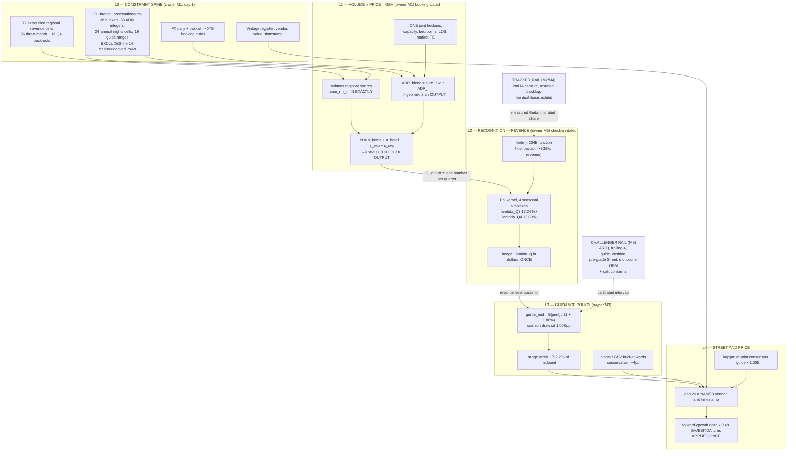

# 00 — The integrated revenue-forecasting system, and the pitch built on it

Head of research, 11 Sep 2026. Repo `main @ a5d6dbb`. Spot **$174.54 (9 Sep 2026)**; the $181.94 used
across the 02-proposals is the 4 Sep close and is stale — every valuation statement below is re-based to
$174.54. Prelim due 2 Oct; finalists 12 Oct; finals 22-24 Oct; **the Q3 print is ~5 Nov, after the finals.**

Convention: **measured** = computed here or in a cited repo file from a disclosure/dataset; **assumed** =
judgement with a cited rationale; **unidentified** = not separable with public data. Numbers I computed in
this session are marked **[recomputed]** and the one-screen script is reproducible from
`data/processed/overnight/02_kpi_panel_quarterly.csv` alone.

**Process gap, stated up front:** `03_critiques/` contains four files (C_M1-C_M4). **No adversarial review
was written for M5 (ML) or M6 (FX/take-rate/timing).** M6 is the lens I am promoting to core engine, so
§1 carries my own adversarial pass on it, and §4 makes an independent red-team of M6 a Week-1 gate.

---

## 1. Ranking of the six lenses, with roles

Critic average = mean of the six published axis scores. Adjusted = my score after applying the critic's
must-fixes and, for M5/M6, my own pass. Roles: **core engine / mechanical bridge / tracker / challenger /
discard**.

| # | Lens | Critic avg | Adjusted | Role | Why (two lines) |
|---|---|---|---|---|---|
| 1 | **M6 — FX, take rate, recognition timing** (`M6_fx_takerate_timing_mechanics.md`) | *no critique written* | **7.0** | **CORE ENGINE** | It is the only lens whose forecasting object — the conversion of *already-printed* GBV into revenue — is both stable (λ_Q4 = 11.95/12.12/12.03% over three years, range **0.171pp** [recomputed]) and applied to a published base, which removes the entire GBV forecast error from the 4Q26 guide problem. Its architecture (one host-payout numéraire, two FX date-stamps, hedge added once in dollars) is adopted whole; **its FX point estimates are rejected** — its own reconstruction puts 3Q26 gross revenue FX at +1.04pp against management's stated ~+3.2pp, a 2.2pp miss on the one quarter where the answer is nearly known, and its 4Q26 $3,284M rests on that miss. |
| 2 | **M3 — guidance function and revision game** (`M3_...md`) | 4.83 | **6.0** | **CORE ENGINE (terminal layer) + the pitch's clock** | Two ideas survive full adversarial attack and they are the pitch: the λ_s booking→check-in kernel, and the **guide-versus-print separation** ("the bridge's $3,111M is a *guide*; the *print* is ~$3,190M"). Everything it names itself after is dead: the revision regression is the identity (1+rev)≡(1+κ)(1+gap) verified to 4.6e-6 on 18 rows, and the 9/9 drift rule is a 2022Q3-2025Q1 calendar artefact (10 of 11 prints negative regardless of gap sign, Fisher p=0.27). |
| 3 | **M1 — structural mix state space** (`M1_...md`) | 4.00 | **5.5** | **MECHANICAL BRIDGE (accounting spine)** | The 72-cell exact filed quarterly regional revenue panel is real, verified (4Q22 $1,902M / 4Q23 $2,218M / 4Q24 $2,480M / 4Q25 $2,778M reproduce to $1M) and **unused anywhere in the repo** — build it day 1 whatever else happens. But the Stan state space is a research project: ~1,100 latent quantities against ~264 informative observations, and the advertised 24-cell free OOS test has 4 clean cells. Ship the constrained least-squares reconciliation, not the state space. |
| 4 | **M2 — nowcast tracker** (`M2_...md`) | 5.00 | **5.0** | **TRACKER (accounting core only)** | Its target statement is the best sentence any lens produced and is adopted system-wide: forecast a **level** and difference only at the last step, because guide-mid-vs-Street has sd 2.485pp against revenue-surprise's 1.099pp. Its alt-data measurement layer is cut for the prelim: the 2025 raw store holds 115 `listings.csv.gz` and **zero** reviews files, so the one genuine PIT replay does not exist, and (A4)/(A5) are saturated by free `p_q`/`π_q` per quarter. |
| 5 | **M5 — ML signal extraction and challengers** (`M5_...md`) | *no critique written* | **4.0** | **CHALLENGER (calibration rail only)** | Keep the challenger bank and the conformal wrapper — they answer "is your interval honest at n=20", which no workstream in the repo has ever answered. **Cut the hierarchical cushion model**: C-M3 §1.3 already killed the identical construction (155 rows returned, 94 carry a cushion, `fillna(0.0)` fabricates 61, survivors mix $m/pp/pts). Keep the LLM only as a same-day 5-Nov extraction tool. |
| 6 | **M4 — bottom-up 120-market panel** (`M4_...md`) | 3.67 | **3.0** | **DISCARD as a lens; 3 artefacts survive** | The central measurement equation is uncorrelated with its target: raw corr of the covered panel against the four disclosed regional nights growths is **NA 0.14 / EMEA −0.07 / LatAm −0.36 / APAC 0.22** on the 7 bucket quarters, and the survivorship curve that was supposed to fix it needs 168 vintage downloads of which 28/73 CDN probes are dead. Survivors: **start the second Inside Airbnb capture on day 1** (irreversible clock), the fee-migration dual-basis exhibit, and the bedroom-elasticity correction (0.23, so the Street's +12%-vs-+10% Bedroom-Nights wedge is worth **+0.46pp of ADR, not +2pp**). |

**The single most important reordering versus the proposals:** M1 was written as the core engine and M6 as a
service layer. That is backwards. The forecastable object is `revenue = Σ_k Φ_k · fee · GBV_{q−k}`, and GBV
for the two quarters that set 4Q26 revenue is either printed (2Q26 $27,200M) or prints on the morning of the
guide (3Q26). Nights × ADR × mix is needed for FY27, not for the trade.

---

## 2. The integrated architecture

### 2.1 The identity, and who owns each term

```
  GBV_q^USD      = Σ_r  n_{r,q} · ADR^local_{r,q} · X^B_{r,q}            [L1, booking-dated]
  Revenue_q^USD  = Σ_k  Φ_{k|Q(q−k)} · fee(m_{q−k}) · GBV_{q−k}^USD  + Λ_q   [L2, check-in-dated]
  ADR_q          = GBV_q / (Nights_q + Seats_q)                          OUTPUT, never an input
  TakeRate_q     = Revenue_q / GBV_q                                     OUTPUT, never an input
  guide_mid_q    = E[Revenue_q] / (1 + c),   c = trailing-8 A/g cushion   [L3]
  S_q^at-print   = guide_mid_q × (1 + κ),    κ = +0.52%, sd 28bp          [L4]
```

| Identity term | Owner | Estimator | Status |
|---|---|---|---|
| Regional home nights `n_{r,q}` | **M1** | constrained LS on log levels; softmax shares so `Σ_r n_r = N` exactly | measured (interval-censored) |
| Hotel nights, Experiences seats, Services seats | **M1** | enter the denominator identity `N = Σn_home + n_hotel + s_exp + s_svc` | assumed volumes, identity structure |
| Home ADR ex-FX by region | **M1** | four levels + one global pricing parameter, forced through 30 disclosed ex-FX ADR integers | measured + assumed |
| Geographic mix | **nobody — it is an OUTPUT** | falls out of `ADR_blend = Σ_r w_r ADR_r` | measured: **−1.06pp (2024) → −1.48pp (2025)**, deepening |
| Seats / hotel dilution | **nobody — it is an OUTPUT** | falls out of the denominator identity | measured structure, assumed tickets |
| Unit-size and LOS mix | **M1**, one joint hedonic | single log-additive regression on `06_wtp_hedonic_coefs.csv` + raw dumps; **party size IS the capacity index** | measured (bedroom ε = 0.23) |
| Like-for-like price + sub-regional mix | **unidentified**, reported as a 2-d ridge | the +3.6pp 2025 residual; report the identified SUM, never the split | **unidentified — say so** |
| Booking-date FX `X^B` | **M6** | one 9-currency basket, GBV/nights-weighted, from `10_fx_daily.csv` | measured |
| Recognition lag `Φ` | **M6** | 4 seasonal simplexes; pinned by 23 revenue identities + restated unearned fees + booking-curve Dirichlet | measured, over-identified |
| Check-in FX remeasurement `λ` | **M6** | **[recomputed] indistinguishable from zero — see §2.3** | measured ≈ 0 |
| Fee schedule / take rate by mechanism | **M6** | one function host-payout → (GBV, revenue); dated migrated-GBV share | measured rates, assumed share |
| Hedge `Λ_q` | **M6** | dollars from the 10-Q, added **once**, after pre-hedge revenue | measured |
| New lines outside GBV (ads) | **M1** | `nb_incr` netting as already built at `13_driver_model.py:437` — **do not "fix" it** | assumed |
| Cushion `c`, range width, bucket words | **M3** | trailing-8 empirical A/g: **mean +1.86%, median +1.79%, sd 1.006pp** [recomputed from `02_guidance_cushion_series.csv`] | measured |
| At-print consensus `κ` | **M3** | LSEG-only pairs, n≈13 | measured, rounding-limited |
| Interval calibration | **M5** | split conformal on walk-forward residuals | measured |

### 2.2 The layered stack



### 2.3 The one recomputation that settles the system's biggest internal fight

The repo's Q4 bridge (`29_q4_fy27_bridge.py`) subtracts a **−3.4pp revenue-FX step** from a guide-anchored
growth walk to get 4Q26 = $3,111M. M6 translates at a check-in basket and gets **+0.41pp** and $3,284M. The
spread is ~3pp ≈ $90M on 4Q26 and ~$430M on FY27, and C-M3 §11 rightly says "one of the two must be shown
wrong before either number reaches the memo."

**Both are wrong, because both treat FX as an input.** In `Revenue_q = λ_s × [⅔·GBV_{q−1} + ⅓·GBV_{q−2}]`
the lagged GBV is already in reported USD at booking-date rates, so the booking-date FX is *inside the base
you multiply*. The only admissible extra FX term is the booking→check-in remeasurement inside λ. I tested it
**[recomputed, 12 season-year cells, 3Q23-2Q26, `02_kpi_panel_quarterly.csv`]**: regress λ (season-demeaned,
% relative) on the wedge `revenue_FX_pp − [⅔·ADR_FX_{q−1} + ⅓·ADR_FX_{q−2}]`:

| | value |
|---|---|
| slope (% of λ per pp of wedge) | **+0.158** |
| standard error | 0.275 |
| t | **+0.57** |
| r | +0.179 |
| wedge sd across cells | 1.62pp |
| λ dispersion (% relative) | 1.43% |

Indistinguishable from zero. The 95% bound on the slope is [−0.45, +0.77], so a 3pp change in the wedge
moves 4Q26 revenue by **−$45M to +$74M** — an order of magnitude smaller than the $200M the repo's two
constructions differ by, and the repo's own −3.4pp step (−3.4% of revenue, −$110M) sits **outside** that
bound. **Ruling: the FX step-down is an OUTPUT of the lagged-GBV arithmetic, not an adjustment. Anyone who
subtracts it again double counts.** The λ within-season ranges — Q1 0.709, Q2 0.497, Q3 0.245, **Q4 0.171pp**
— are the direct evidence: three years of very different dollar paths, and the Q4 conversion moved 17bp.

### 2.4 How double counting is prevented at each interface

| # | From | To | Object crossing the line | Double-count guard |
|---|---|---|---|---|
| 1 | L1 | L2 | `G_q` (GBV in USD, booking-dated) — **one number per quarter, nothing else** | Nights, ADR, geo mix, size mix, LOS, seats and regulation cannot re-enter revenue because they are not in the interface. Write this line into `model/assumptions.md` as a rule, not a convention (C-M3 §11). |
| 2 | L1 internal | L1 | regional nights weights `w_r` | `ADR_blend = Σ_r w_r ADR_r`, so geo mix is an output. Closes the 1.13pp / ~$175M broken loop at `13_driver_model.py:377-379`. |
| 3 | L1 internal | L1 | denominator | `N = Σn_home + n_hotel + s_exp + s_svc`, so seats dilution is an output. Kills the three mutually exclusive treatments worth 0.57pp / ~$88M FY27. |
| 4 | Hedonic | L1 | size + LOS coefficients | One joint regression. Party size **is** the capacity index — a separate party-size driver is forbidden (`13_party_size_adr.py`, annual β −0.36). |
| 5 | M6 fee schedule | L1 **and** L2 | migrated-GBV share `m_q` | The fee function is evaluated **once** and returns `(GBV, revenue)` jointly. The ADR workbook's `+0.50pp fee-migration reprice` row and the take-rate `take_bps` lever are the same event; both are deleted. |
| 6 | FX | everywhere | `X^B` only (booking-date basket) | Exactly one FX object touches the model. `f_A` (inert, cancels at `13_driver_model.py:379` vs `:382`) and the wedge `w_q` are deleted. |
| 7 | Hedge | L2 | `Λ_q` in **dollars** | Added once, after pre-hedge revenue. The −0.21/−0.21/−0.18/−0.18pp in `28_fx_hedge_forward.csv` is **already inside** the letter-stated after-hedge FX; `29_bridge_assumptions.csv` gets this right and `28_fx-hedge-disclosures.md`'s "For the model" section reads like an instruction to add it. Do not. |
| 8 | L2 | L3 | revenue level posterior | The cushion is measured as **A/g** (print over guide midpoint, directly observed, needs no kernel), **not** g/M (which absorbs kernel bias — C-M3 §1.2 shows λ̂ error and c co-move one-for-one). |
| 9 | L3 | L4 | `guide_mid` and its distribution | `κ` converts guide → at-print consensus; `gap` is derived, never separately parameterised. The "revision slope" is the identity (1+rev)≡(1+κ)(1+gap) and is deleted. |
| 10 | L4 | valuation | forward-growth delta | Applied **once**, through the FY27/FY28 growth path, never a second time through an independent FY27 revenue build. |
| 11 | Regulation | L1 | dated DiD covariate **on the nights state** | Not a subtraction from a growth rate already fitted on regulation-contaminated realised data. `reg_mult = 1.67` is deleted. |
| 12 | Tracker rail | L2 | measured θ (0.833-0.845) and tax/cleaning share | Cross-sectional and matched-pair only. No Inside Airbnb time series enters any forecast. |

### 2.5 Data schema on every interface

Every file crossing a layer boundary is long-format with exactly these columns:

`quarter, region, line, variable, value, unit, basis, vintage, source_path, knowable_from`

- `basis ∈ {filed, letter_bucket, letter_integer, back_out, derived, modelled, assumed}` — **`derived` rows
  are never used as observations** (the 14 NA/EMEA nights cells 4Q22-3Q24 are residual-to-total constructions
  that re-import XBRL FX; `08_altdata_backtests.py:248` already gets this right for the IA panel).
- `vintage` = the date the value was first publishable. `knowable_from` = the date a backtest may use it.
- Interval rows carry `lo, hi, phrase_kind` so a coded phrase ("less than 1%" → 0.5) is entered as an
  interval, never as a point with a symmetric ±0.5pp band.

### 2.6 Where the disclosed bands and the 10-K tables act as constraints

| Disclosure | n | How it enters | What it is not |
|---|---|---|---|
| Quarterly regional nights **buckets** (3Q22+) | 28 genuine bucket cells, 4Q24-2Q26 clean | interval likelihood `lo ≤ Δln n_r ≤ hi` | not a midpoint regressor; band-midpoint bias is −0.22pp mean and **−0.72pp over the last two quarters** |
| Total Nights and Seats | 23 | **exact** aggregation constraint by reparameterisation (K−1 free, Kth solved) | retires `CALIB = −0.41pp` and the +0.19pp current-weighting index bias |
| 10-K **Geographic Mix** annual table (nights, GBV, revenue, nights/booking) | 24 region-year cells | interval at the table's own precision (nights rounded to 1M ⇒ ±0.5M ⇒ ±0.45pp of annual growth) | **not an equality** — C-M4 must-fix |
| Filed quarterly regional **revenue** (XBRL) | **72 cells** (56 three-month + 16 Q4 back-outs) | **exact**, the hardest constraint in the system | verified: 4Q22 $1,902M / 4Q23 $2,218M / 4Q24 $2,480M / 4Q25 $2,778M reproduce to $1M |
| Regional ADR ex-FX integers | 68 | interval `±0.5pp` on the letter rounding | half the variance of a 3.5pp-range target is rounding |
| Guide ranges and bucket words | 19 ranges + 5 buckets | interval-censored likelihood on the **guide**, which is a forecast target here, not an input | the FY margin floor and the FY revenue-growth floor are floors, not point estimates |
| Unearned fees / funds held | 24 quarters | balance-sheet identity pinning `Σ_{k≥1}Φ_k`, **on the restated series** `reported/(1−d_q)`, `d_q` = 0.9/3.8/16.2/16.5% for 3Q25-2Q26 | the reported series is why the backlog survivor fails on revenue (WF 1.17× naive) |

---

## 3. What the system emits, and how it maps to the pitch

### (a) The 3Q26 print card versus the frozen pre-registered card

| Object | Our system | Frozen card `20_frozen_q3_2026.csv` | Guide | Street |
|---|---|---|---|---|
| Revenue | **$4,815M (+17.6%)**, 80% [$4,700, $4,930] | $4,805M (= 4,740 × 1.0137 trailing-4 baseline) | $4,690-4,770M (+15-17%) | $4,740M (Zacks, 7 est.) / $4,737M (36 est.) |
| — kernel only, no fee step | $4,804M | — | — | — |
| — guide + trailing-8 cushion | $4,818M | `bl_guide_plus_cushion` 4.63% surprise | — | — |
| Nights and Seats | **+10.5%**, 80% [+9.0, +12.5] ⇒ **147.6M** | +1.83% surprise on a 145M bar ⇒ 147.6M | "low double-digit" (10-12%) | not published |
| GBV | **$26,300M (+14.8%)** | $26,185M | "mid teens" (14-16%) | not published |
| Printed ADR | **+3.9%** | +3.8% | "moderate increase" | $181.56 basis (Zacks ADR consensus, 5 prints, ABNB beat 5/5) |
| **Printed take rate** | **18.14%** (+26bp y/y) | — | "relatively in-line" (17.88%) | flat |

The kernel is arithmetic: lagged GBV = ⅔($27,200M) + ⅓($29,200M) = **$27,867M**; λ_Q3 = 17.239%
(17.391/17.145/17.182 over three years) ⇒ **$4,804M** [recomputed]. Two constructions that share no
parameter — the kernel and guide-plus-cushion — land 0.3% apart. That is the strongest validation available
before 5 Nov, and it is **two** constructions, not three: C-M3 §2.3 is right that the frozen card holds no
revenue level and its $4,805M is `4,740 × (1 + 1.374%)` on a Zacks vintage the file itself quarantines.

`P(revenue > $4,770M, the top of the range)` = **0.72**; `P(revenue > Street $4,740M)` = **0.85**.

### (b) The 5-Nov Q4 guide midpoint versus Street, with the FX-lag decomposition

Q4 revenue is `λ_Q4 × [⅔·GBV_3Q26 + ⅓·GBV_2Q26]`. `GBV_2Q26` is printed. `GBV_3Q26` prints the same
morning. So **the Q4 guide carries no GBV forecast error at the moment it is set** — which is why the
cushion is small and shrinking (+3.04% over the first 11 prints, +1.86% over the last 8; range width 4.9% →
1.9% of midpoint).

| GBV_3Q26 | Q4 print (no fee step) | y/y | Guide mid = print / 1.0186 | vs Zacks $3,200M | vs 36-analyst $3,158M |
|---|---|---|---|---|---|
| $25,900M (+13.1%) | $3,168M | +14.0% | $3,110M | −2.8% | −1.5% |
| $26,185M (frozen card) | $3,191M | +14.9% | $3,132M | −2.1% | −0.8% |
| **$26,300M (central, +14.8%)** | **$3,200M** | **+15.2%** | **$3,141M** | **−1.8%** | **−0.5%** |
| $26,600M (+16.2%) | $3,224M | +16.1% | $3,165M | −1.1% | +0.2% |
| $27,000M (+17.9%) | $3,256M | +17.2% | $3,197M | −0.1% | +1.2% |

Adding the fee-migration step at half weight (§3d) puts the print at **$3,240M** and the guide midpoint at
**$3,181M**. Guide range ≈ **$3,145-3,215M** (trailing-8 width 1.7-2.2% of midpoint).

**Probability distribution.** Predictive sd = √(kernel PIT RMSE 2.44%² + cushion draw 1.01%²) ≈ **2.6pp**.

| Consensus anchor | mean gap | P(guide mid < anchor) |
|---|---|---|
| Zacks $3,200M (10 est., range $3,050-3,700; the $3,700M is probable bad data, median ≈ $3,150M) | −0.6% to −1.8% | **0.60** [0.41 full fee step, 0.76 no fee step] |
| Alpha Vantage / 36-analyst $3,158M (11 Sep) | +0.7% to −0.5% | **0.47** [0.29, 0.65] |

**Say this out loud in the memo: the guide-below-Street trade is a 60/40, not the 0.87 M3 claimed, and it
flips on which vendor you quote.** State the vendor and the timestamp or do not state the trade.

**FX-lag decomposition of the Q4 step** (this is the exhibit):

| | 3Q26 | 4Q26 | step |
|---|---|---|---|
| Lagged-GBV growth (⅔ q−1 + ⅓ q−2) | +16.9% | +15.2% | −1.7pp |
| — of which booking-date FX carried through Φ | ⅔(+1.0) + ⅓(+5.0) = **+2.3pp** | ⅔(≈0.0) + ⅓(+1.0) = **+0.3pp** | **−2.0pp** |
| — of which ex-FX | +14.5% | +14.9% | **+0.4pp** |
| Guided revenue growth | +15% to +17% | **+13.2% to +15.7%** | ≈ −1.5pp |

**Every point of the Q4 deceleration is the dollar, and it accelerates ex-FX.** That is the sentence.

### (c) The Feb-2027 FY27 guide versus Street $15.73-15.76bn

| | Ours | Street |
|---|---|---|
| FY26 | 1H26 actual $6,286M + 3Q26 $4,815M + 4Q26 $3,240M = **$14,341M (+17.2%)** | $14,100M (Zacks, 8) / $14,155-14,160M (43) — **we are +1.3 to +1.7% above** |
| FY27 | **$15,850M (+10.5%)**, 80% [$15,350M, $16,350M] | $15,730M (13) / $15,760M (44) — **we are +0.6 to +0.8% above** |
| FY27 guide wording, Feb 2027 | "low double digits" P≈0.55, "low to mid teens" P≈0.25, a point ≈11% P≈0.20 | n/a — management has said nothing on FY27 ("I'm not going to give you a specific guide for 2027", Sheridan/Mertz 2Q26) |
| FY26 guide action on 5 Nov | raised to ≈"17%" or "high teens", P≈0.75 (base rate: the FY guide has only ever been raised, and the raise lands at the Q3 print, 2/2) | "at least mid teens" |

**Be honest: on FY27 revenue we are the Street.** $120M on $15.75bn is inside the kernel's own walk-forward
MAE of 1.74%. The memo must say this in one sentence and then say where the edge is instead.

### (d) FY27 revenue growth, decomposed into named non-overlapping contributions

Each line is an output of exactly one owner and appears exactly once. They sum by construction.

| Contribution to FY27 revenue growth | pp | Owner | Class |
|---|---|---|---|
| Lagged-GBV **volume** ex-FX (home nights + hotel nights + seats) | **+8.6** | M1 | measured/assumed |
| Lagged-GBV **within-region price** ex-FX | **+3.5** | M1 hedonic + residual | +0.6 measured (size, ε=0.23), +0.0 LOS, **+2.9 unidentified (price + sub-regional mix)** |
| **Geographic mix** (output of `Σ_r w_r ADR_r`) | **−1.5** | M1 identity | **measured**: −1.06pp (2024) → −1.48pp (2025), deepening as NA nights share goes 32.6 → 31.3 → 29.6% |
| **Seats / hotel dilution** (output of the denominator identity) | **−0.5** | M1 identity | structure measured, ticket prices assumed |
| **Booking-date FX** carried through Φ | **−0.4** | M6 | measured (spot-constant); ±1.5pp on a ±1sd euro path |
| **Fee / take-rate step** net of incentives and the direct-link pilot | **+0.9** | M6 | +40-50bp gross migration, less 0-15bp direct-link (**not −80bp** — see kill list), plus the 15% hotel-credit expiry 31 Dec 2026; carried at **half weight** |
| **New lines outside GBV** (ads $0 FY26, Services excess) | **+0.2** | M1, `nb_incr` netting as built | assumed |
| **Regulation** (dated DiD on EMEA nights) | **−0.3** | M1 | model-based; replaces `REG_DRAG_PP` × 1.67 |
| **FY27 revenue growth** | **+10.5** | | vs Street +11.3% |

The two lines a judge will attack are the +2.9pp unidentified price/sub-regional residual and the +0.9pp fee
step. Both are flagged as such on the exhibit. **Do not split the residual.** Airbnb discloses no
country-level ADR; report the identified sum as a 2-d ridge.

### (e) The forward-multiple path and the 3-12 month stock view

At $174.54: market cap $102.8bn (588.9M FY26E diluted shares, post the WS18 share-roll fix), net cash
~$9.6bn (30 Jun 2026) ⇒ **EV ≈ $93.2bn**. FY27E adj. EBITDA at a 36.5% margin on $15.85bn = **$5,785M** ⇒
**EV/FY27E adj. EBITDA = 16.1×**, against the repo's independently derived fair band **13.5-18.5×, base
16.5×** (`12_valuation-multiple-regime.md`) — i.e. **roughly fair, not stretched.** The 30.9× a bear quotes
(Phillip Securities, 11 Aug) is a different EBITDA definition and should not be used.

Multiple mechanics, **+0.48 EV/EBITDA turns per point of forward revenue growth, margin ≈ zero**:

| Event | Forward-growth delta | Turns | EV | Equity |
|---|---|---|---|---|
| 5 Nov: Q4 guide crystallises FY27 at ~+10.5% vs +11.3% | −0.8pp | −0.38 | −2.4% | −2.2% |
| Feb 2027: FY27 guided "low double digits" ⇒ Street marks FY28 forward growth ~+11% → ~+9.5% | −1.5pp | −0.72 | −4.5% | −4.1% |
| Print reaction, guide mid below the quoted consensus (9/9 negative 20-day, mean −4.21%, **but see kill list — it is a calendar artefact, discount to ~−2%**) | — | — | — | −2% |
| **Cumulative to Feb 2027** | **−2.3pp** | **−1.10** | **−6.9%** | **≈ −8%** |

**12-month targets (re-based to $174.54): bear $120 / base $158 / bull $215.** Base is 15.0× FY27E adj.
EBITDA plus net cash; bull is 18.0× on FY27 marked to $16.25bn; bear is 12.5× on FY27 at $15.35bn. The
repo's football-field base of $154-157 (all six lenses, discounted to a ~30 Sep 2027 target date) and its
EV/EBITDA-only lens of $181 bracket this.

**Call: SHORT / UNDERWEIGHT ABNB into the 5 Nov print and through the Feb-2027 FY27 guide.** Base −9.5%,
probability-weighted −2% to +3% with fat two-sided tails (mean absolute earnings move 12.1%). If the team
is not comfortable with a near-flat expected value on the single name, the risk-managed expression is
**short ABNB / long BKNG** — it isolates the take-rate, geo-mix and bedroom-nights calls from travel beta,
which is exactly what our system has an edge on and what it has none on.

### The mechanism of the variant view, stated honestly

**We are not variant on the FY27 revenue level. We are +0.7% on FY27 and +1.5% on FY26, both inside our own
walk-forward error.** The variant view is in three places, and they are all compositional:

1. **The guide is a different object from the print, and nobody models it separately.** Sell-side Q4 numbers
   *are* their guide expectations; they carry no cushion parameter. Our system forecasts the guide directly
   (trailing-8 A/g cushion +1.86%, sd 1.006pp) and the print separately. The team's own $3,111M is a
   *guide*; the print is ~$3,200M. That single distinction reconciles an $89M internal contradiction and a
   $90M disagreement with the Street.
2. **None of the FY26→FY27 growth halving (+17.2% → +10.5%) is demand.** It is a dollar lap (−2.0pp of the
   Q3→Q4 step is booking-date FX already observed), a product lap (management's "+3 points of nights, +4
   points of GBV" is the **bundle** — RNPL + cancellation redesign + simplified fees — with the US lap in
   3Q26 and the global lap in 1Q27), and a mix identity that deepens every year. Both the bull "nights are
   re-accelerating" narrative and the bear "demand is cracking" narrative are therefore wrong.
3. **The three ADR levers the Street reads as strength are each measured smaller or negative.** Bedroom
   Nights +12% vs nights +10% is worth **+0.46pp of ADR at a measured bedroom elasticity of 0.23**, not the
   ~+2pp the Street maps 1:1. Geographic mix is **−1.48pp in 2025 and deepening**. Seats dilution is
   −0.5pp a year. Against them sits one genuine positive — the fee migration — which **has not moved a
   single printed take rate through 2Q26** (2Q26 13.26% vs 2Q25 13.17%, +9bp) and sits in the one guide
   family Airbnb has actually missed, twice, both to the downside (3Q25 −0.69 vs guided 0.0; 1Q26 −0.10 vs
   "up slightly").

### Where the asymmetric edge is, and the defined flip

The asymmetry is **one line of the P&L on one date**. The 3Q26 printed take rate resolves ±45bp, worth
±$530M of FY27 revenue, ±3.4pp of FY27 growth, ±1.6 EV/EBITDA turns and **±12% of the equity**. Everything
else about the next four guides we can already compute.

- **Bear branch (P ≈ 0.30):** Q4 nights guided "high single digit" (the RNPL lap), printed take rate flat or
  down, FY26 guide merely reiterated. Historical analogues on a nights-bucket reversion: −13.4% (2 Nov
  2022), −10.9% (10 May 2023), −8.0% (7 Aug 2025). → **$140-152**.
- **Base (P ≈ 0.35):** in line; FY26 raised a notch; Q4 guide $3,145-3,215M. → **$170-185**.
- **Bull / FLIP (P ≈ 0.35):** **3Q26 printed take rate ≥ 18.10% (+22bp y/y) AND Q4 nights reiterated "low
  double digit."** That marks FY27 to $16.1-16.3bn, +2pp of forward growth, +0.96 turns. → **$205-215.**
  **If both conditions print on 5 Nov we cover and go long. Write that in the memo.**

---

## 4. Backtest and pre-registration protocol

### 4.1 Point-in-time rules (binding on every workstream)

1. **Vintage register.** `data/processed/overnight/20_vintage_register.csv` gains a row for every consensus
   value with `vendor, period, metric, value, n_estimates, as_of_timestamp, url`. The guide-vs-Street feature
   for 6 Aug 2026 is **LSEG $4,610M**, not Zacks $4,740M (4 Sep). Mixing them is the trap that killed the
   peer read-across, and the frozen card's own note already says so.
2. **Specification, not just data, is filtered by date.** M1's PIT harness filters observations by
   `knowable_from` but takes priors from a 7 Sep 2026 note, a 3Q23-3Q25 φ fit and the 2025 10-K, then
   replays 2022-23. **Rule: every prior is elicited from trailing data through T−1 and both replays
   (full-sample prior and PIT prior) are published side by side.**
3. **Refit at guide dates, not quarter-ends.** Information set = letters and 10-Qs filed strictly before the
   guide date, FRED FX through the prior day, nothing else. Expanding window, **origin 1Q23** (n=14). C-M3
   §2.1 showed the author's 1Q24 start drops the four worst quarters and improves MAE by 28%; quote the
   honest number (**MAE 1.74%, RMSE 2.44%, bias +0.99%**), and if COVID-era λ's are excluded, say so and
   give the number both ways.
4. **Interval likelihoods on rounded disclosures.** Letter integers are scored on `[x−0.5, x+0.5]`, not as
   points. Coded qualitative phrases carry `phrase_kind` and are never entered as symmetric intervals
   around a fabricated integer.
5. **Executable returns only.** `open_*` columns, never `legacy_*`. Next-session-open entry cut the
   guide-below-Street rule from −8.90% to −4.21%.
6. **`basis == 'derived'` rows are excluded from every likelihood.** The 14 NA/EMEA nights cells 4Q22-3Q24
   are residual-to-total constructions carrying XBRL FX contamination.

### 4.2 Windows, baselines and the scoring card

| | |
|---|---|
| Windows | **W1: 1Q23+** (n=14 guide dates). **W2: 1Q24+** (n=10). A result must survive **both** to be quoted. |
| Baselines every object must beat | (i) naive / AR(1) on the same series; (ii) trailing-4 mean; (iii) **guide + trailing-8 cushion**; (iv) **the free pre-guide Street consensus** — the baseline M3 nominated and never ran, and which beat its kernel on the guide level (MAE 1.61% vs 1.93%). |
| Scoring metrics | RMSE ratio to naive (repo convention), MAE, bias, CRPS, PIT histogram, and split-conformal 80% coverage on the last 6-8 residuals. |
| Parameter count, published | Core: 4 seasonal λ + 1 lag weight w + 1 cushion + 1 κ = **7 free parameters** against 23 revenue identities, 23 balance-sheet identities, 19 interval-censored guide buckets and 72 exact regional revenue cells. Any lens that cannot state this ratio does not ship. |
| Contraction test | For every term in the FY27 decomposition exhibit, publish prior-to-posterior contraction. **Strike any term contracting <20% from the exhibit.** |

### 4.3 Pre-registration — frozen 26 Sep, scored 6 Nov

Increment `spec_id` in `20_experiment_spec.json` to `ABNB-INT-v1` and freeze these **before 2 Oct**, in
`20_frozen_q3_2026.csv` schema with `decision_time`, `consensus_vintage` and `consensus_point_in_time`:

| # | Pre-registered object | Our number | Scored against |
|---|---|---|---|
| P1 | 3Q26 revenue | $4,815M, 80% [$4,700, $4,930] | printed 5 Nov |
| P2 | 3Q26 Nights and Seats | +10.5%, 80% [+9.0, +12.5] | printed |
| P3 | 3Q26 GBV | $26,300M | printed |
| P4 | **3Q26 printed take rate** | **18.14%**; binary test **≥18.10% = migration flowing / ≤17.88% = fully offset** | printed — **this is the thesis test** |
| P5 | 4Q26 guide midpoint | $3,181M, 80% [$3,075, $3,290] | the letter, 5 Nov |
| P6 | 4Q26 guide range width | 1.7-2.2% of midpoint | the letter |
| P7 | P(guide mid < Zacks $3,200M as of 4 Sep) | **0.60** | the letter vs the registered vintage |
| P8 | 4Q26 nights bucket | "low double-digit" P=0.55, "high single-digit" P=0.40, other 0.05 | the letter |
| P9 | FY26 revenue-growth guide action | raised P=0.75; wording ≈"17%"/"high teens" | the letter |
| P10 | FY27 revenue | $15,850M, 80% [$15,350, $16,350] | Feb 2027 print + guide |
| P11 | λ_Q4 realised (4Q26 revenue ÷ [⅔GBV_3Q26 + ⅓GBV_2Q26]) | 12.03% ± 0.20 | Feb 2027 |
| P12 | **Falsification: λ's FX-wedge slope** | +0.158, se 0.275, t=+0.57 — re-estimated with 4Q26 added must remain \|t\| < 2 | Feb 2027 |

Four **kill gates** during the build, each with a number and a date:

| Gate | Date | Pass condition | If it fails |
|---|---|---|---|
| G1 — restated backlog | Wed 16 Sep | restated unearned fees beat naive on revenue growth on **both** windows | Φ loses its hardest pin; fall back to the column-sum restriction + booking-curve prior and say so |
| G2 — exact-cell reconciliation | Thu 17 Sep | the constrained LS places all clean annual regional nights cells inside ±0.5M while reproducing all 72 filed revenue cells exactly | the disclosures are mutually inconsistent — that is itself a reportable finding |
| G3 — bottom-up null test | Thu 17 Sep | the 120-market panel must cut the mean 80% posterior width by **≥25%** versus bands-plus-total alone | cut the panel; publish the negative result as an exhibit |
| G4 — head-to-head | Fri 25 Sep | our guide-midpoint forecast must beat the free pre-guide Street consensus on **sign** (target ≥8/14) | lead the memo with the FX/mix decomposition, not the gap forecast |

### 4.4 Honesty rules for the memo

Referencing the withdrawn-claims ledger at `research/notes/overnight/14_master-synthesis.md` §11 (and
`26_change_ledger.csv`, `15_claim_checks.csv` at 82 confirmed / 11 wrong / 1 unsupported / 4 unverifiable):

**May not be claimed, ever:**

- That any Inside Airbnb supply-exit figure is real. §11.5 item 8: 25 of 103 year-ago pairs had a partial-scrape
  endpoint; **Paris 33%, Nashville 44%, Chicago 40% "is not real and must not appear on a slide."**
- Any options-implied move for 5 Nov. §11.5 item 7: the headline is **withdrawn, not corrected**; there is no
  quotable ABNB event-implied move as of 6 Sep 2026 and the 6 Nov weekly is not listed.
- The nights-surprise 20-day drift. §11.5 item 4: **withdrawn** under an executable next-open entry.
- "−0.8pt of take rate from the direct-link pilot." §11.1: that needs 8.4% of all GBV at the 6% tier or 14.5%
  at 10%. **Use 0-15bp of FY27 take rate**; reserve −0.8pt for a "pilot becomes policy" tail.
- "No publisher quotes an ADR consensus." Withdrawn — Zacks does, for 5 prints, and ABNB has beaten it 5/5.
- AirROI's 55.9% as a measurement of hidden fees. It is a model, and it assumes the pre-migration 14% guest fee.
- That the 2020Q4 move was about long-term margin framing. No contemporaneous source supports it.
- That the WS08 guide reconciliation forecasts a beat. It is consistency evidence; the zero revenue-minus-GBV
  gap was *chosen* to make it land.
- **New to this list:** that the revision slope of 0.988 (r 0.993) is a finding. It is the identity
  (1+rev) ≡ (1+κ)(1+gap), verified to 4.6e-6 on all 18 rows.
- **New:** that "guide below Street → 20-day drift" is an edge. All 9 events sit in 2022Q3-2025Q1, a window in
  which **10 of 11 prints were negative at 20 days regardless of gap sign** (mean −3.51%); Fisher exact
  in-window p = 0.27. Quote it as a base rate with that caveat attached, or not at all.
- **New:** that "85-90% of the quarter is on the booking ledger at the guide date." That is the **Q1-end**
  figure. Q3-end unearned-fee coverage is **0.661 / 0.668 / 0.655** and 0.599 in the RNPL era — the exact
  vintage for the 4Q26 guide. The defensible sentence is volume-based, not balance-sheet-based: *"at the
  guide date, 100% of the GBV that will convert into Q4 revenue has printed."*

**Must be claimed, explicitly, every time:**

- Which vendor and which timestamp defines "the Street."
- Whether a number is a **guide** or a **print**. They differ by +1.86% and the memo's whole gap depends on it.
- Which terms are **unidentified**: the +2.9pp price/sub-regional residual, hotel commission, seats volume and
  ticket price, the RNPL cohort cancellation curve, and the booking→check-in transition matrix's tail.
- The honest probability. `P(guide mid < Zacks $3,200M) = 0.60`, not 0.87. `P(gap<0)` compounded over cushion,
  kernel, GBV and estimation error has sd ≈ 2.6pp and its 80% interval includes zero.
- That the finals (22-24 Oct) **precede** the catalyst (5 Nov), so the pitch is pre-positioned and eats an
  overnight gap with sd 8.7pp on below-Street events. The next-open drift rule is unusable for the pitch.
- **That our FY27 is within 1% of consensus.** Say it in the first 200 words. A judge will find it in ninety
  seconds and it is far better said by us.

---

## 5. Week-by-week build plan

Four people. **P** = Python (pandas/scipy/statsmodels/cmdstanpy, DuckDB), **R** = the FX engine
(`Citadel-ABNB-fx-engine/analysis/src/fx_engine/*.R`, 42 engine + 11 rate-path + 14 calibration checks),
**X** = Excel/model plumbing, **W** = writing and exhibits. Compute: one laptop plus DuckDB; no GPU is on the
critical path (M5's Chronos/TimesFM pass is one optional Colab T4 session). Everything is on disk; the only
outbound spend is Fiscal.ai Pro at $39/mo, optional.

### Immediately — start today, 11-12 Sep (irreversible clocks)

1. **Start the daily Inside Airbnb capture** on the identical 120-market list (adapt
   `inside_airbnb_supply_panel.py discover`; HEAD-poll `data.insideairbnb.com` daily; download on first
   sight; **also fetch `reviews.csv.gz` and `calendar.csv.gz`, not only `listings.csv.gz`** — that omission
   is why M4's vintage stack does not exist). A missed dump is unrecoverable; 28 of 73 historical CDN probes
   are already dead. Owner **P2**. Cost: storage.
2. **Register the consensus vintage now.** Pull and timestamp Zacks, Alpha Vantage/36-analyst and S&P
   Global for 3Q26, 4Q26, FY26, FY27. Re-pull 2-3 Nov when Zacks publishes nights/ADR/GBV consensus. Owner **P4**.
3. **Freeze `spec_id = ABNB-INT-v1`** with the §4.3 card skeleton before any model is run. Owner **W**.
4. **Diarise the two fee deadlines** (15 Sep ex-EEA, 13 Oct EEA+CH) and capture listed-price panels on
   14/16 Sep and 12/14 Oct for the dual-basis exhibit. Owner **P2**.

### Week of 14 Sep — build the spine, run the gates

| Day | P1 (core engine) | P2 (data/panel) | P3/R (FX + take rate) | W/X |
|---|---|---|---|---|
| Mon 14 | λ_s kernel + PIT walk-forward from 1Q23; reproduce Q3 17.391/17.145/17.182, Q4 11.946/12.117/12.026. **Acceptance test — if it does not reproduce, stop.** | build `L0_exact_regional_revenue.csv` (72 cells); assert the four Q4 back-outs | build `X^B` daily basket from `10_fx_daily.csv`; reproduce stated ADR-FX with an interval likelihood | vintage register; spec freeze |
| Tue 15 | trailing-8 A/g cushion + block bootstrap (mean 1.856%, median 1.79%, **sd 1.006pp**); κ on LSEG-only pairs | `L0_interval_observations.csv`; exclude the 14 `derived` rows; add `phrase_kind` | **rerun my λ-vs-FX-wedge regression** and extend it to all four seasons with the interval likelihood on letter integers | memo skeleton, exhibit list |
| Wed 16 | Q4 guide distribution across the GBV_3Q26 grid | restated unearned fees `reported/(1−d_q)`; **GATE G1** | migrated-**GBV** share path from `06_fee_timeline.csv` × `inside_airbnb_host_concentration.csv`; measured θ from `12_reprice_summary.csv` | — |
| Thu 17 | constrained LS: softmax shares, adding-up, hinge intervals, fee_{r,q}; **GATE G2** | 120-market panel vs the four disclosed regional growths; **GATE G3 — expect it to fail; publish the negative** | tax+cleaning share of GBV from `06_quote_line_items.csv`; fee function `schedule()` | reconciliation table skeleton |
| Fri 18 | first end-to-end run: 3Q26, 4Q26, FY27 with named decomposition | second-capture verification | **four-way FX reconciliation** (repo −0.43pp / M6 +0.41pp / guide-anchored +2.6pp / kernel-implied ≈0) written down | **independent red-team of M6** — the critique nobody wrote |

**End of week 1 deliverable:** a runnable pure-pandas engine that emits (P1, P5, P7, P10) with intervals, plus
the four-way FX reconciliation. If nothing else ships, this is the pitch.

### Week of 21 Sep — validate, reconcile, challenge

- **P1:** expanding-window PIT replay at all 14 guide dates versus the four baselines including the free
  pre-guide Street consensus; PIT histogram; split conformal on the last 8 residuals. **GATE G4 Fri 25 Sep.**
- **P2:** joint hedonic (capacity, bedrooms, LOS bucket, market FE) on `06_wtp_hedonic_coefs.csv` + raw
  dumps; reconcile the 1.27-vs-1.37 bedrooms-per-log-capacity docstring conflict; **one** set of coefficients
  shift-shared into size and LOS.
- **P3/R:** feed real `exposure.csv` / `forecasts.csv` (adr_basis = **usd_constant**, never reported ADR) /
  `hedges.csv` into the R engine; verify the Python and R revenue lines agree to <0.1%; consume
  `adapter.csv`'s `revenue_fx_usd` **or** `revenue_timing_multiplier`, **never both**.
- **P4/M5:** challenger bank (AR(1), trailing-4, guide+cushion, monotone GBM with sign priors from the two
  validated survivors) scored on both windows; conformal wrapper.
- **X:** the **model-to-model reconciliation** — the artefact the audit says does not exist. Bridge
  `13` $15,842M → `29` $15,804M → `14` $15,727.8M → WS10 ~$15,925M → ADR-workbook ~$15,555M → choice driver
  ~$15,570M → **ours $15,850M** → Street $15,745M, one named term at a time. A judge will ask "which of your
  six numbers is it?" and today there is no answer.
- **W:** first full memo draft; the one chart.

### Week of 28 Sep → 2 Oct — freeze and submit

- Mon 28: freeze `ABNB-INT-v1`; register all twelve P-objects with `decision_time`.
- Tue 29: FY27 decomposition exhibit with the contraction test applied (strike anything <20%).
- Wed 30: hostile-judge dry run against the eight questions in §6, **60 seconds and a number for each**.
- Thu 1 Oct: two-page memo + model tab finalised; "what we refuse to claim" appendix.
- Fri 2 Oct: **submit.**

### 5-21 Oct — finals prep

- Weekly FX refresh (Fri) and consensus re-pull; a two-hour turnaround protocol for the 5 Nov print even
  though it lands after the finals.
- 12-14 Oct: EEA fee deadline capture; build the dual-basis exhibit (listed price col 47 vs
  `price_quote_price_per_night` col 51 on migrating cohorts).
- Build the live 5-Nov card as a one-click sheet so the finals can show "here is exactly what we will score
  on 6 Nov, frozen 26 Sep."
- Rehearse the flip: the conditions under which we cover and go long, stated on the slide.

### Minimum viable path if things slip

Cut in this order: (1) the Stan port — constrained LS with a block bootstrap gives every point estimate;
(2) the conformal layer — keep the posterior and say it is uncalibrated at n≈12; (3) the 120-market panel
(expect G3 to cut it anyway); (4) the regulatory DiD — revert to the Monte Carlo with `reg_mult` deleted and
an honest interval; (5) the R-engine cross-check; (6) the FY28 build.

**Cannot be cut, in any scenario:** the λ_s kernel and its PIT walk-forward; the trailing-8 A/g cushion; the
72-cell exact regional revenue panel; the four-way FX reconciliation; the guide-versus-print separation; the
pre-registered card. Those six are two-and-a-half days of one person's work and they are the whole pitch.

---

## 6. The pitch

### Three sentences a Citadel PM should remember

1. **"Airbnb's revenue is not forecast, it is converted: two-thirds of a quarter's revenue comes from the
   prior quarter's already-printed GBV and one-third from the quarter before, at a seasonal conversion that
   has been 17.4/17.1/17.2% for three straight Q3s and 12.0/12.1/12.0% for three straight Q4s — so on 5
   November management guides Q4 off a number that prints the same morning, and we can build it today."**
2. **"Run through that identity, reported growth halves from +17% in FY26 to ~+10.5% in FY27 and every point
   of the step is a dollar lap and a product lap already visible in printed data — none of it is demand,
   which means the bull 'nights are re-accelerating' story and the bear 'demand is cracking' story are both
   wrong."**
3. **"The one line that is genuinely mispriced is the take rate, and it cuts against the longs: the mandatory
   15.5% fee migration is worth +40-50bp gross but has not moved a single printed take rate through 2Q26,
   geographic mix is draining blended ADR faster every year (−1.06pp in 2024, −1.48pp in 2025), and the
   Street reads the new Bedroom-Nights metric 1:1 into ADR when the measured elasticity is 0.23 — so we are
   short into the 5 November guide with a defined flip if the printed take rate clears 18.10%."**

### The one chart

**"Nothing in the next two guides is a demand forecast."** A stacked bar of reported revenue y/y by quarter,
1Q25 through 4Q27, decomposed into five non-overlapping bands — lagged-GBV volume ex-FX, lagged-GBV price
ex-FX, booking-date FX carried through Φ, the fee/take-rate step, and new lines — with a vertical rule at
2Q26 (the last print) and a shaded overlay giving the **share of each future bar already determined at the
guide date**: 4Q26 = 100% of the volume base once the Q3 GBV prints, ~85% of the FX. One annotation:
*Q3 → Q4 revenue growth steps −1.7pp; the FX band alone steps −2.0pp; ex-FX accelerates +0.4pp.*

### Anticipated attacks, with answers

| # | Attack | Answer (60 seconds) |
|---|---|---|
| 1 | "Your λ kernel is a take rate with extra steps." | Different denominator. The take rate divides check-in revenue by the **same quarter's** booking GBV, which is why it swings 9.2/13.1/18.3/14.0 through the year and why Mertz calls it "just a timing difference." λ divides by the GBV that actually generated the revenue: within-season range Q3 0.245pp, **Q4 0.171pp over three years**. And it applies to a base that is already published. |
| 2 | "Show me λ isn't just absorbing FX." | Regressed λ (season-demeaned) on the booking→check-in FX wedge, 12 cells: slope +0.158% per pp, **se 0.275, t = +0.57, r = 0.179**. The 95% bound caps a 3pp wedge at −$45M to +$74M on Q4. Our own bridge's −3.4pp step implies −$110M and sits outside that bound. Pre-registered: adding 4Q26 must keep \|t\| < 2. |
| 3 | "Your own team's bridge says Q4 is $3,111M, 2.8% below the Street. Now you say $3,240M." | $3,111M is a **guide**, not a print, and it subtracts an FX effect that is already inside the USD GBV levels the kernel multiplies. Two errors, both corrected: print $3,240M, guide midpoint $3,181M. We are publishing the correction of our own work — that is the reconciliation table on page 2. |
| 4 | "Guide-below-Street, 9/9 negative 20-day drift — that's your trade?" | No. All nine events sit in 2022Q3-2025Q1, a window in which 10 of 11 prints were negative at 20 days regardless of gap sign, mean −3.51%; Fisher exact in-window p = 0.27. We carry it as a base rate with the caveat attached. Our P(guide mid < Zacks $3,200M) is **0.60**, and it is 0.47 against the 36-analyst $3,158M. The vendor matters and we name it. |
| 5 | "Your FY27 is within 1% of consensus. Where is the variant view?" | We agree on the dollar and disagree on the derivative. The Street builds FY27 off a Q4 exit rate and reads Bedroom Nights 1:1 into ADR; we build it off a lagged-GBV identity in which geographic mix is an **output** (−1.48pp in 2025, deepening) and the bedroom elasticity is 0.23. Same number, different composition — and composition is what moves the Feb-2027 guide and the multiple. |
| 6 | "What kills your short?" | A 3Q26 printed take rate ≥ 18.10% (+22bp y/y) together with a reiterated "low double-digit" nights guide. That marks FY27 to $16.1-16.3bn, +2pp of forward growth, +0.96 EV/EBITDA turns, and we cover and go long. It is pre-registered as P4 and P8, frozen 26 Sep, scored 6 Nov. |
| 7 | "23 quarters. How is any of this identified?" | We removed parameters rather than adding them. Seven free parameters — four seasonal conversions, one lag weight, one cushion, one κ — against 23 revenue identities, 23 balance-sheet identities, 19 interval-censored guide buckets and **72 exact filed regional revenue cells nobody in the market uses**. No exogenous demand predictor appears anywhere in the model. |
| 8 | "Inside Airbnb failed 36 tests in your own repo. Why is it in the deck?" | It isn't, as a time series — the panel's correlation with the four disclosed regional nights growths is 0.14 / −0.07 / −0.36 / 0.22 and we cut it on a pre-registered width threshold. It appears twice, both cross-sectional and both within-vintage: the measured host re-pricing pass-through θ = 0.833-0.845 on matched listing pairs, and the dual price basis in the 2026 schema, which is why 4Q26 **listed** ADR will look like acceleration when all-in price, GBV and ADR are ~unchanged. |

---

## 7. Kill list

**Ideas that must NOT be used** (with the reason and its source):

1. **M3's revision regression** (slope 0.988, r 0.993). It is the identity (1+rev) ≡ (1+κ)(1+gap), max
   residual 4.6e-6 on all 18 rows; 4 of the 18 "revisions" are exactly zero from vendor rounding. — C-M3 §1.1.
2. **"Guide below Street → 20-day drift" as an edge.** Calendar artefact; in-window Fisher p = 0.27, binomial
   vs the in-window base rate p = 0.47. — C-M3 §3.1.
3. **M3's hierarchical cushion pool ("n=19 becomes n=159").** The query returns 155; 94 carry a cushion;
   `led.cushion.fillna(0.0)` fabricates 61 synthetic zeros (39% of the pool); survivors mix $m, pp and pts in
   one Normal. — C-M3 §1.3.
4. **The −2.33% g/M cushion.** Not reproducible from any stated sample and structurally confounded with λ̂
   bias. Use the directly observed A/g cushion: mean +1.86%, median +1.79%, sd 1.006pp. — C-M3 §1.2.
5. **M1's 120-state τ_{r,t} random walk.** The φ kernel leaves a residual conversion of 12.39/13.69/17.45/
   12.08% by quarter — a 5.4pp seasonal that τ must absorb. "There is no take-rate forecast" is false; use 16
   quarter-specific regional `fee_{r,q}` levels. — C-M1.
6. **M1's "24-cell free OOS test."** Buckets run only 4Q24-2Q26 = **4 clean cells**. The 19-21/24 pass and
   14/24 fail thresholds are unreachable. — C-M1.
7. **M1's joint hedonic on `06_quote_line_items.csv`.** That file is **76 aggregate rows** with no price,
   capacity, bedroom or LOS column (the 1.71M is a `quotes` column sum). Re-point at `06_wtp_hedonic_coefs.csv`
   / raw dumps. — C-M1, C-M4.
8. **M1's separate `q` and `m_sub` states.** Exactly collinear — two T×R zero-mean matrices in the same
   equation. Merge, or add an observation that separates them. — C-M1.
9. **M2's "10-K regional nights" anchor (B3).** Airbnb does not disclose it; the repo has only
   `{r}_nights_share_est_pct`, the FX-contaminated plug the audit condemns, and M2's quoted split is
   transposed (LatAm 16.9 / APAC 13.1 vs the repo's 14.0 / 16.1). — C-M2.
10. **M2's (A4)/(A5) as over-identifying.** `p_q` and `π_q` are free per quarter, so both equations are
    saturated; and `Payouts_q` is imputed as `(1−τ)·Σφ·Ĝ`, making (A5) a restatement of (A3). Two
    observables, two plugs. — C-M2.
11. **M2's "one genuine PIT replay."** The 2025 raw store has 115 `listings.csv.gz` and **zero** reviews
    files, and 21 of 115 prior_2025 markets were scraped after the 2025-11-06 print. — C-M2.
12. **M4's f(age) survivorship spline.** Needs 168 vintage downloads that were never made; 28/73 CDN probes
    are dead, concentrated in 2021-22. Use the matched-id retention curve already on disk
    (0.897 ≤120d, 0.680 at 250-400d, 0.584 at 400-800d) and **do not shrink toward Common Crawl** (0.872 at
    1-2y — it disagrees by 2.5×). — C-M4.
13. **M4's 120-market nights panel as a measurement of regional nights.** Corr 0.14 / −0.07 / −0.36 / 0.22;
    in first differences LatAm −0.71. — C-M4.
14. **M6's FX point estimates** (3Q26 +1.04pp gross, 4Q26 +0.41pp, 4Q26 revenue $3,284M, FY27 ~$16.05bn).
    Its own fit misses management's stated ~+3.2pp for 3Q26 by 2.2pp on a quarter that is already ~observed;
    do not publish a 4Q26 number that rests on it. — my pass, §1.
15. **M5's item-level LLM cushion model as a predictor.** C-M3 §1.3 already killed the identical target and
    sample. Keep the extraction pipeline as a 5-Nov same-day reading tool only. — my pass, §1.

**Claims the team must stop making** (all from `14_master-synthesis.md` §11 unless noted): the Inside
Airbnb supply-exit figures; any options-implied move for 5 Nov; the nights-surprise 20-day drift; "−0.8pt
from the direct-link pilot" (use 0-15bp); "no publisher quotes an ADR consensus"; AirROI 55.9% as a
measurement; 2020Q4 as evidence that margin framing moves the stock; the WS08 guide reconciliation as a beat
forecast; "85-90% of the quarter is on the ledger at the guide date" (that is Q1-end; Q3-end is 0.655-0.668,
0.599 in the RNPL era); "three independent constructions of 3Q26" (it is two); and "λ_s is independently
confirmed by `h2_bridge_gbv_lag_conversion.csv`" (it is the same six ratios from the same two columns).

---

## 8. Open questions ranked by value of information

| # | Question | Why it is worth the most | Cheapest experiment |
|---|---|---|---|
| 1 | **Does the fee migration reach the printed take rate?** | ±45bp = ±$530M of FY27 revenue = ±3.4pp of growth = **±1.6 EV/EBITDA turns = ±12% of equity**. It is the single largest swing in the whole system and it is the thesis's flip condition. | Two hours: regress the printed quarterly take rate on the Φ-weighted migrated-GBV share over 3Q25-2Q26, and pre-register the 3Q26 threshold (≥18.10% flowing / ≤17.88% offset). Then read it on 5 Nov. |
| 2 | **Is λ genuinely FX-neutral, or is the n=12 test underpowered?** | Decides whether a separate FX adjustment is admissible at all. The two live constructions differ by ~$90M on 4Q26 and ~$430M on FY27. | Half a day: re-run my regression with the **interval likelihood** on the letter-rounded FX integers (which currently attenuate it), add regional pass-through weighting (EMEA 1.04 / LatAm 0.62 / APAC 0.86), and report the slope both ways. |
| 3 | **Is there a k=0 term in the lag polynomial?** | If w₀ > 0, same-quarter bookings enter the forecast quarter and the "management can already see it" premise — the pitch's first sentence — weakens. M3 asserted K=2 without testing it. | One hour: refit the non-negative lag polynomial on 22 quarters with k ∈ {0,1,2,3} and show w₀ shrinks to zero, or carry it as a stated assumption with a sensitivity. |
| 4 | **Does the Q4 nights guide revert to "high single digit"?** | Sign of the print-day move. Nights acceleration is the only feature with a respectable sign hit rate (0.79, 15/19), and bucket reversion is the historical sell trigger (−13.4%, −10.9%, −8.0%). | One day: build the RNPL/bundle lap arithmetic explicitly — US lap 3Q26, global lap 1Q27, Jul-2026 eligibility expansion — on the disclosed "+3 points of nights / +4 points of GBV" bundle, and map to the bucket vocabulary with the measured ~4pp conservatism. |
| 5 | **Is the unearned-fee distortion RNPL alone, or also the fee migration?** | Decides whether the 16.5% restatement reverses after 15 Sep / 13 Oct. If it is the fee migration, the backlog indicator repairs itself in 1Q27 and Φ gains back its hardest pin. | Two hours now: regress `d_q` (0.9 / 3.8 / 16.2 / 16.5%) on disclosed single-fee penetration (0 / 15 / ~25 / ~50%) and RNPL GBV share. Then read the 3Q26 10-Q's unearned-fee balance against a post-migration prior — free, EDGAR, mid-Nov. |
| 6 | **How much of the +2.9pp price/sub-regional residual is price?** | It is the largest single term in the ADR build and it is jointly unidentified. If it is mostly sub-regional mix, FY27 ADR is structurally weaker than the Street's. | Two days: repeat-listing index on matched `listing_id`s across the 2026 vintages with **both** price bases, bounding the split rather than estimating it. Report as a ridge, not a point. Do **not** use CPI lodging, BEA hotels or MAR/HLT RevPAR — all r ≈ 0 against ABNB ADR ex-FX post-2023. |
| 7 | **What is the GBV-weighted (not listing-weighted) migrated share?** | The fee arithmetic is GBV-weighted; professional hosts migrated first and are larger, so the true share runs ahead of "~50% of listings" and question 1's threshold moves. | One day: `inside_airbnb_host_concentration.csv` × `06_fee_timeline.csv` dates, cross-checked against the measured θ = 0.833-0.845 in `12_reprice_summary.csv`. |
| 8 | **Do the 72 exact filed regional revenue cells and the 28 bucket cells reconcile?** | If they do not, the disclosures are mutually inconsistent and that is itself a publishable finding — and it invalidates the whole regional build if ignored. | Gate G2, Thu 17 Sep, half a day: constrained LS must place every clean annual regional nights cell inside ±0.5M while reproducing all 72 revenue cells exactly. |
| 9 | **Does the second Inside Airbnb capture show the listed-price artefact?** | The 15 Sep / 13 Oct migration lifts listed prices ~14.8% at payout-neutral pricing with ~zero effect on all-in price, GBV or ADR. Listed-price readers will print a spurious 4Q26 ADR acceleration. It is the only genuinely unowned exhibit in the deck. | Free, but only if the capture starts now: two matched panels (14/16 Sep and 12/14 Oct) on migrating cohorts, comparing col 47 `price` against col 51 `price_quote_price_per_night`. |
| 10 | **What is the point-in-time consensus on 3 Nov?** | The 5-Nov gap is defined against it, and the whole trade's trigger convention depends on the vendor. Zacks publishes nights, ADR and GBV consensus 2-3 days before each print. | Free: diarise 2-3 Nov, pull Zacks + Alpha Vantage + S&P Global, timestamp into the vintage register. Expect a 1-2% vendor gap to StreetAccount and say so. |

---

*Research, not investment advice. Prices as of 9 Sep 2026; consensus as of 3-11 Sep 2026 with vendor and
date named at every use.*
