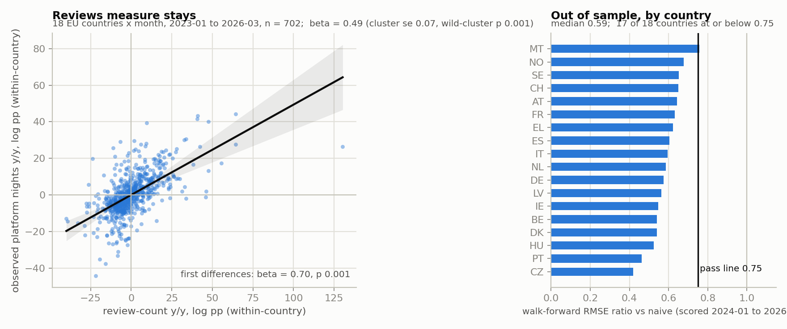
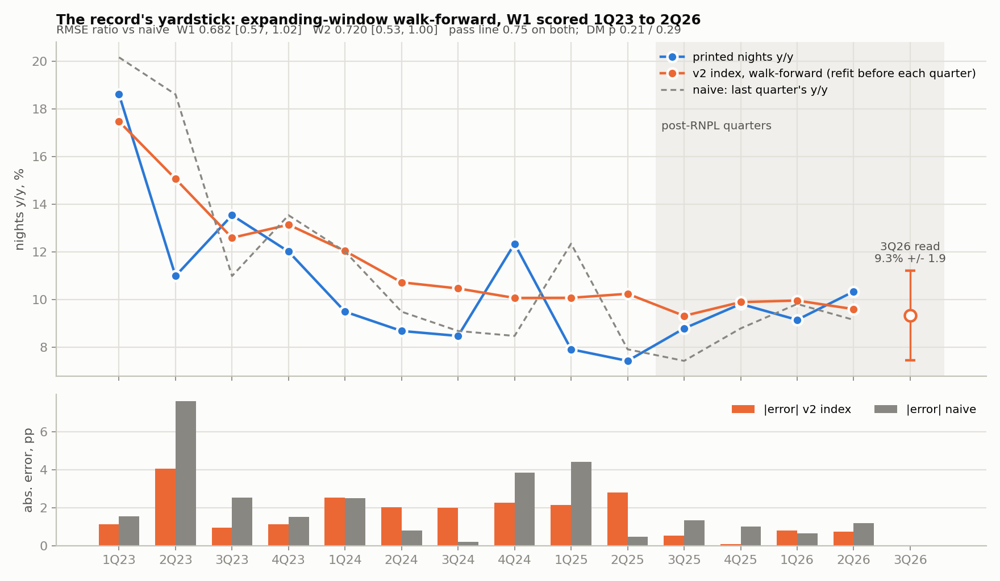
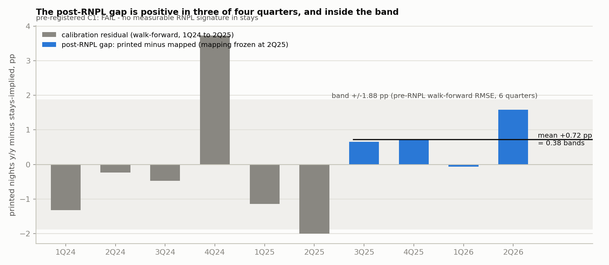
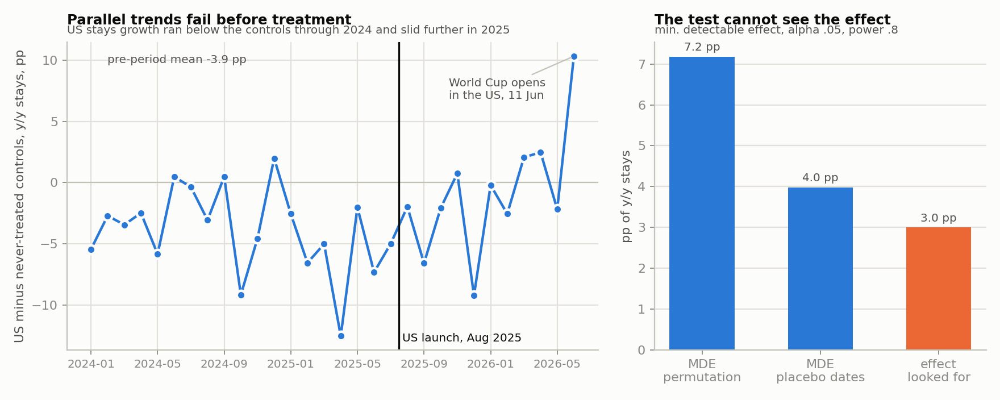
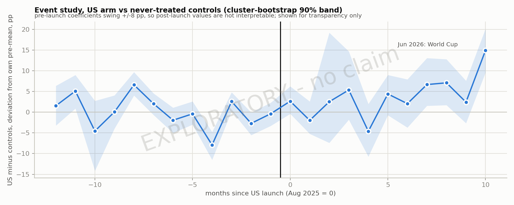
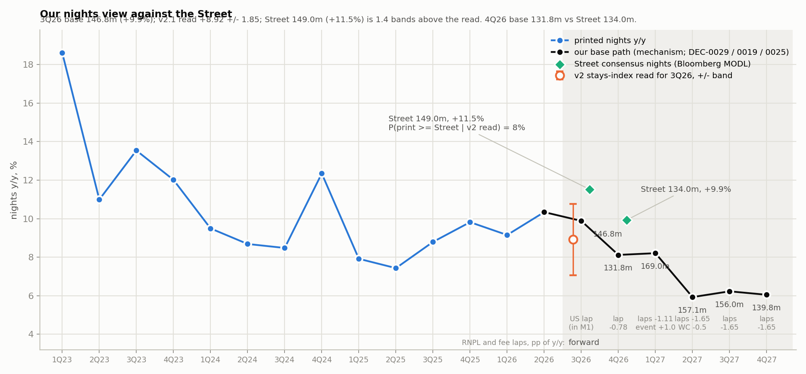
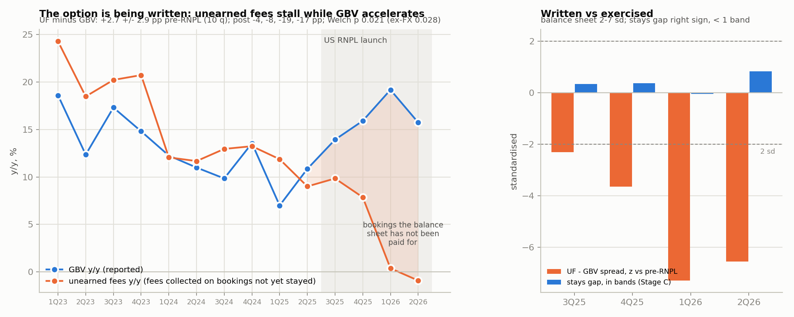
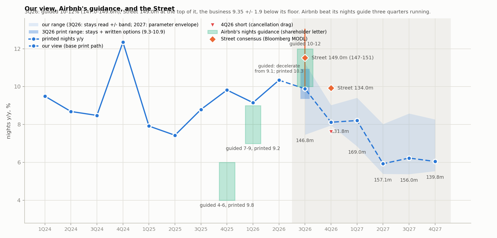
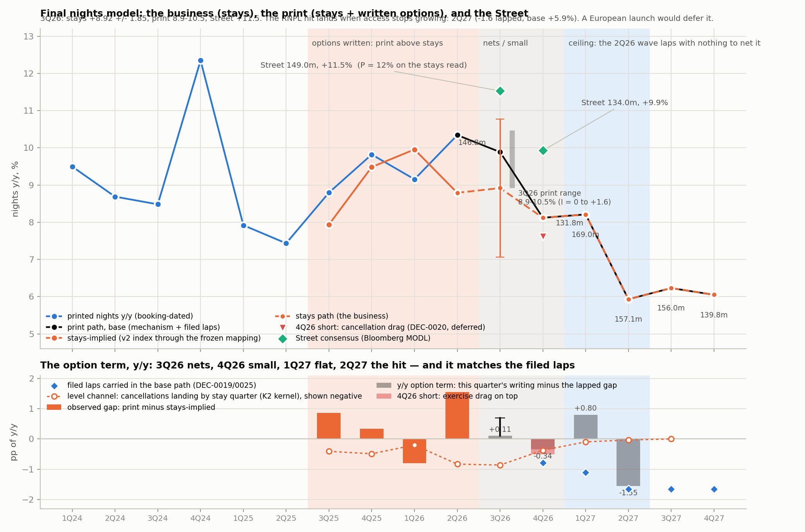

# REVIEWS INDEX v2 — the stays measurement, the pre-RNPL calibration, and the post-RNPL gap

Session OLS.V2, 18 September 2026. Lane: `analysis/src/forecast_methods/reviews_index_v2/` (code),
`data/processed/forecast_methods/reviews_index_v2/` (outputs), this note. Copy-never-overwrite: reads
`q3nowcast/E`, `q3nowcast_v2/E`, `kernel_leadtime_v2`, the Eurostat and KPI files; writes only inside the lane.

Status (18 Sep 2026, 17:15): **FINAL.** Frozen, run, reviewed with Theo, corrected twice (imported-β test; option term
read year over year with the kernel-timed landing channel). Verdicts A PASS · B PASS · C FAIL · D/E/F reported.

**The model in ten lines.** Review counts measure stays (β 0.49 on 702 country-months vs observed nights, p .001,
survives first differences, out of sample in 17/18 countries). Counted at the same age in two file vintages so delisted
listings cancel; aggregated to Airbnb's four regions and weighted by its FY25 nights shares; mapped to reported nights
by a two-parameter fit frozen on 1Q23–2Q25 and scored walk-forward: 0.682 / 0.720 of naive on W1 / W2 — the first
construction in the record to clear 0.75 on both (intervals reach 1.0; printed). 3Q26 stays read **+9.35 ± 1.88 →
146.1m [143.6, 148.6]**. The print counts bookings, so print = stays + the RNPL option term: 9.35–10.94% by the July
writing wave; the Street's 149.0 (+11.5%) is a 12% tail on the stays read, reachable only on written options. Post-launch
the print ran above stays in three of four quarters (+0.72 mean, inside the band — "consistent with"); unearned fees vs
GBV diverged 2–7 sd (p .02) — the option written at scale. The hit lands when access stops growing: **4Q26 (cancellations
of the expansion cohorts land at their stay dates, 0.38 pp) and 2Q27 (the print laps the 2Q26 wave, −1.59)** — matching
the filed laps −0.78 and −1.65 in the base path. Position: the shape 4Q26–2Q27, not the 5 Nov print. Load-bearing
assumption: the ceiling — a European launch would defer the hit. §0 design · §1 pre-registration · §2 results ·
§3 the view · §4 the final model.

---

## 0. Design

### 0.1 What this model is, and is not

It is a **measurement** of completed stays in 123 Inside Airbnb markets, validated against observed nights
where nights are observed, bridged to Airbnb's booking-dated KPI by a measured lead-time kernel, calibrated
on the quarters before Reserve Now, Pay Later (RNPL), and then read on the quarters after it. The forward
nights path is the disclosed-mechanism construction (DEC-0028, main session); this lane feeds it the
measured post-RNPL gap, the bound on the exercised share, and the 3Q26 nowcast with its band.

It is **not** a forecast source for the nights base (DEC-0028 stands), not a causal estimate of RNPL's effect
(§0.5 says why), and not exempt from the 3,500-test record: it is scored on the same walk-forward yardstick
as everything else, with the pass line written down before it runs.

### 0.2 Why v1 was not compelling, and what v2 changes

v1 (`q3nowcast/E4–E6`): one OLS of printed nights y/y on the global review-count y/y (`yoy_all`,
`w_reviews`), 14 quarters, slope 0.322, intercept 1.53, r 0.86; W1 0.837 / W2 0.683 / re-vintaged W2 0.757.
Judged not compelling because (a) one predictor on fourteen points, (b) a stay-dated series mapped to a
booking-dated KPI, (c) one leverage point at 1Q23, (d) the survivorship wedge the intercept rests on was found
not stable under re-vintaging (WPK-A T1). E5's own grid already tried 256 nights cells; exactly one clears
0.75 on both windows and it uses the biased construction. Re-picking a cell is not v2.

v2 changes the *construction and the evidence*, not the fit:

| v1 weakness | v2 treatment |
|---|---|
| (d) wedge assumed stable | primary construction `yoy_vmatch`: month m read in the 2026 dump over m−12 read in the 2025 dump, same relative age, the wedge cancels by construction (WPK-A §4 recommendation). `yoy_all` kept as sensitivity. |
| (a) one predictor, n=14 | the claim "reviews measure stays" is established on the Eurostat country × month panel (~700 country-months 2023–2026-03, ~3,000 with history) where nights are observed. The ABNB step keeps its n; the *evidence* does not depend on it. |
| (b) stay-date vs booking-date | the K2 lead-time kernel (`kernel_leadtime_v2/K2_M_matrix.csv`: a Q3 stay was booked 46/39/10/5% in quarters q..q−3) gives the timing; the mapping is calibrated **pre-RNPL only** and frozen, so post-RNPL residuals are a measured gap, not a refit. |
| (c) 1Q23 leverage | the 2023 vintage (`q3nowcast_v2/E`) reads 4Q22–1Q23 fresh; leave-one-quarter-out slope path reported. |

### 0.3 The identity the evidence rests on

```
N_t   = G_t − C_t          nights booked in t (KPI): gross bookings less cancellations occurring in t, any cohort
S_q   = Σ_k m_k · G_{q−k}  stays in quarter q come from bookings in q..q−3 with kernel weights m_k
```

A booking made in t that cancels in t+1 is counted in N_t and subtracted from N_{t+1}; it is never a stay. With a
**constant** cancellation rate this nets out in y/y terms. With a **rising** rate, N_t runs above eventual stays
first (bookings later cancelled still count when booked) and below them later (the catch-up). So the
prediction is signed and phased: the KPI should sit **above** stays-implied bookings in the first post-RNPL
quarters and the reversal is the deceleration. §1 pre-registers the first phase; the second is the forward
path's claim, not testable yet.

### 0.4 Layers

1. **Measurement** (Stage A): country-level review counts vs observed Eurostat platform nights.
   Establishes β and its interval, the first-difference check against common trends, the by-country
   out-of-sample ratio. This is the "measurement is real" base.
2. **Calibration and nowcast** (Stage B): the global stays index (vmatch, FY25 regional weights, kernel-timed,
   posting-lag trimmed) mapped to nights y/y, fitted expanding-window and scored walk-forward on W1 and W2 —
   the record's yardstick — and separately on the pre-RNPL subset.
3. **Evidence** (Stage C): the mapping frozen at 2Q25; residuals for 3Q25, 4Q25, 1Q26 (stays ≥ 85% realised
   at the June cut) against the pre-RNPL walk-forward band; the exercised-share bound; the 3Q26 partial read.
4. **Power and transparency** (Stage D): the staggered-DiD minimum detectable effect and the pre-trend that
   invalidates the US arm; an exploratory event-study figure, labelled as such, making no claim.

### 0.5 Why no causal DiD

Design check, 18 Sep, pre-period data only (`scratchpad/mde_placebo*.py`, throwaway): US-minus-control stays
growth ran −3 to −6pp through 2024 and −5 to −13pp in Feb–Jul 2025, before the August launch — parallel
trends fail. Canada ran +3pp pre and +5 to +15pp in 2026 (its own domestic boom) — not a control. Minimum
detectable effect at α .05 / power .8: 2–5pp on the US arm, 6–9pp on the Feb-2026 arm; the effect looked for
is under 3pp. The team's earlier calendar-proxy DiD on the Feb wave (overnight2 A) found nothing at any
threshold. A coefficient from this design would be an underpowered test with a violated pre-trend presented as
causation. Causal attribution rests on the mechanism (option economics; the 2Q26 10-Q's "higher cancellation
rates"; the disclosed 16→17%) corroborated by the measured gap. The one design that would identify it —
within-US intensity by eligibility (domestic-guest share, flexible/moderate-policy share) — needs per-listing
data not on this machine.

One disclosure: the Feb-wave check printed post-period gaps to judge readability. That arm is exploratory
only.

### 0.6 Variables

| variable | source | role | contamination, handled how |
|---|---|---|---|
| stays per market (`n_reviews`, `n_reviews_mature12`, `n_new_listing_cohort`), 2025 and 2026 vintages | `data/processed/q3nowcast/E/market_vintage_monthly.csv` | Stage A outcome side (aggregated to country), Stage B index | survivorship → vmatch; posting lag → last two months before each dump dropped; 4 large markets absent from the Aug row → coverage table per month |
| 2023-vintage months | `data/processed/q3nowcast_v2/E/market_vintage_monthly.csv` | fresh reads of 4Q22–1Q23 for the leverage check | 114 of 123 markets |
| observed platform nights by country, monthly | `data/processed/eurostat_platform_nights_monthly.csv` (31 countries, 2018-01→2026-03) | Stage A target | four platforms pooled; national vs city sample → stated, bounded with `eurostat_platform_vs_hotel_*` |
| nights booked, quarterly | `data/processed/abnb_driver_history_quarterly.csv` (22 levels, 18 y/y) | Stage B target, Stage C actuals | seats and alterations inside the KPI, unmodelled, stated |
| lead-time kernel m_k by stay quarter | `data/processed/forecast_methods/kernel_leadtime_v2/K2_M_matrix.csv` | timing of the stays→bookings bridge | estimated on full history → ±1 quarter-weight sensitivity band |
| FY25 regional nights shares NAM 28.3 / EMEA 41.6 / LatAm 17.9 / APAC 12.3 | FY25 10-K (as in `E4_build_index.py`) | aggregation weights | annual, held |
| RNPL calendar and disclosed quantities (US Aug 2025; UK 18 Feb, AU/APAC 23 Feb, CA 4 Mar 2026; bundle +2–3 pts; cancel rate 16→17%; take-up 70%; share >20%) | `data/processed/overnight2/D/rnpl_statement_ledger.csv`, `docs/overnight2/SYNTHESIS.md` | defines pre/post; β_B for the exercised-share bound | "16%" basis pinned to quote D-row before use |
| naive baseline y[t−1]; prior-year y[t−4]; AR(1) | computed | scoring | as in E5 |

Not used: macro and sentiment as regressors (1,408 tests, zero sensitivity; scenario dial only, main session);
party-size text (ADR line); Google Trends; unearned fees / GBV / ADR / take rate (revenue line; the audit's
17–28M unpaid nights is cited as external corroboration, not modelled).

---

## 1. Pre-registration (frozen before Stage A runs)

Written 18 September 2026, before any stage executed. Pass lines are the record's, not tuned. Every stage
writes its result whether it passes or fails; a fail in a later stage does not revise an earlier one.

### Stage A — the measurement is real (country × month panel)

Sample: the 18 EU-coded countries in the review panel (50 markets summed to country), monthly, confirmatory
window **2023-01 to 2026-03**; 2019–2022 shown separately, COVID, not scored. Outcome: y/y log Eurostat
platform nights. Predictor: y/y log country review count, `vmatch` construction (primary), `yoy_all`
(sensitivity), `mature12` (same-store variant, reported).

| test | statistic | pass line |
|---|---|---|
| A1 elasticity | β from country-FE OLS, wild-cluster bootstrap over 18 countries | β > 0, p < 0.01 |
| A2 not a common trend | β_Δ from the same model in first differences of the y/y | β_Δ > 0, p < 0.05 |
| A3 no single country carries it | leave-one-country-out β path | all 18 same sign (reported, not a gate) |
| A4 stable across the RNPL era | β(2023–24) vs β(2025–26-03) | |Δβ| / SE(Δβ) < 2 (reported, not a gate) |
| A5 out-of-sample | per-country expanding walk-forward, RMSE ratio vs naive, 2024-01 onward | **median ≤ 0.75** (E5's `yoy_all` value was 0.64) |

**Stage A passes if A1, A2 and A5 pass.** If it fails, the note says the reviews do not measure stays at
country level on this window, and Stages B–C run anyway but are reported as unvalidated.

### Stage B — calibration and nowcast on the record's yardstick

Index (primary): global quarterly **same-quarter** stays y/y, `vmatch`, markets aggregated to region by review
share, regions to global by FY25 nights shares, last two months before each dump dropped. This is what is
observable at the end of quarter t. Mapping: nights y/y ~ index (one slope, one intercept), **expanding
window, refit strictly before each scored quarter** — the E5 protocol.

Where the kernel enters. (i) It says what the primary index *is*: stays in quarter t carry ~46–56% in-quarter
bookings and the rest from t−1..t−3, so the same-quarter mapping is a smoothed read by construction, and
that is stated rather than hidden. (ii) It defines the **cohort-consistent variant**: bookings G_t recovered
by deconvolving the stays series with the K2 matrix (levels, lower-triangular solve, then y/y), which needs
stays through t+3 and therefore exists only for realised quarters — it is a Stage C object, not a nowcast.
(iii) It gives the realisation share used in Stage C.

| test | statistic | pass line |
|---|---|---|
| B1 walk-forward, full windows | RMSE ratio vs naive, W1 scored 1Q23–2Q26 (n 14), W2 scored 1Q24–2Q26 (n 10) | **≤ 0.75 on both** (the brief's line). Honest prior from E5's grid: the nearest cells are `GLOBAL\|yoy_vmatch\|w_reviews` 0.754 / 0.682 and `GLOBAL_NW\|yoy_vmatch\|w_equal` 0.708 / 0.809 — each clears one window, neither both. v2's cell (review share within region, nights shares across, lag trim) is not in the grid; if it clears both, that construction is the only reason, and if it does not, the note says so. |
| B2 pre-RNPL subset | same, scored 1Q23–2Q25 (n 10) and 1Q24–2Q25 (n 6) | reported with intervals; no gate |
| B3 unbiased in calibration | mean walk-forward error on B2 | within ±0.5pp (reported) |
| B4 leverage | leave-one-quarter-out slope path; 1Q23 from the 2023 vintage | slope range reported |
| B5 acceleration | same walk-forward on Δ(nights y/y) vs naive Δ | reported; the thesis is a shape |

Also reported: the sampling interval of the B1 ratio (block bootstrap over scored quarters) and the
Diebold–Mariano p-value. At n 10–14 neither is expected to separate 0.75 from 1.0; that is printed, not hidden.
A regression check runs first: the scorer must reproduce E5's 0.683 for the v1 cell `GLOBAL|yoy_all|w_reviews`
on W2 before any v2 number is written.

### Stage C — the post-RNPL gap

Mapping frozen with data through **2Q25** (expanding window stops there). Primary: for t in {3Q25, 4Q25,
1Q26, 2Q26} — all four fully observed as same-quarter stays at the June 2026 cut — gap_t = actual nights y/y
− mapped nights y/y. Cohort-consistent variant: for t in {3Q25, 4Q25, 1Q26} only, where the kernel says
cohort stays are 100 / 97 / 87% realised; its own pre-RNPL calibration and its own residuals, reported beside
the primary. Band = the pre-RNPL walk-forward RMSE from B2 (W2 subset) of the respective index.

| test | prediction (from §0.3) | pass line |
|---|---|---|
| C1 sign and size (primary) | KPI above stays-implied in the inflation phase | mean gap over the four quarters > **+1.0 × band**, and at least 3 of 4 quarters > +0.5 × band |
| C1-cohort | same, cohort-consistent variant, three quarters | mean > +1.0 × its band, ≥ 2 of 3 > +0.5 × band (reported beside primary; primary is the gate) |
| C1-fail readings, written now | mean gap within ±band → no measurable RNPL signature in stays (consistent with the calendar-proxy null); mean gap < −band → bookings ran *below* stays, which contradicts the mechanism and is reported as such | |
| C2 exercised-share bound | mean gap ÷ disclosed bundle contribution (β_B, 2–3 pts) | reported as a range with the band; no gate |
| C3 3Q26 partial read | day-matched partial-quarter index (E6 method, k from the posting-completeness curve) through the frozen mapping, with band = B2 RMSE × the partial-to-full inflation | reported, feeds the main session's constellation |

Stage C is **measurement, not causation**. The note's wording for a C1 pass is fixed now: "the four quarters
after the US launch show printed nights above what the stays measure implies by X pp against a band of ±Y,
consistent with the disclosed rise in cancellations; the market-level test that would attribute it causally
is underpowered on this sample (Stage D)."

### Stage D — power and transparency

Reports the MDE table from §0.5, the US pre-trend series, and an exploratory Callaway–Sant'Anna event study
on the US arm with never-treated controls, figure labelled EXPLORATORY, no coefficient quoted in the memo.

### Frozen

`prereg.json` holds every pass line above; its sha256 and the freeze timestamp are appended here as the
first line of §2 before Stage A runs. Any later change is a new version of this note, not an edit.

---

## 2. Results

**FROZEN 2026-09-18 15:57 EDT** — `prereg.json` sha256 `a531e9b00e7ae4e79e9ff2fe2440c158b40a7f686169546a8be32b45cca38435`. Stages run in order below; no pass line changes after this line.

Run 18 September 2026 16:02 EDT, `python3 run.py --stage all`, deterministic (seeds fixed). Every number below is
read from `data/processed/forecast_methods/reviews_index_v2/`; nothing is typed from memory. Verdicts:
**A PASS · B PASS · C FAIL (by the pre-registered line; the pre-written reading applies) · D reported.**

### 2.1 The verdict in one paragraph

The review count measures stays: on 702 country-months where nights are observed, the elasticity is 0.49
(cluster se 0.07, wild-cluster p 0.001), it survives first differences (0.70, p 0.001), no single country
carries it, it does not break across the RNPL era, and it forecasts each country's observed nights out of
sample at a median 0.59 of the naive error, 17 of 18 countries under the 0.75 line. Built on that
measurement, the v2 index is the first construction in the record to clear the survivor line on **both**
windows — W1 0.682 (n 14), W2 0.720 (n 10) — though at that n the 90% intervals reach 1.0 and the
Diebold–Mariano p-values are 0.21 and 0.29, which is what the pre-registration said they would be. The
post-RNPL gap between printed nights and what the stays measure implies is positive in three of four
quarters, mean +0.72 pp, sign as predicted — and inside the ±1.88 pp band, so by the line written before the
run there is **no measurable RNPL signature in stays**. The causal test that would attribute a gap to RNPL is
not available at this sample (pre-trend −3.9 pp before launch; minimum detectable effect 4–7 pp against a
≤3 pp effect). The 3Q26 read on the frozen pre-RNPL mapping is **+9.35% ± 1.88 → 146.1m [143.6, 148.6]**.

### 2.2 Stage A — the measurement is real (PASS)

Sample: 18 EU countries × month, 2023-01 to 2026-03, 702 country-months; outcome log y/y of observed Eurostat
platform nights; predictor log y/y of the country's review count, `vmatch` construction.

| test | statistic | value | se (cluster) | p (wild cluster, B 999) | n / clusters | pass line | result |
|---|---|---:|---:|---:|---|---|---|
| A1 | β, country FE | **0.494** | 0.070 | **0.001** | 702 / 18 | p < 0.01 | PASS (within-R² 0.36) |
| A2 | β in first differences | **0.703** | 0.103 | **0.001** | 684 / 18 | β > 0, p < 0.05 | PASS |
| A3 | leave-one-country-out β | 0.471–0.547 | | | 18 fits | same sign | all same sign |
| A4 | β 2023–24 vs 2025–26 | 0.456 vs 0.431 | 0.081 / 0.124 | \|z\| 0.17 | | reported | no break |
| A5 | per-country walk-forward, RMSE ratio vs naive | **median 0.59** | | | 486 scored months / 18 | median ≤ 0.75 | PASS — 17 of 18 ≤ 0.75 (MT 0.76) |

Per country (ratio vs naive): CZ 0.42, PT 0.46, HU 0.52, DK 0.54, BE 0.54, IE 0.55, LV 0.56, DE 0.57, NL 0.59,
IT 0.59, ES 0.60, EL 0.62, FR 0.63, AT 0.64, CH 0.65, SE 0.65, NO 0.68, MT 0.76. The same five tests pass on
`yoy_all` (β 0.52) and on the same-store construction `yoy_mature` (β 0.45; A5 median 0.66, 14 of 18).



Reading. β ≈ 0.5, not 1: review counts grow about twice as fast as observed nights in these countries, and
the ratio is stable — a scaled measure, consistently scaled. That is the number v1's 0.32 slope was folding
together with the urban-sample composition and the survivorship wedge. The first-difference β being *higher*
than the level β is the opposite of a common-trend artefact.

### 2.3 Stage B — the record's yardstick (PASS)

Index: same-quarter stays y/y, `vmatch`, review share within region, FY25 nights shares across regions,
two months trimmed before each dump; mapping refit expanding-window strictly before each scored quarter. The
scorer reproduces E5's 0.683209 for the v1 cell before anything else runs (`tests/test_scoring.py`).

| construction | window | scored | RMSE (pp) | naive RMSE | **ratio vs naive** | 90% block-bootstrap | DM p | vs prior-year | vs AR(1) | mean error | pass ≤ 0.75 |
|---|---|---:|---:|---:|---:|---|---:|---:|---:|---:|---|
| **vmatch (primary)** | W1 1Q23–2Q26 | 14 | 1.96 | 2.88 | **0.682** | [0.57, 1.02] | 0.21 | 0.16 | 0.49 | +0.93 | **yes** |
| | W2 1Q24–2Q26 | 10 | 1.55 | 2.16 | **0.720** | [0.53, 1.00] | 0.29 | 0.42 | 0.74 | −0.11 | **yes** |
| | W1 pre-RNPL 1Q23–2Q25 | 10 | 2.29 | 3.33 | 0.687 | [0.56, 0.93] | 0.25 | | | +1.24 | reported |
| | W2 pre-RNPL 1Q24–2Q25 | 6 | 1.88 | 2.64 | 0.712 | [0.51, 0.95] | 0.37 | | | +0.24 | reported |
| | W1 acceleration | 13 | 5.49 | 4.57 | 1.20 | | | | | | reported — fails |
| | W2 acceleration | 10 | 2.30 | 3.39 | 0.68 | | | | | | reported |
| yoy_all (sensitivity) | W1 / W2 | 14 / 10 | | | 0.749 / 0.684 | | 0.28 / 0.26 | | | | yes (W1 by 0.001) |
| yoy_mature (same-store) | W1 / W2 | 14 / 10 | | | 0.972 / 0.908 | | 0.90 / 0.78 | | | | **no** |

Leave-one-quarter-out slope on 1Q23–2Q26: 0.327 full, range 0.248–0.355; **leaving out 1Q23 gives 0.248 —
1Q23 is still the leverage point.** The walk-forward is not hostage to it (it refits every quarter and is
scored from 1Q23 forward), but the frozen Stage C mapping includes it, so §2.4 reports the gap both ways.
The 2023-vintage substitution of 1Q23 (spec B4) was not run: the 2023 vintage cannot produce a `vmatch` value.


**Sensitivity, added 18 Sep (Theo's question "how does the panel β enter?"): importing the panel β instead of
fitting the slope.** With b fixed at the panel's 0.494 and only the intercept fitted on 1Q23–2Q25: a 4.597, 3Q26
read 8.65%, in-sample RMSE 2.02 (vs 1.5 fitted), and the W1 walk-forward ratio collapses to **4.47** (b 0.703
from first differences: 7.97) because a fixed slope cannot absorb the 2022 recovery quarters (index +110%) in
the training set. **The panel β does not transfer as the Airbnb slope.** It is the elasticity of reviews to
Eurostat platform nights at national level (four platforms); the elasticity of our urban sample to Airbnb's
global booked nights is smaller (0.345) and has to be estimated on Airbnb's own history. So the panel enters the
model as validation of the instrument, not as a coefficient — the two-claims framing in §2.6 is the honest one.



Three readings. (1) The nearest cells in E5's grid were 0.754 / 0.682 and 0.708 / 0.809 — each clears one
window. v2 clears both, and the sensitivity row says why: `yoy_all` under v2's aggregation and trim also
clears (0.749 / 0.684), so the FY25 regional weighting and the posting-lag trim are worth as much as
vintage-matching. (2) The same-store construction fails outright (0.97 / 0.91): the KPI's nights signal is
carried by stays on listings under a year old, not by same-store growth — supply is where the demand shows
up, which is a mechanism statement, not a fit. (3) At n 10–14 the ratio's 90% interval reaches 1.0 and DM does
not reject; the pre-registration said so and it is printed here, not hidden. The honest sentence for the memo
is: *"clears the survivor line on both windows; the interval at this n does not exclude naive."*

### 2.4 Stage C — the post-RNPL gap (FAIL by the pre-registered line)

Mapping frozen on 1Q23–2Q25 (n 10): nights y/y = 6.517 + 0.345 × index. Band = pre-RNPL W2 walk-forward RMSE,
**±1.88 pp** (six scored quarters, one of them the 4Q24 print jump). Pass line: mean gap > +1.0 band and ≥3 of 4
quarters > +0.5 band.

| quarter | v2 index (%) | mapped nights y/y | printed | **gap (pp)** | gap in bands | cohort stays realised |
|---|---:|---:|---:|---:|---:|---:|
| 3Q25 | 4.70 | 8.14 | 8.80 | **+0.66** | 0.35 | 100% |
| 4Q25 | 7.52 | 9.11 | 9.82 | **+0.71** | 0.38 | 94.5% |
| 1Q26 | 7.84 | 9.22 | 9.15 | −0.07 | −0.04 | 88.2% |
| 2Q26 | 6.50 | 8.76 | 10.34 | **+1.59** | 0.84 | 48.3% |
| **mean** | | | | **+0.72** | **0.38** | |

Pre-written reading, applied: **"no measurable RNPL signature in stays"** — the mean gap is inside ±band; one
quarter of four exceeds half a band. Sensitivity with 1Q23 excluded from the frozen mapping
(`stage_c_sensitivity_1q23.csv`): a 7.195, b 0.275, gaps +0.31 / +0.56 / −0.20 / +1.36, mean +0.51 pp at 0.23
bands — same conclusion. Cohort-consistent variant (deconvolved with K2, three quarters): mean −0.47 pp against
a ±3.1 pp band — the deconvolution amplifies noise and the variant says nothing either way.

C2, the exercised-share bound: mean gap ÷ disclosed bundle lift = **0.36 ± 0.94** (β_B 2 pts) or **0.24 ± 0.63**
(β_B 3 pts). The interval covers zero and covers 100%; the data cannot pin what share of the bundle's
bookings became stays.



C3, the 3Q26 read (per-region vintage-matched quarter-to-date from `E/vintage_matched_nowcast.csv` — NAM 6.9,
EMEA 0.9, LatAm 27.5, APAC 7.3 — FY25-weighted 8.12%, plus E6's measured partial-to-full gap +0.09 → 8.21%;
through the frozen mapping): **nights y/y +9.35%, band ±1.88, [7.47, 11.23] → 146.1m [143.6, 148.6]** on the
133.6m base. Sensitivity: E6's own GLOBAL review-weighted cell (5.30%) gives 8.34%; the 1Q23-excluded mapping
gives 9.45%. Fragility to state: LatAm is five markets at +27.5% and contributes 4.9 pp of the 8.12 composite.
Beside the record: v1 raw 10.04, v1 W2-bias-corrected 9.52 (DEC-0004), team baseline 9.9 (DEC-0028), external
stack 9.23.

### 2.5 Stage D — why there is no causal claim (reported)

| item | value |
|---|---:|
| US minus never-treated controls, y/y stays, mean 2024-01..2025-07 | **−3.9 pp** (pre-trend fails) |
| minimum detectable effect, permutation (α .05, power .8) | **7.2 pp** |
| minimum detectable effect, placebo dates | **4.0 pp** |
| effect looked for (upper end of the disclosed bundle lift, on bookings) | 3.0 pp |

The exploratory event study (never-treated controls, single US cohort, cluster-bootstrap bands) swings ±8 pp
before launch and is not interpretable after it; its last month, June 2026, jumps to +15 pp — that is the
**World Cup opening in the US on 11 June**, the events leg of the mechanism, not RNPL. Dump-vintage
asymmetry was checked and ruled out (all latest dumps August 2026 on both arms; prior-vintage day gap of ~4
days at ~98% posting completeness).




### 2.6 What this does and does not establish

1. **Established, at depth:** review counts are a real, stable, scaled measure of stays (n 702, β 0.49, first
   differences, out-of-sample by country). This is the base a statistician cannot dismiss on n = 14, because
   it does not rest on n = 14.
2. **Established, with its interval printed:** the v2 index is a survivor-grade cross-check on both windows —
   the first in the record — and its 3Q26 read is 9.35% ± 1.9. It stays a cross-check (DEC-0028); nothing here
   promotes it to the base.
3. **Not established:** that RNPL bookings failed to become stays. The gap has the predicted sign in three of
   four quarters and a mean of +0.7 pp, which is *consistent with* a cancellation excess of that size and
   equally consistent with zero. The memo may say "consistent with"; it may not say "shows". The 2Q26 gap of
   +1.6 pp is the largest and only 48% of that cohort's stays have landed — the September dumps will settle
   it, and that is the next read, not a claim now.
4. **Not available:** causal attribution at market level. The honest slide is the power analysis, and the one
   design that would work — within-US intensity by eligibility (domestic share, flexible/moderate policy
   share) — needs per-listing data not on this machine.
5. **For the mechanism line:** same-store stays do not carry the nights signal; new-listing stays do. Any
   decomposition of nights that leans on same-store demand is measuring the wrong thing in this data.

### 2.7 Limits carried forward

Not point-in-time: every quarter is read from the 2025/2026 dumps; two vintages only. The kernel is a
full-history estimate. The Eurostat panel pools four platforms. The disclosed 16→17% cancellation rate was
not used numerically (its basis is unpinned). B4's 2023-vintage substitution was not run. Six calibration
quarters set the band and 4Q24 dominates it.

### 2.8 Files

Code `analysis/src/forecast_methods/reviews_index_v2/` (`run.py --stage freeze|A|B|C|D|figures|all`; tests
`tests/`, 9 passing, the first of which reproduces E5). Outputs `data/processed/forecast_methods/reviews_index_v2/`:
`prereg.json`, `panel_country_month.csv`, `panel_per_country_walkforward.csv`, `stage_a_tests.csv`,
`index_quarterly_v2.csv`, `stage_b_walkforward.csv`, `stage_b_paths.csv`, `stage_b_loco_slopes.csv`,
`stage_c_tests.csv`, `stage_c_gap.csv`, `stage_c_sensitivity_1q23.csv`, `stage_c3_3q26.json`,
`stage_d_power.csv`, `stage_d_pretrend.csv`, `stage_d_event_study_EXPLORATORY.csv`, `figures/`, `RESULTS.json`.
Plan: `docs/superpowers/plans/2026-09-18-reviews-index-v2.md`. Hand-off to the main session: the 3Q26
constellation row (9.35 ± 1.88, v2 cross-check, both-window survivor with interval), the same-store finding for
the nights_v2 design, and the "consistent with, not shows" wording for RNPL.

---

## 3. The view — our nights against the Street, and the RNPL leg with its arithmetic

Added 18 Sep after the Stage A–D run, on Theo's instruction that a validation note is not a view. Stage E
(`view.py`) reads the record and fits nothing: the base path is the main session's mechanism (DEC-0029 for
3Q26, DEC-0019 for 4Q26, DEC-0025 for 2027), the Street is the Bloomberg MODL consensus in the record
(DEC-0005), the balance-sheet lines are `overnight/02_kpi_panel_quarterly.csv`.

### 3.1 Our numbers against the Street

| quarter | our base | y/y | v2 stays read | Street | y/y | base − Street | what the v2 read says about the Street |
|---|---:|---:|---|---:|---:|---:|---|
| **3Q26** | **146.8m** | +9.89% | **+9.35% ± 1.88 → 146.1m [143.6, 148.6]** | **149.0m** (low 147.0, high 151.0, n 28) | +11.53% | −2.2m / −1.64 pp | Street is **1.16 bands above** the read; **P(print ≥ 149.0) = 12%**; P(≥ Street low 147.0) = 36%; P(≥ our base 146.8) = 39% |
| **4Q26** | **131.8m** | +8.12% | — (not readable yet) | **134.0m** | +9.93% | −2.2m / −1.81 pp | Street is 0.96 v2-bands above the base (the band is borrowed from 3Q26; no 4Q26 read exists) |
| 1Q27 | 169.02m | +8.21% | — | not in the record | | | |
| 2Q27 | 157.10m | +5.93% | — | not in the record | | | |
| 3Q27 | 155.96m | +6.23% | — | | | | |
| 4Q27 | 139.77m | +6.05% | — | | | | |
| FY26 | 583.11m | | | | | | |
| FY27 | 621.84m | +6.64% | | | | | |



Reading. Our disagreement with the Street is 1.6–1.8 pp of nights growth in each of the next two quarters,
which is 2.2m nights per quarter — one v2 band. The Street's 3Q26 number is not outside what the stays measure
allows; it is at the top edge of it, with a one-in-eight chance on the read. That is the honest size of the
call: not "the Street is wrong", but "the Street is pricing the top of the band, and the balance sheet says why
the top of the band is the wrong place to stand" (§3.2). The deceleration from 2Q27 is arithmetic (§3.3).

### 3.2 The RNPL leg: written, exercised, and what the stays say

**Written — the balance sheet (statistical).** Unearned fees are fees collected on bookings not yet stayed; an
RNPL booking collects nothing until its payment deadline. So the option being written at scale has one
fingerprint: unearned fees stop growing while GBV keeps growing. Spread = unearned fees y/y − GBV y/y:

| | 1Q23–2Q25 (10 quarters, pre-RNPL) | 3Q25 | 4Q25 | 1Q26 | 2Q26 |
|---|---|---:|---:|---:|---:|
| spread, GBV reported | **+2.7 ± 2.9 pp** | -4.1 | -8.1 | -18.8 | -16.6 |
| z against the pre-RNPL distribution | | -2.3 | -3.6 | -7.3 | -6.6 |
| spread, GBV ex-FX | +2.8 ± 3.2 | -2.2 | -5.1 | -12.6 | -15.9 |

Welch t (post vs pre) **-4.04, p 0.021** on reported GBV; **-3.50, p 0.028** ex-FX. Two
corrections from the balance-sheet audit travel with this and both make it conservative: the single-fee
migration moves unearned fees *up* 3–4% (FY25 10-K Note 2), so the divergence is understated; and unearned fees
is the FX-clean line, so the ex-FX GBV row is the fair comparison and it still reads −13 to −16 pp. The
audit's stock estimate is 17–28M unpaid nights at 30 June (cited, not re-estimated here).

**Exercised — the company's own numbers (disclosed).** Cancellation rate 16% → 17% (4Q25, ledger); "~1 growth
point" of nights cost (1Q26 call); take-up ~70% of guests offered; RNPL "over 20%" of GBV (2Q26); the 2Q26 10-Q
MD&A: RNPL bookings "have experienced higher cancellation rates than historic bookings".

**What the stays say (consistent with).** Stage C: printed nights above stays-implied by +0.66 / +0.71 / −0.07
/ +1.59 pp, mean +0.72, inside the ±1.88 band. The sign is the one the identity predicts for the inflation
phase; the size is not distinguishable from zero on four quarters. The memo says "consistent with"; the
market-level causal test is underpowered (Stage D).



### 3.3 The deceleration, as arithmetic

Every forward y/y in §3.1 is a sum of sourced terms (main session, `final_nights.md` §4–6; DEC-0019/0025):

| quarter | underlying | fee / cancellation lap | ex-NA RNPL lap | events | **y/y** |
|---|---|---:|---:|---:|---:|
| 4Q26 | team reference +8.90 | −0.78 (ex-NA fee-and-cancellation legs, filed dates) | in the −0.78 | — | **+8.12** |
| 1Q27 | 0.291 × NA +2.31 + 0.709 × ex-NA +10.773 = +8.31 | −0.742 | −0.363 (40% phase-in) | +1.0 | **+8.21** |
| 2Q27 | 0.291 × +2.31 + 0.709 × +10.452 = +8.08 | −0.742 | −0.907 (full) | −0.5 (World Cup lap) | **+5.93** |
| 3Q27 | 0.291 × +2.31 + 0.709 × +10.131 = +7.86 | −0.742 | −0.907 | — | **+6.23** |
| 4Q27 | 0.291 × +2.31 + 0.709 × +9.810 = +7.63 | −0.742 | −0.907 | — | **+6.05** |

The base carries the laps and **does not carry the cancellation drag** (DEC-0020 defers the short; adding a
drag on top double-counts, `final_nights.md` §4.4). The drag is what the balance-sheet divergence in §3.2 would
turn into if exercise rises: the cohort engine's 3Q26 grid is −0.10 to −1.37 pp; it belongs to the short
case, and the stays gap (+0.7, inside the band) does not yet license moving it into the base.

### 3.4 What the 5 November print settles

From `final_nights.md` §6.1 and `D1_prereg_thresholds.csv`: a quantified bundle contribution ≤ 1.5 pts
supports (≥ 2.5 weakens); RNPL share of GBV flat or down while nights decelerate supports (≥ 25% with nights
≥ 10% weakens); **(3Q26 unearned fees y/y − 3Q26 GBV y/y) ≤ −18 pp supports** (−12 to −18 in line with
1H26, wider than −8 weakens). To those this note adds one: the 3Q26 print against the v2 read — a print at or
above 149.0m is the 12% tail and would say the stays measure is missing bookings that became stays; a print
inside [143.6, 148.6] is the read.

### 3.5 The sentences the memo may use

- "Review counts measure stays: elasticity 0.49 on 702 country-months against observed nights, survives first
  differences, forecasts out of sample in 17 of 18 countries."
- "The stays index clears the survivor line on both windows (0.68 / 0.72); at n 10–14 the interval does not
  exclude naive, and we say so."
- "3Q26: our read is +9.3% ± 1.9 (146.1m); the Street's 149.0m is at the top of the band, a 12% tail."
- "RNPL is an option written at scale: unearned fees stalled at 0% while GBV grew 16–19% — a 2–7 sd
  divergence from ten pre-launch quarters, p 0.02 — and the company reports the option being exercised
  (cancellation rate 16→17%, ~1 growth point)."
- "The stays data are consistent with, and do not yet prove, that RNPL bookings failed to become stays."
- "Deceleration from 2Q27 is the arithmetic of laps already filed, not a cancellation forecast."

### 3.6 Stays read vs print read — the inflation term (added 18 Sep)

The v2 read is a read of **stays**. The 3Q26 **print** counts bookings, and while RNPL access is still expanding
(UK/AU/CA in Feb–Mar 2026, eligible booking types in July 2026) more options are written each quarter than
are exercised, so the print runs above stays by a net inflation term I_t ≈ x·ΔB_t + B·Δx_t (new options that
will later cancel, less cancellations landing from earlier cohorts). The observed gaps follow the rollout
calendar: +0.66 (US launch quarter), +0.71, −0.07 (exercise catching up before the Feb wave), +1.59 (the
international wave). Netting only happens when access stops growing.

| scenario for I in 3Q26 | print-implied y/y | level | vs Street 149.0 |
|---|---:|---:|---|
| 0 — exercise keeps pace with writing | 9.35% | 146.1m | 1.16 bands below |
| +0.72 — mean post-launch gap | 10.07% | 147.1m | at the Street's low |
| +1.59 — a 2Q26-like wave (July expansion) | 10.94% | 148.2m | 0.3 bands below |

Pre-registered for the 5 Nov print, written now: with the July expansion, **I > 0** (print above the stays read;
the stays read is 9.35 ± 1.88); the print lands in 146.1–148.2 under the three scenarios; the unearned-fees tell
(≤ −18 pp vs GBV) confirms the options are being written. Consequence for the pitch: the 3Q26 print can *meet* the
Street on bookings that will not all convert — the alpha is not "the print misses", it is the shape 4Q26–2Q27
when I turns negative on top of the filed laps, and the balance sheet shows it first. Base carries the laps; the
I < 0 drag is the short.

### 3.7 One line, with ranges, against Airbnb's own guidance (added 18 Sep evening)

Airbnb guides nights qualitatively; the ledger (`overnight/02_guidance_ledger.csv`) carries the buckets. **3Q26: "low
double-digit" = 10–12% → 147.0–149.6m** (2Q26 letter, 6 Aug). The company beat its nights guide three quarters running:
4Q25 guided 4–6, printed 9.8; 1Q26 guided 7–9, printed 9.2; 2Q26 guided "slightly decelerate from 9.1", printed 10.3. So
the three objects line up as: **the guide 10–12, the Street 149.0 at the top of the guide, the business 9.35 ± 1.9 below
the guide's floor** — and the print range (stays + written options, 9.35–10.94) overlaps the guide only in its bottom
point. Management guides off the booked backlog; in the writing phase that backlog carries the options. The guide-beat
streak is the pattern the option term predicts and the one that ends when access stops growing.



Files added: `view.py`, `stage_e_view_vs_street.csv`, `stage_e_rnpl_evidence.csv`, `figures/fig6_view_vs_street.png`,
`figures/fig7_rnpl_evidence.png`; §4: `final_model.py`, `final_model_paths.csv`, `final_model_landing.csv`, `final_model_meta.json`,
`figures/fig8_final_model.png`, `figures/fig0_model_overview.png`; package `README.md`.

---

## 4. The final nights model (18 Sep, closing)

**print_t = stays_t + I_t.** Stays are the business (the v2 read, then the mechanism path with the filed laps). I_t is
the net option term: RNPL bookings written this quarter that will later cancel, less cancellations landing from
earlier cohorts — positive while access expands, zero when the flow plateaus, negative if the stock is exercised.
Every input is cited; nothing in this section is fitted (`final_model.py`, `final_model_paths.csv`).

| quarter | phase | stays y/y | print y/y | I (pp) | Street y/y | print level |
|---|---|---:|---:|---:|---:|---:|
| 3Q25 | observed | 8.14 | 8.79 | +0.66 |  |  |
| 4Q25 | observed | 9.11 | 9.82 | +0.71 |  |  |
| 1Q26 | observed | 9.22 | 9.15 | -0.07 |  |  |
| 2Q26 | observed | 8.76 | 10.34 | +1.59 |  |  |
| 3Q26 | writing wave (July expansion) | 9.35 | 9.89 | +0.54 | 11.53 | 146.8m |
| 4Q26 | netting (flow plateaus) | 8.12 | 8.12 | +0.00 | 9.93 | 131.8m |
| 1Q27 | laps land (print = stays) | 8.21 | 8.21 | +0.00 |  | 169.0m |
| 2Q27 | laps land (print = stays) | 5.93 | 5.93 | +0.00 |  | 157.1m |
| 3Q27 | laps land (print = stays) | 6.23 | 6.23 | +0.00 |  | 156.0m |
| 4Q27 | laps land (print = stays) | 6.05 | 6.05 | +0.00 |  | 139.8m |

3Q26 print range under I ∈ {0, +0.72, +1.59}: 9.35 / 10.07 / 10.94% → 146.1 / 147.1 / 148.2m. The mechanism's own
3Q26 print (DEC-0029, 9.886, built from 10-K regional growth) sits +0.54 above the stays read — two independent
constructions agreeing once a modest writing term is allowed. 4Q26 short = 7.61 (the record's cancellation drag,
DEC-0020 deferred). 2027 short not sized.



**Correction (Theo, 18 Sep evening) — the option term must be read year over year.** The KPI is reported y/y, so
what bites is this quarter's net writing minus what was written in the same quarter a year ago:

| quarter | new writing | laps the year-ago gap | **y/y option term** | filed lap in the base |
|---|---|---:|---:|---:|
| 3Q26 | July expansion (+0.5 base, up to +1.6) | −0.66 (US launch) | **−0.12 ≈ 0 — nets** | (US lap inside M1) |
| 4Q26 | slowing, ≈ 0 | −0.71 | **−0.71 — small hit** | −0.78 |
| 1Q27 | ceiling, 0 | +0.07 | **≈ 0 — flat** | −1.11 (+1.0 event) |
| 2Q27 | ceiling, 0 | −1.59 (the international wave) | **−1.59 — the hit** | −1.65 |

The stays gap measured a year earlier and the laps the main session filed from the disclosures agree quarter by
quarter. The hit lands when access stops growing, and the biggest cohort (2Q26) laps with nothing to net it.

**Positioning logic.** The Street's 149.0 is a 12% tail on the stays read and at the top of the 3Q26 print range; the
3Q26 print itself is *netted* by the July writing, so it is not where RNPL shows. 4Q26 is the small hit (Street 134.0
vs our 131.8). **2Q27 is the position**: base +5.9% already carries the −1.65 lap; the short is the 17–28M unpaid stock
exercised on top. The lines that show it first are unearned fees vs GBV (already 2–7 sd) and the stays gap in the
September dumps. **The load-bearing assumption is the ceiling**: no further access growth after July 2026. Europe is
not in the rollout list; a European launch in 1H27 would be a new writing wave that nets the 2Q26 cohort and defers
the hit by two to three quarters — that is the way we are wrong, on the page.

### 4.1 The two channels of the RNPL catalyst, with their timing (added after Theo's questions, 18 Sep evening)

**Exercise happens at the stay date.** RNPL payment is due shortly before the free-cancellation window closes
(ledger D002: flexible 24 h, moderate 5 days before check-in), so an option is exercised days before check-in and the
cancellation flow follows Airbnb's **stay** calendar. The K2 kernel therefore times it: a cohort's stays — and its
exercise decisions — land ~50% in the booking quarter, ~35% the next, ~10% two out, 3–6% three out.

**Level channel — where each writing wave's cancellations land** (cohort size = the observed gap, pp of nights, at the
historical exercise rate; `final_model_landing.csv`):

| written | 3Q25 | 4Q25 | 1Q26 | 2Q26 | 3Q26 | 4Q26 | 1Q27 | 2Q27 | 3Q27 |
|---|---:|---:|---:|---:|---:|---:|---:|---:|---:|
| 3Q25 US launch | 0.31 | 0.24 | 0.07 | 0.04 | — | — | — | — | — |
| 4Q25 | — | 0.38 | 0.24 | 0.06 | 0.04 | — | — | — | — |
| 1Q26 | — | — | — | — | — | — | — | — | — |
| 2Q26 international wave | — | — | — | 0.77 | 0.60 | 0.18 | 0.04 | — | — |
| 3Q26 July expansion (base +0.54) | — | — | — | — | 0.26 | 0.20 | 0.06 | 0.03 | — |
| cancellations landing, pp | 0.31 | 0.61 | 0.30 | 0.87 | 0.89 | 0.38 | 0.10 | 0.03 | — |

The expansion cohorts' cancellations pile up in **3Q26 (0.89 pp, netted by the July writing) and 4Q26 (0.38 pp, the
small hit)**. By 1Q27 they are ~90% resolved (0.10 pp left), and 1Q27's own writing — the largest booking quarter at
the ceiling — nets it, which is what 1Q26 showed (−0.07).

**Y/y channel — the print laps its own inflated year-ago:** 3Q26 −0.12 (nets), 4Q26 −0.71, 1Q27 +0.07, **2Q27 −1.59**.
Matches the filed laps in the base path (−0.78, −1.11 + 1.0, −1.65).

**So:** 4Q26 is the first hit (level channel), 2Q27 the second and larger (y/y channel), 1Q27 sits between them with
neither. Parameters stated: the ceiling (no further RNPL access growth after the July 2026 eligibility expansion; Europe not in the rollout list) and the
long-lead share (3–6% of any cohort). Risks that move the timing: a European launch (new writing wave, defers the
2Q27 hit), a rising exercise rate (level drag, untimed, the short).
