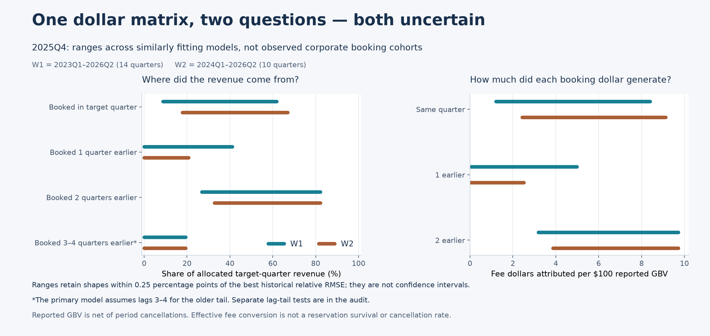
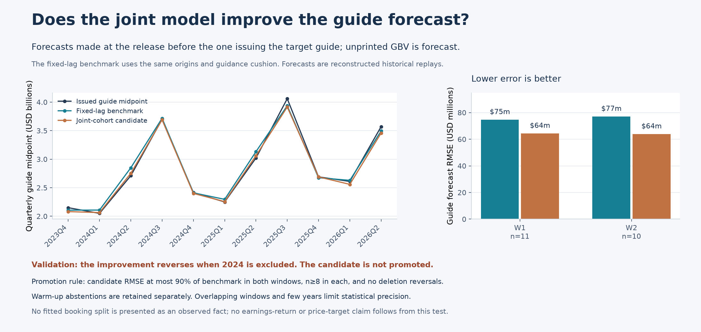

# improvement_0915_theo — joint booking composition and GBV conversion

15 September 2026 · parent consolidation · branch `codex/submission-readiness-v1`

## Decision for the pitch

**The joint model is built and audited. Precise current booking-cohort shares and physical booking conversion rates are not eligible as pitch evidence. The new forecasting challenger remains research-only.**

There are three distinct findings:

1. A directly observed current corporate booking-to-recognition cohort ledger is **unavailable** in the inspected repo and PR 60 data. Actual cohort variance therefore cannot be measured from these inputs.
2. A coherent inferred allocation can be constructed, but materially different booking compositions explain similar corporate totals. Its uncertainty fails the preregistered precision and year-deletion gates, even in the parsimonious seven-parameter model.
3. The challenger improves average historical early-origin guidance error, but the improvement reverses when 2024 is removed. Paired uncertainty includes no improvement. The tested PR 60 flight feature worsens accuracy on comparable origins.

This does not establish that actual customer cohorts fluctuate too much to be useful. It establishes that the held data do not determine their composition precisely enough, and that the candidate's apparent forecast improvement is not robust enough to promote. Keep the aggregate GBV framework and its benchmark; do not present fixed lag weights as measured reservation-cohort percentages. No current Excel forecast, pitch conclusion or price target is replaced by this package.

## What was consolidated

A quant subagent built the model and variance diagnostics, a data subagent audited actual repo/PR 60 availability, and an independent reviewer tested implementation, time cutoffs and numerical outputs. Parent coordinated registration, preservation checks, visuals and this decision.

PR 60 merge `dd3aa1440b152b46fdee8c094875d178b802d74a` is already an ancestor of worktree HEAD `2dfe0c2a1852181a246f4b6b9072e05e844d52d5`. The source audit covered 23 candidate sources (20 actual tables and three missing advertised tables), 59 sample manifests and a 1,773-entry discovery catalogue. A manifest is not counted as available raw data.

The financial panel supplies corporate reported GBV and recognized revenue. K2 supplies a stale 2016–17 Melbourne accommodation-value reconstruction for sensitivity only. Review, availability, RNPL scenario and separate booking/stay aggregate tables do not contain a matched booking/value/cancellation/fee ledger. Joining separate aggregate margins would manufacture the missing relationship.

The actual PR 60 EUROCONTROL QTD75 table provides 17 stored historical quarterly demand vintages. Stored commit dates and arithmetic reconcile; exact UTC timestamps gate feature eligibility. Its maximum stored publication lag is 16 days. Original raw blobs and daily 40-state completeness were not locally recertified. A pinned fetch attempt obtained no bytes because network access failed; its receipt is preserved in the data supplement. The subsequent flight test is qualified by this inherited source lineage.

Detailed evidence: [source audit](JOINT_COHORT_DATA_v1.md), [pinned-fetch supplement](JOINT_COHORT_DATA_PINNED_FETCH_v2.md).

## One dollar matrix, two different denominators

Let `A[b,t]` be the model's fee dollars allocated from booking quarter `b` into recognition quarter `t`.

| Question | Quantity | Interpretation |
|---|---|---|
| What portion of the target quarter's allocated revenue came from this booking quarter? | `A[b,t] / sum_b A[b,t]` | Backward revenue-composition share |
| What fraction of actual corporate revenue is attributed to this cell? | `A[b,t] / Revenue[t]` | Attribution with a separately retained model residual |
| How many fee dollars does this booking quarter contribute to that recognition quarter per reported GBV dollar? | `A[b,t] / GBV[b]` | Forward effective fee conversion |

These are dollar-based measures, not reservation-count shares. Reported GBV nets reporting-period cancellation and alteration effects; it is not an original gross-booking cohort denominator. Forward effective fee conversion cannot be called reservation survival, a cancellation rate or a causal RNPL effect. The same allocation matrix prevents accidental mixing of backward and forward percentages.

The primary model contains same-quarter bookings, lag 1, lag 2, and the average of lags 3–4. Three independent pooled exposure weights plus four same-season EWM scales give seven parameters; guidance adds one shared cushion estimate, giving eight. Separate lag-3-only and lag-3–8 tail specifications are retained. Beyond each finite support remains unobserved. A fitted zero weight does not prove the true cohort contributes zero.

The model dollar cells are in `data/processed/forecast_methods/gbv_joint_cohort_v1/quant_v1/results_v1/model_matrix.csv`; `realized_conditional_matrix.csv` rescales the same assumed shape to actual revenue for an exact accounting identity. This rescaling does not create observed cohorts. Forward rows retain left/right censoring and unknown older-tail flags.

## Variance and identification results

Retrospective W1 covers 2023Q1–2026Q2, 14 quarters; W2 covers 2024Q1–2026Q2, 10 quarters. W2 overlaps W1 and is not an independent replication.

| Prespecified diagnostic | W1 | W2 | Pass limit |
|---|---:|---:|---:|
| Largest near-fit share range across quarter/group cells | 60.84 pp | 52.25 pp | 10 pp |
| Largest 90% year-bootstrap mean-season share interval width | 75.93 pp | 97.19 pp | 10 pp |
| Largest year-deletion mean-season share shift | 26.58 pp | 50.33 pp | 5 pp |

The 200 parameter-bootstrap draws refit the model by year clusters; there are only four/three calendar-year clusters, including a partial final year. The near-fit set contains 219/103 shapes fitting within 0.25 percentage points of the minimum relative RMSE. Near-fit ranges are conditional model sensitivity, not confidence intervals or observed population dispersion.

For a concrete **2025Q4** example, W1 permits the following ranges among similarly fitting models:

| Booking quarter relative to 2025Q4 | Share of allocated Q4 revenue | Fee dollars into Q4 per $100 reported GBV of the respective booking quarter |
|---|---:|---:|
| Same quarter | 8.83–61.72% | $1.20–$8.40 |
| One earlier | 0–41.02% | $0–$4.98 |
| Two earlier | 26.91–82.17% | $3.18–$9.71 |
| Three–four earlier, finite tail | 0–19.34% | Separate booking-quarter denominators; do not sum into one cohort rate |

These marginal ranges come from the same coherent model family; their endpoints need not occur in the same model and cannot be added. W2 also permits a broad same-quarter share, 17.83–66.95%.

Holding one fitted shape fixed produces much lower apparent time variation: the W1 Q4 same-quarter share has mean 36.22%, sample SD 0.79 percentage points and variance 0.623 pp² across only three Q4s. W2 has mean 39.61% and SD 0.75 pp across two Q4s. This conditional smoothness does not validate the assumed shape; it coexists with the large identification ranges above. All seasons, both backward/forward metrics, sample counts and dollar covariance identities are preserved in the output tables.

Allocation uncertainty can offset in the total. Conditional on the same projected GBV inputs, W1 near-fit shapes span only $44.16m of 2026Q4 revenue and $43.36m of implied guidance despite a very wide cohort split. This excludes GBV-input and cushion uncertainty. The grid covariance is a sensitivity calculation without probabilities on shapes, not a predictive risk interval. It does not by itself make the total forecast reliable.



## Does the challenger improve the forecast we would trade?

For target quarter `t`, forecasts are made at the `t−2` earnings release, before the `t−1` release issues the target guide. Thus an August Q2 release is an origin for predicting the Q4 guidance to be issued in November. Both unprinted GBV quarters are forecast recursively; their eventual actual values are excluded. Same-event guidance is also excluded from training. Realized-GBV oracle results are explicitly nontradable diagnostics.

The benchmark is the fixed two-lag EWM conversion rule at **identical forecast origins**, with the **same** trailing-eight arithmetic-mean guidance cushion. This mean cushion differs from the median used in earlier GE work; the comparison does not attribute every difference from older package results to the new cohort model.

| Primary paired guide forecast test | W1 | W2 |
|---|---:|---:|
| Scored origins | 11 | 10 |
| Joint model RMSE | $64.29m | $63.83m |
| Fixed EWM lag benchmark RMSE | $74.59m | $77.01m |
| Candidate / benchmark RMSE | 0.862 | 0.829 |
| 90% paired year-bootstrap ratio interval | 0.543–1.574 | 0.604–1.125 |
| Ratio excluding 2024 | 1.064, n=7 | 1.030, n=6 |

The preregistered 10% point-improvement threshold passes, but the requirement that year/quarter deletion not reverse the advantage fails. Excluding 2024Q2 also reverses W1 (ratio 1.022). Both 2,000-draw paired intervals include 1. Three initial W1 origins fail the prespecified eight-complete-training-row warmup; they are recorded, not scored as successes. The windows contain only four/three evaluation-year clusters.

The actual PR 60 flight ablation uses one prespecified bounded slope, at least six eligible training pairs and stored UTC-vintage gating. On the **same eight eligible origins** in each window, guide RMSE is $73.50m with flights versus $69.61m for the joint model without flights; the no-flight fixed benchmark is $67.58m. Both windows contain these identical eight targets. The feature worsens the candidate and is not admitted into the live model. It never measures cohort conversion.



## Reproducibility and registration

The preregistration, timing addendum and economic contract precede model execution. Failed specifications, skipped origins and infeasible stale-K2 restrictions remain recorded. Reproduction commands and output definitions are in `analysis/src/forecast_methods/gbv_joint_cohort_v1/quant_v1/README.md`. The exact primary test command is:

```powershell
& 'C:/Users/wille/Desktop/Citadel - ABNB/.venv/Scripts/python.exe' -m unittest discover -s analysis/src/forecast_methods/gbv_joint_cohort_v1/quant_v1 -p test_quant.py -v
```

All 11 core tests pass. The complete deterministic core rebuild reproduces all 21 outputs byte-for-byte, with six input hashes unchanged; receipt: `quant_v1/validation_v1/core_rebuild_receipt.json` under the processed-data package. Independent numerical and actual-API adversarial checks pass, including poisoning future GBV/revenue/guidance inputs and verifying that historical forecasts remain unchanged. The separate oracle responds to future-GBV changes as expected. The final independent review and supplemental rebuild receipts provide the final suite inventories; check counts across suites overlap and must not be added into a fabricated count of independent tests.

The new method's 42 historical replay rows are registered in two new registry files: `gbv-joint-cohort-v1__primary-guide.csv` and `gbv-joint-cohort-v1__primary-revenue.csv`. No LIVE or sensitivity rows were registered. Both unchanged scorer implementations returned zero and agreed on 292 score rows; all 288 preexisting score rows and 122 original protected files remained unchanged. The receipt is `data/processed/forecast_methods/gbv_joint_cohort_v1/control_v1/after_v1/receipt.json`.

The frozen scorer's naive comparator lookup omits origin date/horizon. Consequently, its relative baseline scores and promotion flags are not decision evidence for this early-origin model. The paired race above is authoritative. See [harness change request](JOINT_COHORT_HARNESS_CHANGE_REQUEST_v1.md). Expected single-replay and W1-coverage warnings are retained. Exact registration, scorer and chart commands are in `control_v1/README_delivery.md`; successful registration is not model promotion.

## What to do next

The priority is a **matched booking-month × recognition-month value sample**, rather than another unconstrained fit to aggregate margins. It needs original booking timestamp and value; stay/check-in/recognition dates; modifications and cancellation/refund events; final status; a bridge to platform fees; geography/channel coverage; and observation/as-of dates. Booking IDs may be pseudonymous. Cohorts must mature before conversion is scored, with censoring handled explicitly.

For an authorized PMS or comparable reservation panel, first assess coverage, professional-manager selection and the fee mapping. Then construct observed dollar cells, reconcile gross and net definitions, and estimate within-season share/conversion variation with suitable time/property clustering. Only after that should the measured restrictions enter this joint model and be tested at the same historical guide origins against the same benchmark. RNPL attribution additionally needs relevant payment-plan exposure; booking lead time alone cannot establish its causal effect.

Until then, the pitch may describe the aggregate GBV-conversion framework and timing uncertainty. It may not claim a measured corporate cohort split, a physical cancellation/RNPL conversion rate, a statistically established incremental guidance edge or a stock-return/price target from this package. These outcomes do not require abandoning the GBV approach; they limit which mechanism claims the available evidence can support.

## RESUME

The requested joint model, repo/PR 60 data audit, variance analysis, historical guide race, flight ablation, registry and preservation checks are complete. Read the quant results and final independent review alongside this consolidation. Preserve all negative findings and the distinction between unavailable direct measurement and failed inferred precision. The next material step is obtaining a matched original-booking/value/recognition/cancellation/fee sample, validating coverage, then testing its restrictions without future information. Retain the existing live model and keep this candidate as research-only until those gates pass; do not translate its fitted weights into factual cohort percentages in Excel or the two-pager.
