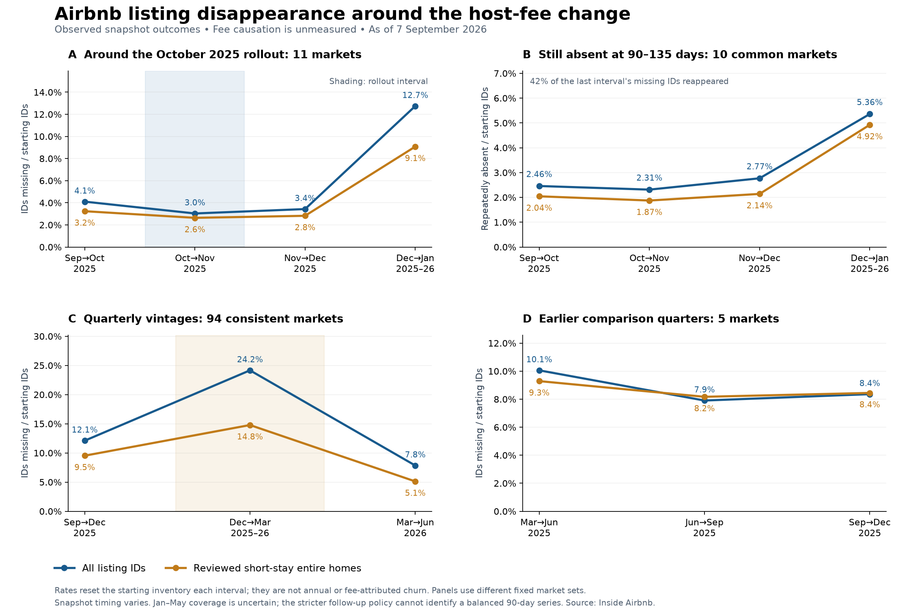

# Does Airbnb's 15.5% host fee create a churn catalyst?

**Follow-up correction:** The [new August panel and source-composition audit](2026-09-07_fee-churn-recent-followup.md)
supersede the interpretation of the January spike below. January Toronto, Vaud and
New Zealand captures have zero previous-scrape rows; 65–90% of their missing IDs
reappear by July. These captures do not validate a permanent or fee-caused exit spike.
The follow-up also verifies the May/June 2026 regional rollout and reviews recent host actions.

As of **2026-09-07**. Prepared by Codex for the team using the pinned team inventory,
newly acquired public snapshots, Airbnb disclosures and a PMS supplier's rollout notice.
Scope: churn measurement and investment materiality; no stock price target or causal fee estimate.

**Assessment: a plausible risk to monitor, but the current evidence does not establish
a significant fee-driven bearish catalyst.** The October 2025 rollout did not coincide
with an immediate disappearance spike in our monthly panel. A later January spike
is visible, including higher repeated absence, but many missing IDs reappeared and
coverage is uncertain. The broader September/October 2026 deadlines are still ahead.
This is not evidence that the fee has no effect.

The earlier **21.10% nine-month disappearance** estimate cannot answer whether fees
caused departures. The analysis below resets the at-risk cohort every interval and
holds market membership fixed within each comparison. No rate is annualized.



## The event dates are different for different hosts

| Date | Relevant population and event |
|---|---|
| August 25, 2025 | New hosts connecting to property-management/channel software default to the single fee. |
| **October 27, 2025** | Existing software-connected hosts on split fees transition; already-single-fee software hosts may face a much smaller rate adjustment. |
| December 1, 2025 | Existing non-software hosts already paying 15% single fees move to 15.5%, per the supplier notice. |
| July 2026 | Airbnb announces migration of most remaining hosts during 2026. |
| **September 15 / October 13, 2026** | Published adjustment deadlines for remaining hosts outside the EEA versus within the EEA or Switzerland; based on host residence. Early switches are possible. |

The 2025 implementation dates are from [Guesty's notice](https://help.guesty.com/hc/en-gb/articles/9362649851037-Understanding-Airbnb-service-fees-for-hosts-and-guests),
with the October API-host rollout corroborated by [Airbnb's Q4 call](https://s26.q4cdn.com/656283129/files/doc_financials/2025/q4/Airbnb-Q4-25-Earnings-Call-Transcript.pdf).
The 2026 expansion is described in [Airbnb's Q2 letter](https://www.sec.gov/Archives/edgar/data/1559720/000119312526337928/d70413dex991.htm)
and its [current host notice](https://www.airbnb.com/resources/hosting-homes/a/simplifying-service-fees-on-airbnb-771),
updated August 24. Booking confirmation date, not simply the eventual stay date,
determines the fee on new reservations. Exact treatment dates and PMS use are absent
from our listing data. Property country alone cannot identify the deadline applying
to a host who lives elsewhere.

## Broad churn over time: 94 consistent markets

| Snapshot vintages | Starting IDs | Missing IDs | Disappearance | Complete-date spacing |
|---|---:|---:|---:|---:|
| 2025-09 → 2025-12 | 1,119,381 | 135,469 | **12.10%** | 89–112 days |
| 2025-12 → 2026-03 | 1,085,386 | 262,219 | **24.16%** | 71–99 days |
| 2026-03 → 2026-06 | 925,305 | 72,614 | **7.85%** | 84–107 days |

These are rolling **listing-ID disappearance rates between snapshot vintages**.
They are not permanent property exits, annual churn or departures caused by fees.
Same-property relisting under a new Airbnb ID also counts as ID disappearance here;
no verified physical-property linkage adjustment is made to these rolling rates.
The starting pool changes as new listings arrive; market membership is constant.
The comparable subset is 94 of the earlier headline's 118 markets because every
intermediate vintage must pass the same coverage checks. The first denominator is
1,119,381 IDs. Geography remains availability-selected rather than Airbnb-representative.

For reviewed short-stay entire homes, the corresponding rates are **9.53%, 14.78%
and 5.12%**. That subset requires an entire home, minimum stay under 30 nights and
at least one review in the prior year; it is not verified currently booked supply.

**The Q1 spike is coverage-sensitive.** Repeatedly missing and returning IDs occur
across many markets. Excluding all February–May 2026 files as negative evidence
removes the middle comparisons altogether. We retain these observed counts as
diagnostics rather than presenting the 24.16% reading as confirmed economic churn.
We cannot identify which residual absences reflect capture gaps, seasonal pauses,
regulation, genuine withdrawals or fee responses.

## Closer timing around the October rollout: 11 markets

| Snapshot vintages | Starting IDs | Missing IDs | Disappearance | Complete-date spacing |
|---|---:|---:|---:|---:|
| 2025-09 → 2025-10 | 136,142 | 5,585 | **4.10%** | 20–40 days |
| 2025-10 → 2025-11 | 135,406 | 4,108 | **3.03%** | 24–49 days |
| 2025-11 → 2025-12 | 138,185 | 4,742 | **3.43%** | 17–42 days |
| 2025-12 → 2026-01 | 139,895 | 17,827 | **12.74%** | 15–36 days |

Markets: Albany, Bozeman, Brisbane, Dallas, Mid North Coast, New York City, New
Zealand, Quebec City, Toronto, Vancouver and Vaud. We selected markets with published
October and November snapshots, then required valid observations throughout
September–January and an October capture completed before October 27. Five of the
16 monthly markets fail that clean-preperiod requirement; they remain in the full
outputs. This selection uses dates and coverage, not the direction of churn.

The first fee-rollout interval falls below the preceding interval, and the following
interval is similar. The later **12.74%** reading should not be hidden or treated as
all permanent exit. Toronto contributes **6,840** missing IDs and lacks an eligible
confirmation in our fixed 90–135 day window. Vaud contributes **1,855**, of which
**1,657 (89.3%)** are reobserved by April 15; that case was independently reconciled
directly from its saved ID sets.

For the same 11 markets, June→July 2026 disappearance is **3.19%** (4,356/136,716).
Those file-completion spacings are only 8–29 days, so this is not an equal-duration
comparison with January. It precedes the broader September/October deadlines and
cannot measure their post-rollout effect.

## Does the January rise survive waiting for reappearances?

For **ten common markets**, excluding Toronto because its confirmation is missing,
we can require a usable negative capture 90–135 days after initial absence and no
intervening positive observation:

| Snapshot vintages | At-risk IDs | Still absent at confirmation | 90-day rate | Reappeared / initially missing |
|---|---:|---:|---:|---:|
| 2025-09 → 2025-10 | 114,786 | 2,822 | **2.46%** | 39.89% |
| 2025-10 → 2025-11 | 114,090 | 2,639 | **2.31%** | 16.09% |
| 2025-11 → 2025-12 | 116,717 | 3,232 | **2.77%** | 13.21% |
| 2025-12 → 2026-01 | 118,293 | 6,339 | **5.36%** | 42.30% |

The corresponding reviewed-home rates are **2.04%, 1.87%, 2.14% and 4.92%**.
Thus, a later sustained-absence increase remains in this panel: we do not dismiss
the entire January rise as a scrape artifact. But **42.3%** of the last interval's
initially missing IDs reappear by confirmation. Repeated observed absence still
does not establish permanent exit or a fee cause.

The stricter policy excluding February–May negatives yields **no common four-period
confirmation panel**. Its result is unidentified, not zero. Many follow-ups underlying
the primary persistence series are therefore subject to the known coverage concern.
January attribution needs better coverage and actual fee-exposure labels.

## Pre-change quarters and host-size diagnostics

Five team markets have earlier quarters and comparable late-2025 observations:
Chicago, Los Angeles, Paris, Rome and San Diego.

| Snapshot vintages | Starting IDs | Missing IDs | Disappearance | Complete-date spacing |
|---|---:|---:|---:|---:|
| 2025-03 → 2025-06 | 187,376 | 18,847 | **10.06%** | 95–109 days |
| 2025-06 → 2025-09 | 187,348 | 14,808 | **7.90%** | 75–98 days |
| 2025-09 → 2025-12 | 187,213 | 15,650 | **8.36%** | 99–112 days |

The fee-containing quarter is not an obvious break from these pre-change levels,
but durations, seasonality and listing composition differ. Only Paris and Rome allow
a same-season 2024 comparison: fall disappearance is **9.80% in 2024 versus 7.33% in
2025**. Two markets cannot serve as a global seasonal control.

We also split listings by the host's observed within-market portfolio. Among reviewed
homes belonging to hosts with five or more observed listings, the duration-normalized,
fixed-market-weight change across the rollout is **−1.21 percentage points** relative
to the preperiod; in the following interval it is **+0.04 points**. One-listing hosts
also show lower immediate disappearance. These are descriptive checks: neither group
identifies PMS usage, actual fees or an untreated control, and they do not form a
causal difference-in-differences estimate.

The supplemental 30-day equivalents assume constant disappearance risk over each
interval and use file-completion spacing. Long scrape windows can make that spacing
shorter than the typical listing's exposure. These sensitivities are not observed
monthly churn, and the headline tables use unnormalized counts and actual timing.
The supplied fixed-market-weight results remove changing geography weights, not
seasonality or within-market changes in listing composition.

## Why 15.5% can matter without being a 12.5-point new platform tax

The fee replaces a host-plus-guest fee structure. A host who does not reprice can
lose payout, but an offsetting price adjustment need not increase the guest's total
by the same percentage. Illustrative booking subtotal, excluding taxes:

| Example | Host-set subtotal | Guest pays | Host receives |
|---|---:|---:|---:|
| Old split fee: 3% host + illustrative 15% guest | $100.00 | $115.00 | $97.00 |
| 15.5% host fee, unchanged subtotal | $100.00 | $100.00 | $84.50 |
| 15.5% host fee, payout preserved | $114.79 | $114.79 | $97.00 |

Calculated from the example: unchanged host pricing reduces payout **12.89%**;
raising the subtotal **14.79%** preserves the old payout. This is not an observed
repricing response. For a host already on 15%, moving to 15.5% reduces unchanged-price
payout by only **0.59%**. [Airbnb fee structure](https://www.airbnb.com/help/article/1857),
[price-adjustment tool](https://www.airbnb.com/help/article/4095).

Host misunderstanding, failure to reprice, willingness to absorb fees and actual
guest-price changes could all alter retention. The 2025 professional-host response
need not predict the response of remaining individual hosts in 2026.

## What would make the effect financially material?

Use **incremental departures relative to a no-fee-change counterfactual**, weighted
by lost booking productivity. Guest demand transferred to another Airbnb listing
does not disappear from Airbnb revenue.

```text
Net booking-value loss = affected booking share × excess churn × relative productivity
                        × (1 − demand recaptured within Airbnb) × time exposure
Revenue change = (1 − net booking-value loss) × (1 + relative take-rate change) − 1
```

The following is a **scenario, not a forecast**: affected inventory supplies 50% of
counterfactual booking value; lost listings have average productivity; Airbnb
recaptures 50% of displaced demand; full-period exposure; no take-rate offset;
70% incremental contribution margin. Q2 2026 revenue of **$3,608m** and adjusted
EBITDA of **$1,261m** provide scale only, not a forward forecast.

| Extra churn in affected booking exposure | Company revenue change | Revenue at Q2 scale | Adjusted EBITDA change |
|---|---:|---:|---:|
| 2.00% | -0.50% | $-18.0m | -1.00% |
| 5.00% | -1.25% | $-45.1m | -2.50% |
| 10.00% | -2.50% | $-90.2m | -5.01% |

For example, five points of extra churn in that hypothetical affected exposure
implies **1.25% less revenue**, about **$45.1m** at Q2 scale, and **2.50% less adjusted
EBITDA** under the assumed contribution margin. Actual affected share, incremental
churn, productivity and demand recapture are not measured here. The scenario grid
also shows hypothetical take-rate offsets; it never treats the 3%→15.5% host-fee
change as 12.5 points of extra company take rate.

For this diligence exercise, a 1% revenue or 5% adjusted-EBITDA forecast change is an
analyst-chosen materiality screen. Materiality to the stock additionally requires a
surprise relative to investor expectations. We have not estimated that surprise.

Counterevidence: Airbnb reported **10% growth in nights and seats booked and 16%
GBV growth in Q2 2026**, after the first rollout. Those net results do not reveal
gross host churn, but they do not show an aggregate booking contraction either.
Management described a positive booking contribution from fee simplification in
Q4; its quantified feature uplift combined three initiatives and cannot be assigned
to fees alone. [Q2 letter](https://www.sec.gov/Archives/edgar/data/1559720/000119312526337928/d70413dex991.htm),
[Q4 call](https://s26.q4cdn.com/656283129/files/doc_financials/2025/q4/Airbnb-Q4-25-Earnings-Call-Transcript.pdf).

## Decision and next observations

Keep fee-driven churn as a **testable risk**, not a quantified bearish pitch pillar
yet. The immediate 2025 discontinuity is weak; the later rise deserves follow-up;
the wider rollout is largely ahead of this dataset. We lack exact fee cohorts,
enough clean preperiods, a validated untreated group and a reliable booking-value
bridge. No causal coefficient or statistical-significance claim is warranted.

Freeze pre-transition cohorts, record actual host fee/PMS status where observable,
and compare repeated listing and host-presence observations after the relevant
deadline. Preserve early switchers, unknown exposure and seasonal/local-policy
confounds. Do not call a host globally departed because its listings vanish from
one market. Meaningful 90-day confirmation for initial October/November absences
would arrive around January/February 2027 or later, depending on capture dates.

The thesis becomes stronger if excess repeated absence persists among verified
affected hosts, is concentrated in productive listings, and produces a booking or
forecast shortfall after allowing for substitution and fee offsets. It weakens if
hosts reprice, listings reappear and bookings remain on Airbnb.

## Reproduction and audit

- Acquisition: **203/203 selected captures**, 132 new downloads and 71 reuses;
  **24** older team snapshots extend pre-September-2025 history. All 34 overlapping
  historical team counts and six current-file hashes reconcile. Approximately
  1.02 GB of new raw data, kept ignored locally.
- The measurement joins **692 unique market/date captures** across the existing
  and new inventories. Duplicate geographic baseline IDs are removed within each
  interval; any same-month positive elsewhere prevents inferred absence.
- [Full interval rates](../../data/processed/fee_churn_history/market_interval_rates.csv),
  [headline trend tables](../../data/processed/fee_churn_history/trend_summary.csv),
  [persistence table](../../data/processed/fee_churn_history/persistence_summary.csv),
  [coverage sensitivity](../../data/processed/fee_churn_history/persistence_coverage.json),
  [snapshot quality](../../data/processed/fee_churn_history/snapshot_quality.csv),
  [paired comparisons](../../data/processed/fee_churn_history/paired_comparisons.csv),
  [scenario inputs and outputs](../../data/processed/fee_churn_history/catalyst_scenarios.csv),
  [source ledger](../sources/fee_churn_catalyst.json).
- Eleven focused tests cover censored follow-up, partial-file positives, date order,
  returns after confirmation, frozen geography weights and fee/payout arithmetic.
  Vaud's reappearance counts were independently reconciled from saved captures.
- Inside Airbnb data: [Inside Airbnb](https://insideairbnb.com/get-the-data/), CC BY 4.0.
  Source commit: `df833f5f3980078beef09c1327940bfa58d57acf`.

```powershell
.\.venv\Scripts\python.exe analysis/src/acquire_fee_churn_history.py
.\.venv\Scripts\python.exe analysis/src/measure_fee_churn_history.py
.\.venv\Scripts\python.exe analysis/src/summarize_fee_churn.py
.\.venv\Scripts\python.exe analysis/src/report_fee_churn.py
.\.venv\Scripts\python.exe -m unittest discover -s analysis/tests -p test_fee_churn_history.py -v
```

Raw captures and compact caches are required for exact replay. API histories may
change availability. The existing panel downloads described in the
[broad execution memo](2026-09-07_listing-churn-broad-panel.md) are prerequisites;
the commands above extend and analyze them. Failed acquisitions remain unknown.
Preserve the dated public
archive index and source ledger. No raw licensed vendor data, host conversations,
actual booking feed or causal treatment labels were acquired.
