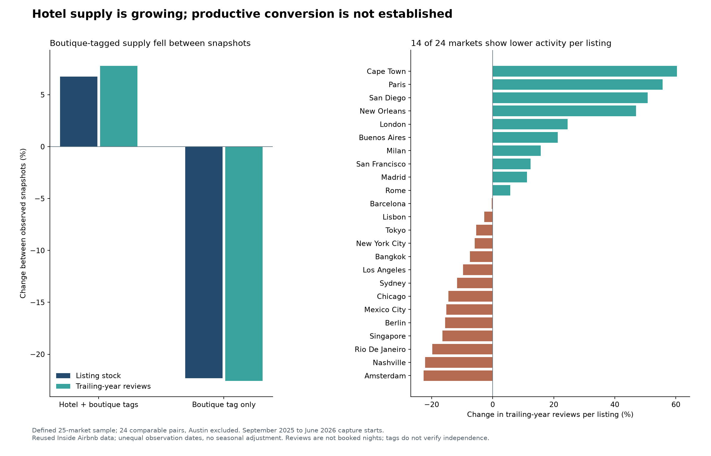

# Airbnb hotel acquisition funnel: preliminary supply and activity audit

As of September 7, 2026. Forward window: approximately September 2026–September 2027.

**Scope clarification:** the 25 cities were an analyst-selected extension of the repository's listing-churn panel, not Jessie's separate 13-market study or an agreed 25-country universe. The observed results below are hotel-tagged rows within Inside Airbnb; no physical-hotel match to external reservation records was performed. They cannot establish a demand surge caused by joining Airbnb. Read [the data explanation and corrected demand question](2026-09-07_hotel-demand-data-reset.md) first.

**Decision: measured scaling is possible; productive, profitable hotel acquisition is not yet demonstrated.** The addressable room stock is large enough that global TAM is unlikely to be the immediate constraint. Activation, room allotment, bookings per available room night, cannibalization and incentive costs determine the next year's result. The broader 25-market audit produces substantially weaker review productivity than the earlier 13-market supplement, so the smaller sample should not carry the investment conclusion.

## Scope and evidence boundary

Because the prior list could not be identified, this audit defines an explicit **25-market analytical sample across 16 countries**. It retains the original 13 markets, adds disclosed destinations Madrid and Singapore, and adds ten urban/geographic comparisons with existing history: Amsterdam, Berlin, Lisbon, Milan, San Francisco, Tokyo, Bangkok, Cape Town, Buenos Aires and Rio de Janeiro. Selection was fixed before measuring those additions' hotel outcomes. This is a judgment-selected sample, not a random world sample, a recovered prior team list or Airbnb's complete rollout universe. Selection reasons are in [the market configuration](../../analysis/config/hotel_markets_25.csv).

All 25 markets have an evidence row. **24 have comparable listing pairs; Austin's inherited partial-scope flag excludes its growth from the pool.** Rio's room-capacity denominator remains unverified; missing independence data remain missing throughout. The [combined 25-market table](../../data/processed/hotel_funnel_audit/hotel_25_market_audit.csv) joins capacity evidence, vintage, selection reason and listing outcomes without treating listings as physical rooms.

## What the earnings claim establishes

Airbnb says hotel nights are growing approximately three times as fast as home nights while remaining a single-digit share. It reports thousands of hotels in more than 20 destinations. This compares growth rates, not booking volumes. Absolute hotel nights, live rooms, hotel ADR and dedicated hotel commission are not disclosed sufficiently to reconcile an acquisition funnel. Platform Nights and Seats is not a pure lodging denominator. [Airbnb Q2 2026 shareholder letter, page 5 and footnotes](https://www.sec.gov/Archives/edgar/data/1559720/000119312526337928/d70413dex991.htm)

The reported 35% hotel-to-home return rate tracks first-time hotel guests from **July 2024–June 2025** for 365 days. That cohort predates the May 2026 expansion. It is neither a causal estimate for the new rollout nor a credit redemption rate. Eligible hotel bookings can earn up to 15% credit through December 31, 2026; credits last one year, so January 2027 is not a clean unsubsidized period. [Airbnb Q2 2026 shareholder letter, page 5 and footnotes](https://www.sec.gov/Archives/edgar/data/1559720/000119312526337928/d70413dex991.htm)

The curated boutique/independent positioning and short-stay use cases are already team evidence. Public data do not establish the new hotel's solo or business-travel mix, or how many guests would otherwise have booked an Airbnb home. [Airbnb 2026 Summer Release](https://news.airbnb.com/airbnb-2026-summer-release)

## Can growth remain measured for the next 12 months?

Let `s` be hotel share of lodging nights, `gc` home growth and `gh` hotel growth:

`Next hotel share = s × (1 + gh) / [(1 − s) × (1 + gc) + s × (1 + gh)]`.

**Sensitivity, not guidance:** assume home nights grow 10% and hotel nights grow 30% for one year.

| Starting hotel share | Ending hotel share | Combined lodging growth | Uplift vs. all nights growing at home rate |
|---:|---:|---:|---:|
| 1.0% | 1.18% | 10.2% | 0.2 pp |
| 3.0% | 3.53% | 10.6% | 0.6 pp |
| 3.5% | 4.11% | 10.7% | 0.7 pp |
| 5.0% | 5.86% | 11.0% | 1.0 pp |
| 8.0% | 9.32% | 11.6% | 1.6 pp |
| 9.0% | 10.47% | 11.8% | 1.8 pp |

A starting share below **8.59%** stays below 10% under this scenario. At a 5% starting share, hotels rise to **5.86%** and add only **1 percentage point** to combined growth versus a 10% counterfactual. At 9%, they cross 10%. Single-digit share alone therefore does not establish that scaling will remain measured. Management can pace contracting, activation and room allotments; public reporting does not prove those controls are working.

The appropriate supply balance is **booked room nights per time-weighted room night actually offered on Airbnb**. Productivity changes by `(1 + booked-night growth) / (1 + offered-room-night growth) − 1`. Nights growing 30% against offered capacity growing 20% improves productivity **8.3%**; capacity growing 50% reduces it **13.3%**. Signed hotels and endpoint listing counts miss activation timing and how much inventory each hotel allocates.

## Numerical TAM: what is established, and what is not

IHG's 2025 industry overview reports **23.7 million global hotel rooms**, **57% branded**, from STR data. The complement is approximately **10.2 million unbranded rooms** (`23.7m × 43% = 10.191m`). IHG and STR are one underlying industry estimate, not two confirmations. Unbranded is a defensible independent-supply proxy; it does not certify Airbnb-eligible boutique rooms. Independently owned franchises are branded, and soft-brand affiliations complicate the boutique distinction. [IHG Annual Report and Form 20-F 2025, industry overview pages 20-21](https://www.sec.gov/Archives/edgar/data/858446/000085844626000011/ihgarafinal.htm)

That stock represents **3.72 billion physical room nights annually**. At assumed 60–75% occupancy, it produces **2.23–2.79 billion all-channel occupied nights**. A hypothetical 1% Airbnb share is **22.3–27.9 million nights before** geographic eligibility, quality screening, contracting, activation and timing filters. These are capacity sensitivities, not a bookings or revenue forecast. No global estimate is extrapolated from our 25 cities.

Two historical city sources identify independent rooms: **New York ~38,000**, or 32% of inventory in September 2024; and **Paris ~51,040**, calculated from 55% of roughly 92,800 rooms at year-end 2023. Their approximately **89,040-room subtotal** is historical, rounded and geographically source-defined. It is not a current lower bound. [CoStar: New York City's existing supply and pipeline is flooded with independent hotels](https://www.costar.com/article/1020852869/new-york-citys-existing-supply-and-pipeline-is-flooded-with-independent-hotels); [HVS Paris Market Pulse 2024 - Going for Gold, page 2](https://hvs.com/Print/Paris-Market-Pulse-2024-Going-for-Gold?id=9930)

Buenos Aires supplies a more precise boutique category: **44 establishments and 34,348 available room nights in March 2026**, equivalent to **1,108 rooms available per day on average**. The source multiplies rooms by days open; 34,348 must not be read as physical rooms, and boutique classification does not verify brand independence or Airbnb eligibility. Cape Town documents **89 rooms/suites across three named examples**; this proves examples exist, not the city TAM. [Buenos Aires statistical institute EHOBA supply, sheet 2026](https://www.estadisticaciudad.gob.ar/eyc/wp-content/uploads/2025/12/Ehoba_1_ano.xlsx); [Cape Town CCID: small luxury hotels, July 31 2025](https://www.capetownccid.org/news/cape-towns-small-luxury-hotels-magnet-visitors)

| Market | Hotel/lodging capacity anchor | Independent or boutique evidence | Vintage | Source geography | Source |
|---|---|---|---|---|---|
| Amsterdam | 42,000 rooms | Not identified | 2023 | HVS Amsterdam hotel market | [HOTEL-AMS](https://www.hvs.com/Print/Amsterdam-Market-Pulse-2024-Full-Recovery-in-Sight?id=9917) |
| Austin | 51,000 rooms | Not identified | undated; retrieved 2026-09-07 | Visit Austin citywide destination definition | [HOTEL-AUS](https://www.austintexas.org/meeting-professionals/) |
| Bangkok | 147,379 rooms | Not identified | 2025-Q4 | Bangkok citywide tracked hotel submarkets | [HOTEL-BKK](https://assets.cushmanwakefield.com/-/media/cw/marketbeat-pdfs/2025/q4/apac-and-gc/bangkok-hotel-mb-4q2025-final.pdf?rev=a1581457d3634b5fa05e6c35ddc8aedd) |
| Barcelona | 40,166 rooms | Not identified | 2024-09 | Barcelona municipality | [HOTEL-BCN](https://tdbnews.barcelonaturisme.com/wp-content/uploads/2024/10/2409_Oferta-hotelera.pdf) |
| Berlin | 69,500 rooms | Not identified | 2023 | Berlin hotel market | [HOTEL-BER](https://www.hvs.com/Print/Berlin-Market-Pulse-2024-A-Bright-Outlook?id=9980) |
| Buenos Aires | 307 hotel-category establishments, includes apart hotels | 44 boutique hotels; 1,108 average daily available rooms | 2026-03 | Ciudad Autonoma de Buenos Aires | [HOTEL-BUE](https://www.estadisticaciudad.gob.ar/eyc/wp-content/uploads/2025/12/Ehoba_1_ano.xlsx) |
| Cape Town | Not identified | 89 rooms/suites in 3 named examples; no city census | 2025-07-31 | Cape Town CBD; named properties only | [HOTEL-CPT](https://www.capetownccid.org/news/cape-towns-small-luxury-hotels-magnet-visitors) |
| Chicago | 46,000 rooms | Not identified | undated; indexed 2026-09-07 | Central Business District | [HOTEL-CHI](https://www.choosechicago.com/meeting-planners/plan-your-chicago-meeting/chicago-meeting-ideas/one-community-approach/) |
| Lisbon | 32,000 rooms | Not identified | 2023 | Lisbon metropolitan area | [HOTEL-LIS](https://www.hvs.com/Print/Lisbon-Market-Pulse-2025-Award-Winning-City-Destination?id=10177) |
| London | 174,000 rooms | Not identified | 2025-Q1 | London; serviced accommodation | [HOTEL-LON](https://data.london.gov.uk/blog/a-snapshot-of-tourist-accommodation-in-london/) |
| Los Angeles | 98,600 rooms | Not identified | undated benchmark; page contains 2023 context | Los Angeles destination region | [HOTEL-LAX](https://www.discoverlosangeles.com/media/facts-about-la) |
| Madrid | 39,656 rooms | Not identified | 2026-07; provisional | Municipality of Madrid | [HOTEL-MAD](https://www.madrid.es/UnidadesDescentralizadas/UDCEstadistica/Nuevaweb/Turismo%20y%20eventos/Turismo/Encuesta%20Ocupaci%C3%B3n%20Hotelera/Tablas/P1110426.xlsx) |
| Mexico City | 66,000 rooms | Not identified | 2025-09 | Ciudad de Mexico | [HOTEL-MEX](https://www.turismo.cdmx.gob.mx/comunicacion/nota/ciudad-de-mexico-presente-en-fit-argentina-con-su-oferta-turistica-ante-operadores-de-60-paises) |
| Milan | 491 hotel establishments; hotel rooms unknown | Not identified | 2025-09; provisional | Municipality of Milan | [HOTEL-MIL](https://resources.salonemilano.it/doc/MilanDesignEcoSystem2025.pdf) |
| Nashville | 42,156 rooms | Not identified | page updated 2025-09-19 | Davidson County | [HOTEL-BNA](https://www.visitmusiccity.com/about/statistics) |
| New Orleans | 26,000 rooms | Not identified | undated; retrieved 2026-09-07 | Downtown only | [HOTEL-MSY](https://www.neworleans.com/hotels/) |
| New York City | Not identified | ~38,000 independent rooms | 2024-09-19 | CoStar New York City market | [HOTEL-NYC](https://www.costar.com/article/1020852869/new-york-citys-existing-supply-and-pipeline-is-flooded-with-independent-hotels) |
| Paris | 92,800 rooms | ~51,040 independent rooms | 2023 year end; report 2024-05 | HVS Paris market definition | [HOTEL-PAR](https://hvs.com/Print/Paris-Market-Pulse-2024-Going-for-Gold?id=9930) |
| Rio De Janeiro | Not identified | Not identified | undated historical bid; 2024 event title is not observation date | Rio de Janeiro; boundary unverified | [HOTEL-RIO](https://www.anpepp.org.br/images/ANPEPP/noticias/pdf/BID-RIO-DE-JANEIRO-ICP-2024.pdf) |
| Rome | 48,747 rooms | Not identified | 2024 year end | Roma Capitale | [HOTEL-ROM](https://www.romaperilclima.it/wp-content/uploads/2026/03/Strategia-di-Riqualificazione-Energetica-del-Patrimonio-Immobiliare-di-Roma-Capitale_documento_ENEA_conferenza_3marzo2026_compressed.pdf) |
| San Diego | 40,158 rooms | Not identified | tourism fact sheet with CY2025 context | City of San Diego | [HOTEL-SAN](https://www.sandiego.org/about/san-diego-tourism-fast-facts) |
| San Francisco | 35,527 rooms | Not identified | 2024 | San Francisco city and county | [HOTEL-SFO](https://www.sftravel.com/sites/default/files/2025-07/2024%20San%20Francisco%20City-County%20Lodging%20Statistics.pdf) |
| Singapore | 79,566 rooms | Not identified | 2026-04 | Singapore; HVS tracked accommodation | [HOTEL-SIN](https://www.hvs.com/Print/In-Focus-Singapore?id=10441) |
| Sydney | 24,990 rooms | Not identified | 2025-06-30 | City of Sydney local government area | [HOTEL-SYD](https://www.cityofsydney.nsw.gov.au/-/media/corporate/files/publications/research-and-reports/city-monitor-reports/visitor-accommodation-monitor-june-2025.pdf?download=true) |
| Tokyo | 212,888 rooms | Not identified | 2025-03 | Tokyo in Ministry of Health Labour and Welfare series | [HOTEL-TYO](https://links.sgx.com/1.0.0/corporate-announcements/GJH8WE7ZD5RBUP3T/880357_CDLHT-AR2025.pdf) |

**Do not sum this table into a harmonized TAM or divide Airbnb listing IDs by room counts.** Unknown independent shares are never filled with the global 43%. Chicago and Mexico City are provisional search-index leads; Rio's historical bid returned 404 and its quoted count is excluded. London, Tokyo and Singapore have broader accommodation definitions; Lisbon is metropolitan, New Orleans downtown only, Sydney the local government area. Madrid's **39,656** hotel-category rooms exclude **8,422 hostal rooms** from its 48,078 total. Milan's **74,685** all-accommodation rooms and **57,295 hotel beds** do not identify hotel rooms. Detailed qualifiers are retained in [capacity anchors](../../data/processed/hotel_funnel_audit/hotel_market_capacity_anchors.csv).

The evidence establishes a large global unbranded-room pool, two city independent-room estimates and selected boutique-specific observations. **It does not establish a fully measured, current boutique/independent TAM across all 25 cities.** A defensible complete census requires property IDs, licensed room counts and brand/soft-brand affiliation matched within the same boundary and date; estimates should not conceal that missing join.

## Are additions producing activity?

The primary analysis reuses **50 existing team captures**, two per market, with September 2025 and June 2026 capture starts. Every stored SHA-256 and expected row count reconciled. Completion dates range from 2025-09-01–2025-10-08 at baseline and 2026-06-22–2026-07-07 at the endpoint. These unequal intervals are **not annual growth rates or seasonally adjusted comparisons**. The endpoint is only around five to seven weeks after the May 20 rollout; this is mainly evidence about existing hotel-tagged supply, not a clean evaluation of the new product.



| 24-market pooled measure | Hotel + boutique tags | Boutique tag only |
|---|---:|---:|
| Listing IDs, starting → ending | 19,788 → 21,124 | 4,462 → 3,467 |
| Listing growth | +6.8% | -22.3% |
| Trailing-year review growth | +7.8% | -22.6% |
| Trailing-year reviews per listing | +1.0% | -0.4% |
| Prior-30-day reviews per listing | -21.1% | -18.2% |
| Trailing-year reviews, same retained IDs | +18.2% | -3.9% |
| Prior-30-day reviews, same retained IDs | -22.5% | -32.0% |

The hotel-tagged pool barely improved annual review activity per listing, while recent activity declined. **14 of 24 markets** have lower annual reviews per listing; **11 combine that decline with higher listing stock**. The broader definition that also admits room type "Hotel room" gives **+1.3%**, similar to the strict pool. It includes serviced apartments/B&Bs and does not solve independence measurement.

Listing flows reconcile exactly: `19,788 + 6,604 new-to-panel IDs + 344 reclassifications in − 5,377 absent IDs − 235 reclassifications out = 21,124`. No duplicate hotel IDs occurred across eligible markets at either endpoint. IDs are neither distinct physical hotels nor individual rooms; absence is not confirmed hotel churn.

Of 6,604 newly observed hotel IDs, **2,602 (39.4%)** have a trailing-year review, and **1,289 (19.5%)** have a prior-30-day review. They account for **29.2% of endpoint 30-day reviews** and **31.3% of listings**. **459 already had first reviews before baseline**, so "newly observed" cannot mean "newly recruited." Only **257 (3.9%)** are boutique-tagged.

Some additions clearly have guest activity, but this cannot establish the percentage with bookings, net nights per room or incremental Airbnb demand. Missing reviews do not prove zero bookings. Shorter stays and review propensity can change reviews per night; trailing-year windows overlap and contain pre-observation activity. Retained-ID results also have survivor bias. The **95 retained IDs with declining lifetime reviews** are flagged instead of silently converting those revisions to negative bookings.

Missing review fields remain unknown: a total, growth rate or reviews-per-listing measure is blank if any required count is missing. Observed subtotals and missing-listing counts are exported separately. These rules also apply to pooled markets and retained IDs. Actual reported zeros remain zero. This dated narrative requires complete review inputs and stops before publishing if that condition changes.

At the endpoint, **94.3%** have a minimum stay of at most two nights. This supports short-stay availability, not actual solo/business-trip mix. Legacy tags also do not establish coverage of Airbnb's dedicated hotel offering. The boutique-tag contraction is a taxonomy/cohort warning, not a refutation of reported corporate hotel growth.

| Market | Observations completed | Hotel IDs | Supply change | Annual review change | Reviews per listing change | Pool status |
|---|---|---:|---:|---:|---:|---|
| Amsterdam | 2025-09-11 → 2026-06-24 | 427 → 461 | +8.0% | -16.5% | -22.6% | Included |
| Austin | 2025-09-17 → 2026-07-02 | 260 → 581 | +123.5% | +32.4% | -40.8% | Excluded: partial scope |
| Bangkok | 2025-09-28 → 2026-07-02 | 2,471 → 3,001 | +21.4% | +12.5% | -7.4% | Included |
| Barcelona | 2025-09-15 → 2026-07-03 | 678 → 602 | -11.2% | -11.5% | -0.3% | Included |
| Berlin | 2025-09-24 → 2026-07-03 | 501 → 508 | +1.4% | -14.4% | -15.6% | Included |
| Buenos Aires | 2025-09-28 → 2026-07-02 | 170 → 401 | +135.9% | +186.1% | +21.3% | Included |
| Cape Town | 2025-09-29 → 2026-07-03 | 433 → 312 | -27.9% | +15.5% | +60.4% | Included |
| Chicago | 2025-09-24 → 2026-07-03 | 335 → 374 | +11.6% | -4.6% | -14.5% | Included |
| Lisbon | 2025-10-08 → 2026-07-03 | 515 → 469 | -8.9% | -11.4% | -2.7% | Included |
| London | 2025-09-18 → 2026-07-01 | 1,374 → 1,477 | +7.5% | +33.9% | +24.5% | Included |
| Los Angeles | 2025-09-03 → 2026-06-23 | 1,252 → 1,441 | +15.1% | +3.9% | -9.7% | Included |
| Madrid | 2025-09-15 → 2026-07-02 | 420 → 495 | +17.9% | +31.1% | +11.3% | Included |
| Mexico City | 2025-09-28 → 2026-07-06 | 847 → 1,061 | +25.3% | +6.2% | -15.2% | Included |
| Milan | 2025-09-24 → 2026-07-03 | 203 → 239 | +17.7% | +36.2% | +15.7% | Included |
| Nashville | 2025-09-24 → 2026-07-03 | 379 → 421 | +11.1% | -13.5% | -22.1% | Included |
| New Orleans | 2025-09-11 → 2026-06-25 | 500 → 793 | +58.6% | +133.1% | +47.0% | Included |
| New York City | 2025-09-03 → 2026-06-23 | 1,726 → 1,901 | +10.1% | +3.6% | -5.9% | Included |
| Paris | 2025-09-15 → 2026-06-29 | 2,494 → 1,856 | -25.6% | +15.9% | +55.7% | Included |
| Rio De Janeiro | 2025-09-28 → 2026-07-01 | 468 → 609 | +30.1% | +4.4% | -19.8% | Included |
| Rome | 2025-09-15 → 2026-07-07 | 646 → 686 | +6.2% | +12.3% | +5.8% | Included |
| San Diego | 2025-09-25 → 2026-07-02 | 586 → 574 | -2.0% | +47.7% | +50.7% | Included |
| San Francisco | 2025-09-01 → 2026-06-22 | 1,216 → 1,111 | -8.6% | +2.7% | +12.4% | Included |
| Singapore | 2025-09-28 → 2026-07-02 | 637 → 582 | -8.6% | -23.6% | -16.4% | Included |
| Sydney | 2025-09-12 → 2026-06-29 | 242 → 310 | +28.1% | +13.2% | -11.6% | Included |
| Tokyo | 2025-09-30 → 2026-07-03 | 1,268 → 1,440 | +13.6% | +7.5% | -5.4% | Included |

The original 13-market panel, extending to late August/early September 2026, remains a **separate sensitivity**: 12 eligible markets, hotel listings **+21.9%**, annual reviews per listing **+28.7%** and boutique listings **-29.9%**. Different dates and market composition explain why its stronger aggregate cannot be pooled with, or treated as an acceleration from, the 25-market results. Both views reuse the same source and overlap in captures; neither independently validates 3× booked-night growth.

## What must sign-ups convert into?

`Airbnb nights = signed properties × rooms/property × activation × average fraction of year live × 365 × physical hotel occupancy × Airbnb share of occupied room nights`.

Alternatively use Airbnb-allocated available room nights and occupancy of that allocation. **Do not apply the same inventory restriction twice.** A channel-manager connection supports distribution, but does not establish activation, allocation or conversion rates. [SiteMinder Airbnb channel manager](https://www.siteminder.com/channel-manager/airbnb-hotels/)

Illustrative assumptions: **50 rooms/property; 80% activation; half-year average live time; 70% all-channel occupancy; $140 ADR; 11% commission**. ADR and commission reuse WS11's estimates solely for comparability; all inputs remain analyst sensitivities.

| Airbnb share of hotel's occupied nights | First-year Airbnb nights per signed property | Sign-ups for 1m nights | Sign-ups for $100m gross hotel revenue |
|---:|---:|---:|---:|
| 2% | 102 | 9,785 | 63,537 |
| 5% | 255 | 3,914 | 25,415 |
| 10% | 511 | 1,957 | 12,707 |
| 20% | 1,022 | 978 | 6,354 |

At 10% channel share, **2,000 sign-ups yield about 1.02 million first-year nights and $15.7 million gross hotel revenue**. This is how thousands of additions can coexist with measured financial impact. Reaching $100m under the same inputs requires approximately **12,707 signed properties**, substantially more than a "thousands of hotels" headline by itself demonstrates.

A booking diverted from another OTA or direct can generate Airbnb commission without increasing the operator's total occupancy. Airbnb incrementality instead requires subtracting displaced home contribution, existing hotel baseline business and migrations/relistings; add home cross-sell only above an appropriate counterfactual. **Do not add a second hotel overlay to the team's WS11 model.** Use these equations to test its existing room, night and revenue assumptions.

## Incentives and unit economics

`Credit cost / hotel GBV = eligible GBV share × awarded rate × redemption rate × Airbnb funding share`.

At assumed **11% commission**, **3% variable cost/GBV**, full eligibility/funding and a **15% award redeemed 50%** of the time, contribution is **0.5% of hotel GBV** before fixed acquisition/support costs and incremental home contribution. At full redemption it is **−7.0%**; break-even redemption is **53.3%**. Caps and partial eligibility reduce costs. These are economic sensitivities, not observed take rates, redemption or GAAP margins. The standard host fee page does not establish negotiated dedicated-hotel commission. [Airbnb Help: service fees](https://www.airbnb.com/help/article/1857)

Separate issued credits, expected redemption, actual cash/economic cost and accounting recognition. Raw hotel-to-home repeat rates cannot substitute for causal acquisition uplift. Follow credit and repeat-booking cohorts through 2027.

## Four-quarter operating decision rules

| Stage | Required measure | Test for productive, measured scaling |
|---|---|---|
| Eligible → signed | Licensed property IDs, rooms, affiliation, existing Airbnb/HotelTonight relationship | Exclude duplicate room-type listings and migrations from new acquisition |
| Signed → live | Activation within 90 days; days to first bookable inventory; offered room nights | Actual activation/timing supports the model's assumptions |
| Live → booked | Net room nights per time-weighted offered room night; cancellation rate; time to first booking; zero-booking cohort | If nights grow 30%, keep offered capacity growth at or below 30% to preserve aggregate productivity; compare matched cohorts too |
| Booked → retained | 180-day property survival and room allotment | Inventory remains bookable after initial promotional support |
| Booked → profit | Fees less credits, payments, service, CAC and displaced home contribution | Positive incremental contribution and payback under a stated horizon |
| Hotel → home | New guest cohorts, with matched or randomized untreated comparison | Incremental home contribution above the counterfactual |

For STR regulation, match neighborhoods, dates, prices and party sizes of constrained homes to **actually offered hotel inventory**. One hotel room is not one multi-bedroom home. Future regulatory deadlines are not automatically near-term transfers. Reuse the team's event register; this audit adds no unsupported regulatory revenue overlay. This makes hotels a plausible gap-filler while leaving the amount of recoverable demand unproven.

## Overlap controls and reproducibility

The frozen review covers **67 GitHub main files at commit df833f5**, local research and text/tabular ZIP entries: **411 document instances, 377 unique hashes, 34 duplicate instances**. Normalized URLs screen source reuse; semantic review handles repeated claims under different links. Zero exact matches is not proof that no teammate has encountered a source.

| Prior work | Treatment |
|---|---|
| Jessie/Jessica accommodation-choice study, Hawaii surveys, NTTO and Eurostat | Existing context; no duplicate visitor survey or hotel-versus-STR study |
| Hotel loyalty/news and revenue-model ZIP drops | Copies hashed; repeated documents count once as evidence |
| WS06 hotel-to-home/customer choice work | Existing management and survey claims acknowledged; cohort interpretation is added analysis |
| WS11 hotel revenue scenarios | Existing ADR/take-rate assumptions reused and labeled; no second revenue overlay |
| Theo/team Inside Airbnb captures and churn work | Existing raw files reused; only hotel-specific classification/cohort transformation is new |
| Global/city room evidence and activation/credit calculations | Added sources or analysis, with exact-match screening and measurement gaps preserved |

Across both panels there are **76 capture references but only 64 unique input hashes**, with **12 captures shared between panels**. No new Inside Airbnb downloads were made. The panels are never added together or called independent corroboration. New city rows similarly remain distinct from the global estimate rather than being added to it.

The review cannot certify private/unshared work or every branch. This is an explicit deduplication boundary, not a promise of zero overlap with everything anyone has found. Reviewable files: [team manifest](../../data/processed/hotel_funnel_audit/team_review_manifest.csv), [source overlap](../../data/processed/hotel_funnel_audit/public_source_overlap.csv), [31-source ledger](../sources/hotel_funnel_audit.json), [unique capture register](../../data/processed/hotel_funnel_audit/unique_reused_captures.csv) and [input assumptions](../../analysis/config/hotel_funnel_audit.json).

Reproduce using the existing local raw captures:

```powershell
.\.venv\Scripts\python.exe analysis/src/audit_hotel_funnel.py --panel archive25
.\.venv\Scripts\python.exe analysis/src/audit_hotel_funnel.py --panel historical13
.\.venv\Scripts\python.exe analysis/src/model_hotel_funnel.py
.\.venv\Scripts\python.exe analysis/src/audit_hotel_overlap.py --sources-only
.\.venv\Scripts\python.exe analysis/src/verify_hotel_capacity.py
.\.venv\Scripts\python.exe analysis/src/report_hotel_funnel.py
.\.venv\Scripts\python.exe -m unittest discover -s analysis/tests -p 'test_hotel*.py' -v
```

`audit_hotel_overlap.py` without the flag refreshes the GitHub/local evidence review. Public spreadsheet/PDF verification files remain under ignored raw storage; CSVs preserve the relevant extracted inputs and source URLs. Tests cover classification, stock-flow reconciliation, revised/missing reviews, exact scope matching, room-night units, invalid rates, zero activation, timing and credit economics. No output claims observed hotel booked nights or a fully verified 25-city boutique census.
