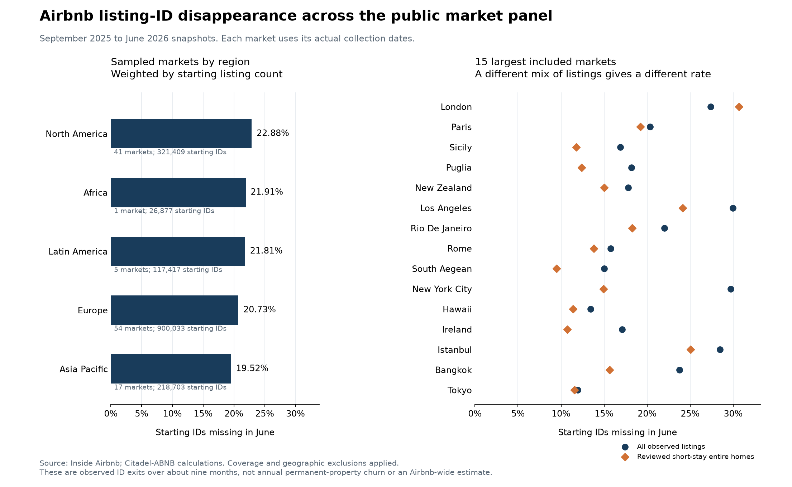

# Airbnb listing churn: broad panel execution

Prepared 2026-09-07. This report supersedes the two-market pilot as the headline churn analysis.

**334,331 of 1,584,439 starting listing IDs were absent at the June 2026 observations: 21.10%.** The measured panel includes **118 markets across 35 country labels**, using September 2025 baselines. Actual observation intervals are **268–295 days**. This is an observed listing-ID disappearance rate over about nine months. It is not an annualized or Airbnb-wide permanent-property churn estimate.

For the baseline subset of entire homes with minimum stay below 30 nights and at least one review in the prior year, disappearance is **16.65%** (131,602/790,417). This subset is a proxy for commercially used short-stay inventory; the reviews do not verify current bookings or revenue.

The disappearing IDs account for **13.48% of the cohort's prior-year reviews**, versus 21.10% of its IDs. Exiting listings therefore had less historical review activity on average. Reviews are not revenue or booked nights, so this is not an estimated revenue loss.

Repeated absence for at least 90 days is **8.22%–12.76% on the same 115-market denominator of 1,543,303 IDs**, depending on whether March 2026 can supply negative evidence. This is coverage sensitivity, not a confidence interval. All positive observations remain valid in both methods.



## What was executed

1. Reacquired and verified all **132 historical listing snapshots across the team's 13 markets**, using immutable source commit [`df833f5`](https://github.com/Kaenyne/Citadel-ABNB/tree/df833f5f3980078beef09c1327940bfa58d57acf). All 132 row counts match the team's catalog.
2. Located the public archive metadata linked to [Inside Airbnb's data page](https://insideairbnb.com/get-the-data/). Selected the last indexed September, December, March and June observations, requiring both September 2025 and June 2026. The index has 123 markets; 120 have these endpoints. No dates or markets were selected to produce a desired churn rate.
3. Acquired **478 broad-panel files**. 50 match a historical team count; 62 match both the team's current-file count and SHA-256. Other files are newly acquired public history, with structural validation and stored hashes, rather than previously held team history.
4. Applied the inherited partial-coverage flags and a large-count-break diagnostic: a file below half the largest selected count for its market cannot supply negative evidence. A flagged baseline or endpoint excludes the market's rate from pooling. These screens cannot certify that an unflagged file is complete.
5. Removed nested geographic files when at least 90% of their baseline IDs overlap a larger file. Removed remaining cross-market duplicate baseline IDs. Presence anywhere in the acquired panel during a selected snapshot month prevents that ID being counted as absent for that month.

Nested geography exclusions: Dublin within Ireland. Remaining overlapping IDs excluded: **3**. **49** IDs missing from their own endpoint file were retained because another geography observed the same ID that month.

The headline pool is total missing IDs divided by total starting IDs. An equal-market average is reported separately as a weighting sensitivity. Rates are not annualized and no Airbnb-wide population weights are inferred from this availability-selected sample.

## Geographic breadth and weighting

| Region | Markets | Starting IDs | Missing IDs | Observed disappearance |
|---|---:|---:|---:|---:|
| North America | 41 | 321,409 | 73,552 | 22.88% |
| Latin America | 5 | 117,417 | 25,614 | 21.81% |
| Asia Pacific | 17 | 218,703 | 42,697 | 19.52% |
| Africa | 1 | 26,877 | 5,888 | 21.91% |
| Europe | 54 | 900,033 | 186,580 | 20.73% |

The equal-market average is **20.53%**, compared with the listing-weighted **21.10%**. Dropping one market at a time produces **20.69%–21.27%**. The largest market contributes 6.11% of starting IDs. These checks describe concentration; they do not repair selection bias or establish global representativeness.

Country labels and geography definitions follow the source. Markets include cities, regions and several country-wide files. Individual country results can still rest on one market. [Country counts and rates](../../data/processed/listing_churn_archive/country_rates.csv) make that explicit.

## Disappearance versus sustained absence

A listing enters the fixed cohort when observed in September. It is an endpoint disappearance if its ID is absent from every acquired June file. It qualifies for 90-day terminal absence only after at least two usable negative observations span 90 actual days, with no observed return from the first negative month onward. Unknown or failed captures cannot create negative evidence. Quarterly observations can miss pauses and returns between captures.

| Measure | Eligible markets | Starting IDs | Event IDs | Rate |
|---|---:|---:|---:|---:|
| June endpoint ID disappearance | 118 | 1,584,439 | 334,331 | 21.10% |
| 90-day repeated absence, coverage screen | 116 | 1,547,945 | 197,470 | 12.76% |
| 90-day repeated absence, March negatives excluded | 115 | 1,543,303 | 126,835 | 8.22% |
| Coverage screen, common eligible markets | 115 | 1,543,303 | 196,932 | 12.76% |
| March negatives excluded, common eligible markets | 115 | 1,543,303 | 126,835 | 8.22% |

The common-market rows isolate the effect of the negative-evidence rule. A market without a usable early negative opportunity has an unidentified persistence rate, even if the endpoint comparison is usable. The zero event count in such an output is never pooled as evidence of zero churn.

## The team's longer historical panel

The team's separate September-to-late-summer panel gives **26.86%** ID disappearance (107,791/401,273, 12 markets, 323–352 actual days). Austin's starting file is flagged and excluded. Persistent 90-day absence is **9.49%–11.72%**, measured on 10 eligible markets and 364,779 starting IDs. Mexico City and Nashville lack enough usable follow-up for this persistence measure.

This longer panel and the broad September-to-June panel have different endpoints and geographic composition. Their raw rates should not be presented as a time-series change in churn.

## Where listings went

The broad endpoint comparison found **4,672 possible continuations under another Airbnb ID across 58 markets**. Each requires a unique exact full permit field, matching room type and bedroom count, location within 300 metres, and a candidate ID not seen anywhere in the starting panel. These are unvalidated property-link candidates, not proven identities. They are reported separately and are not silently removed from the headline ID-disappearance rate.

The externally traced destination evidence remains the 20-case random San Diego pilot, selected from 208 persistent-absence cases with usable unique permits. It is too small and geographically narrow to estimate population destination shares:

| Observed evidence | Cases | What it establishes |
|---|---:|---|
| MLS-reported sale | 1 | A sale was reported after disappearance; post-sale use and causal connection are unknown. |
| MLS-reported residential rental | 1 | A residential tenancy was reported; lease duration is not established. |
| Other destinations unresolved | 18 | Includes one matched other-platform catalog entry and three additional leads. Current operation and newly occurring migration are unverified. |

The sale case has a reported July 30, 2026 transaction in the [sale listing](https://www.redfin.com/CA/San-Diego/3540-Quimby-St-92106/home/5346170). The residential rental case has a February 3, 2026 rented event in the [rental history](https://www.rereader.com/rentals/2307-Meade-Ave-San-Diego-CA-92116-427221294). Exact match evidence, timing and caveats are recorded in the [destination evidence ledger](../../data/processed/listing_churn_execution/destination_review.csv). The sale is not independently deed-verified. A later event does not establish why the Airbnb listing disappeared.

**The existing data do not identify the percentage sold, moved to Vrbo/Booking, converted to residential rental, or paused.** More Airbnb snapshots improve the disappearance estimate; they do not supply the missing cross-platform identities, transaction histories, or booking evidence. An existing competitor listing can be prior cross-listing. An active STR permit does not prove current rental operation. Unknown destinations remain unknown.

The [platform-history follow-up](2026-09-07_listing-platform-history.md) adds independent before/after archive checks for four pilot leads, supported pre-existing direct advertising, a current photo match and a conflicting Vrbo permit. It preserves unknown operating states and does not estimate migration shares.

The [fee-catalyst time-series study](2026-09-07_fee-churn-catalyst.md) measures rolling disappearance before and after the October 2025 software-host fee rollout. It adds earlier history, monthly observations and repeated-absence checks; the headline nine-month rate here is not a fee-attributed churn estimate.

## Exclusions

| Market | Reason |
|---|---|
| Bogotá | No September 2025 baseline and June 2026 endpoint |
| Nairobi | No September 2025 baseline and June 2026 endpoint |
| São Paulo | No September 2025 baseline and June 2026 endpoint |
| Austin | Baseline or endpoint flagged by team or below 50% of maximum selected snapshot count |
| Dublin | At least 90% of baseline IDs overlap the larger ireland file |

## Largest included markets

| Market | Starting IDs | Missing IDs | Disappearance | 90-day absence, March negatives excluded |
|---|---:|---:|---:|---:|
| London | 96,870 | 26,501 | 27.36% | 10.51% |
| Paris | 81,853 | 16,637 | 20.33% | 6.82% |
| Sicily | 57,531 | 9,726 | 16.91% | 8.77% |
| Puglia | 48,553 | 8,834 | 18.19% | 9.06% |
| New Zealand | 47,097 | 8,376 | 17.78% | 6.02% |
| Los Angeles | 45,886 | 13,743 | 29.95% | 10.08% |
| Rio De Janeiro | 43,068 | 9,483 | 22.02% | 8.29% |
| Rome | 37,652 | 5,933 | 15.76% | 5.88% |
| South Aegean | 37,139 | 5,573 | 15.01% | 7.06% |
| New York City | 36,178 | 10,755 | 29.73% | 4.93% |
| Hawaii | 33,457 | 4,491 | 13.42% | 5.79% |
| Ireland | 32,665 | 5,588 | 17.11% | 5.08% |
| Istanbul | 30,051 | 8,551 | 28.45% | 7.21% |
| Bangkok | 28,806 | 6,848 | 23.77% | 6.48% |
| Tokyo | 27,945 | 3,334 | 11.93% | 4.60% |
| Crete | 27,582 | 4,016 | 14.56% | 6.78% |
| Mexico City | 27,051 | 5,439 | 20.11% | Not identified |
| Buenos Aires | 26,945 | 5,537 | 20.55% | 9.60% |
| Cape Town | 26,877 | 5,888 | 21.91% | 12.53% |
| Lisbon | 25,449 | 4,874 | 19.15% | 6.40% |

## Audit and reproduction

- [All broad market rates](../../data/processed/listing_churn_archive/market_rates.csv), [pooled rates](../../data/processed/listing_churn_archive/pooled_rates.csv), [coverage decisions](../../data/processed/listing_churn_archive/market_coverage.csv), [snapshot quality and hashes](../../data/processed/listing_churn_archive/snapshot_quality.csv), [geographic overlaps](../../data/processed/listing_churn_archive/geographic_overlap.csv), [execution metadata](../../data/processed/listing_churn_archive/execution_metadata.json).
- [Longer team panel rates](../../data/processed/listing_churn_panel/market_rates.csv) and [team panel pooled results](../../data/processed/listing_churn_panel/pooled_rates.csv).
- Raw downloaded listing files, compact extracts and granular candidate-ID mappings remain under gitignored `data/raw/`. Public outputs contain market aggregates and evidence references.

From the repository root in PowerShell, with Git available on PATH:

```powershell
.\.venv\Scripts\python.exe analysis/src/acquire_churn_panel.py --source-rev df833f5f3980078beef09c1327940bfa58d57acf
.\.venv\Scripts\python.exe analysis/src/measure_churn_panel.py
.\.venv\Scripts\python.exe analysis/src/acquire_churn_archive.py --metadata data/manifests/inside_airbnb_archive_index_2026-09-07.json
.\.venv\Scripts\python.exe analysis/src/measure_churn_archive.py
.\.venv\Scripts\python.exe analysis/src/report_listing_churn.py
.\.venv\Scripts\python.exe -m unittest discover -s analysis/tests -v
```

The archive metadata is a captured public input, hashed in execution metadata. If the public site changes its archive index, capture a new dated input and review the selection before rerunning. Download errors are recorded without automatic retries. An incomplete history is excluded, never treated as a delisted cohort.

Inside Airbnb data are attributed to [Inside Airbnb](https://insideairbnb.com/get-the-data/) and licensed CC BY 4.0. Geography, source coverage, listing-versus-property identity, seasonal exposure and unobserved destinations remain material limits. No global permanent churn estimate or destination split is asserted.
