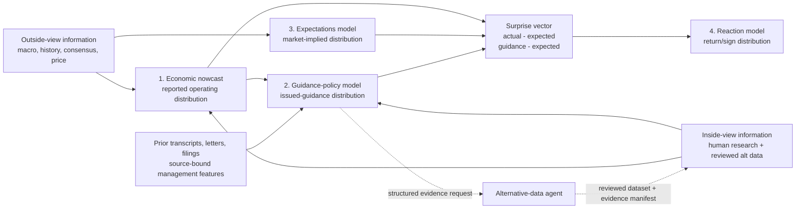

# ABNB Agentic Forecasting System Design

Date: 2026-09-03

Status: Approved by user on 2026-09-03

Initial runtime: `gpt-5.6-sol`, `xhigh` reasoning

## 1. Purpose

Create a permanent project-scoped agent named `abnb_forecasting` that produces
auditable, point-in-time forecasts for Airbnb (NASDAQ: ABNB). Its primary job is
to translate macro conditions and reviewed company evidence into a forecast of
what management will guide. It also preserves the interfaces needed to connect
that forecast to reported results, market expectations, and the post-earnings
stock reaction.

The system is not a single opaque price predictor. It is a chain of four
separate forecasting problems with separately scored outputs:

1. **Economic nowcast:** what operating results will Airbnb report?
2. **Guidance-policy model:** what will management guide, conditional on the
   operating state and information management can observe?
3. **Expectations model:** what result and guidance are embedded in
   point-in-time consensus, bank research, and the pre-event price?
4. **Reaction model:** how might the stock respond to the differences between
   results, guidance, and expectations?

The first implementation milestone foregrounds problem 2. Problems 1 and 3
provide its inputs; problem 4 consumes its output. No model training begins as
part of this design document.

## 2. Decisions Already Made

- The initial agent uses `gpt-5.6-sol` at `xhigh` reasoning in a
  `workspace-write` sandbox.
- The agent is a systematic macro-to-operating-to-guidance forecaster, not a
  replacement for a local Qwen model.
- Fable may later challenge or replace SOL only through a frozen-packet
  comparison. Runtime changes require a versioned decision; no silent model
  substitution is allowed.
- The first MVP-recorded weight is `agentic_weight = 1.0` and
  `local_llm_weight = 0.0`. This records that the local model is absent; it is
  not an empirical claim that zero is optimal.
- A future local LLM will be a separately frozen transcript/report specialist.
  It will initially perform extraction, classification, retrieval, and
  controlled text-feature generation—not unconstrained historical forecasting.
- The forecasting agent can request research from the separate alternative-data
  agent. It cannot scrape on its own and cannot consume that agent's scratch
  work.
- User-provided inputs are first-class inputs, but every factual input still
  needs source, timestamp, entitlement, and confidence metadata. Analyst
  judgment remains labeled as judgment.
- Bloomberg is an approved potential data environment, but every extraction
  still begins with a precise ticket and user approval. Licensed raw reports and
  terminal exports remain outside Git; approved derived rows and evidence
  manifests may be tracked.
- The primary reaction window is the last regular-session close before the
  release to the first regular-session close after the release. After-hours and
  two-trading-day abnormal returns are sensitivity outcomes.

## 3. Information Architecture: Outside View and Inside View

The user-facing research process has two evidence buckets. The term “inside”
means differentiated, lawful research—not material non-public information.

### Outside view

The outside view contains information available to ordinary market
participants and is used to establish base rates and the public timeline:

- prior Airbnb reported results and issued guidance;
- official macro releases and genuine historical vintages;
- exchange rates, inflation, consumer conditions, travel and capacity data;
- seasonality, event calendars, and known reporting lags;
- point-in-time Bloomberg consensus and estimate dispersion;
- timestamped sell-side expectations extracted from entitled bank reports;
- pre-event prices, options-implied moves, and benchmark returns.

### Inside view

The inside view contains differentiated but lawful company-specific evidence:

- human research supplied with evidence and an as-of timestamp;
- datasets approved by the alternative-data agent;
- reviewed evidence manifests and derived features from those datasets;
- structured historical management behavior extracted from prior calls,
  letters, and filings;
- explicit causal hypotheses tying macro and operating signals to Airbnb.

Inside-view evidence does not receive an automatic premium. It must beat the
outside-view baseline out of sample. No signal enters a forecast merely because
it is novel or difficult to obtain.

## 4. Four-Model Forecasting Chain



The arrows do not collapse the models into one objective. Each node writes a
versioned forecast before the next node may consume it. That preserves the
ability to discover whether an error came from the economic view, management
policy, expectations, or market-reaction mapping.

## 5. Model Contract

### 5.1 Forecast unit

One forecast is identified by `forecast_id` and represents one target event at
one immutable information cutoff. Updating a forecast creates a new version and
never overwrites the prior packet.

Every forecast packet must state:

- ticker, fiscal period, target event, and target release timestamp when known;
- `as_of_utc`, generation timestamp, run mode, model, reasoning effort, prompt
  version, code revision, and dataset-manifest versions;
- exact eligible evidence IDs and rejected evidence IDs with rejection reasons;
- outside-view estimate, inside-view adjustments, and combined agentic estimate;
- target distributions, baselines, scenarios, uncertainty, sensitivities, and
  unresolved evidence gaps;
- a machine-readable result plus a short human review memo.

### 5.2 Run modes

- `FORECAST`: create and freeze a new pre-event forecast packet.
- `UPDATE`: create a new version after newly available information, with a
  bridge from the prior version and no rewriting of history.
- `RESOLVE`: attach actual reported results, issued guidance, consensus
  surprises, and market outcomes after they become available.
- `AUDIT`: reproduce evidence eligibility, calculations, and provenance without
  changing the forecast.

### 5.3 Agent workflow

For every `FORECAST` or `UPDATE`, the agent must follow this order:

1. **Open the event clock.** Establish the target event, strict `as_of_utc`,
   market calendar, and which documents/data vintages could legally have been
   known.
2. **Build the outside-view baseline.** Produce seasonal-naive,
   prior-guidance/prior-error, consensus where applicable, and simple time-series
   forecasts before reviewing differentiated signals.
3. **Nowcast the operating state.** Bridge macro and reviewed operating data to
   revenue, nights and experiences booked, gross booking value, take rate, and
   margins when comparable.
4. **Apply management policy.** Estimate how management historically converts
   its observable operating state into formal guidance, including conservatism,
   range width, prior forecast error, seasonality, and regime changes.
5. **Compare with expectations.** Keep forecast and consensus separate, then
   calculate numeric surprises using the point-in-time consensus vintage.
6. **Assess evidence gaps.** If a missing signal could change the decision,
   issue an `AlternativeDataRequest`. Do not scrape, fabricate a value, or wait
   indefinitely; either continue with explicit missingness or stop if the target
   is not estimable.
7. **Generate scenarios and intervals.** Produce downside/base/upside narratives
   tied to numeric assumptions, plus P10/P50/P90 outputs.
8. **Freeze the packet.** Record all inputs, exclusions, prompt/model versions,
   assumptions, and calculations before the outcome is known.

### 5.4 Required agent behavior

The eventual custom-agent prompt must require the agent to:

- forecast distributions rather than false-precision point values;
- distinguish sourced facts, computed features, model outputs, analyst inputs,
  and assumptions;
- cite evidence IDs and stable document locations for every material claim;
- expose the macro bridge, operating bridge, and management-policy adjustment;
- state what evidence would falsify each material causal claim;
- run baselines first and never present in-sample correlation as forecast skill;
- refuse features with missing, ambiguous, equal-to-cutoff, or post-cutoff
  availability;
- preserve negative results and forecast revisions;
- create a structured data request when useful alternative data is missing;
- keep licensed raw content and credentials out of tracked artifacts;
- never delegate work unless the user explicitly requests delegation.

### 5.5 Control plane and quantitative plane

SOL is the research control plane. It establishes the forecast question,
interrogates the evidence, proposes causal bridges, requests missing research,
constructs scenarios, and explains disagreements. A small deterministic Python
layer is the quantitative plane. It validates timestamps and schemas, selects
eligible rows, computes baselines and transformations, fits registered models,
calculates scores and intervals, and writes immutable artifacts.

The agent may call those routines and interpret their outputs, but it cannot
replace a failed calculation with mental arithmetic or an unsupported number.
Every number in the final packet is either a cited input, a reproducible
quantitative-plane result, or an explicitly labeled agentic judgment. The
agentic forecast starts from the strongest available numeric baseline and logs
each signed adjustment; it is never an unexplained number generated from prose.

### 5.6 Operator prompt contract

The normal invocation is deliberately compact because the durable rules live in
the versioned custom-agent configuration:

```text
Run abnb_forecasting in {FORECAST|UPDATE|RESOLVE|AUDIT} mode.
Target event: {event name and fiscal period}.
Information cutoff: {offset-aware timestamp}.
Decision question: {guidance metric, horizon, and optional reaction question}.
Approved input manifests: {manifest IDs or none}.
Approved consensus/Bloomberg packet: {packet ID or none}.
Human inputs: {human-input IDs or none}.
Parent forecast: {forecast ID for UPDATE/RESOLVE, otherwise none}.

Produce the required machine-readable packet and review memo. Apply strict
point-in-time eligibility, run the simple baselines first, show the macro,
operating, and management-policy bridges, and issue an AlternativeDataRequest
for any decision-relevant gap. Stop rather than infer an unavailable target,
timestamp, source, or value.
```

`FORECAST` requires a target event, cutoff, and decision question. `UPDATE`
additionally requires a parent forecast and an evidence-change reason.
`RESOLVE` requires the frozen forecast ID plus reviewed outcome evidence.
`AUDIT` requires only a forecast ID and must not add evidence or revise outputs.

## 6. Target Registry

Targets are long-form rows, not hard-coded wide columns. Each row requires a
stable target ID, metric definition, reference period, unit, currency basis,
source evidence, availability timestamp, comparability flag, and target version.

| Model | Primary target | Supporting targets | Output form |
|---|---|---|---|
| Economic nowcast | Reported quarterly revenue and YoY growth | Nights and Experiences Booked, GBV, take rate, adjusted EBITDA and margin when comparable | P10/P50/P90 and directional probabilities |
| Guidance policy | Next-quarter revenue guidance low, high, midpoint, and implied YoY growth | Formal adjusted EBITDA or margin outlook when explicitly comparable; otherwise a cited categorical direction | Endpoint and midpoint distributions; range-width distribution; raise/maintain/lower probabilities |
| Expectations | Point-in-time consensus for the same reported and guided metrics | Dispersion, revision momentum, broker-level estimates, options-implied move, price trend | Consensus distribution and market-implied thresholds |
| Reaction | Primary close-to-close ABNB return and abnormal return | After-hours and two-day abnormal returns | Probability of positive/negative reaction plus return quantiles |

`raise`, `maintain`, and `lower` must always name their comparator. For the MVP,
the comparator is the latest eligible point-in-time consensus midpoint for the
same metric and period. If that series is unavailable, the categorical output
is omitted rather than silently compared with prior guidance.

Qualitative guidance is never converted into an invented number. Metrics whose
definitions changed are separate target versions unless a documented,
reproducible bridge makes them comparable.

## 7. Data Interfaces

All timestamps use offset-aware ISO 8601 and are normalized to UTC in machine
artifacts. Empty or unverified timestamps are ineligible, not assumed.

### 7.1 `ForecastRun`

Required fields:

```text
forecast_id, forecast_version, ticker, issuing_fiscal_period, target_event,
target_event_at_utc, as_of_utc, generated_at_utc, run_mode, status,
agent_model, reasoning_effort, prompt_version, code_revision,
input_manifest_ids, parent_forecast_id, analyst_owner, notes
```

`as_of_utc` must be strictly earlier than the outcome's earliest verified
availability. `target_event_at_utc` may be null for a prospective event whose
time is not announced, but the forecast must still have a fixed `as_of_utc`.

### 7.2 `FeatureObservation`

Required fields:

```text
feature_id, feature_definition_version, source_id, evidence_id, evidence_bucket,
metric, value, value_type, unit, currency, geography, reference_start,
reference_end, observed_at_utc, first_available_at_utc, vintage_at_utc,
collected_at_utc, revision_status, availability_status, review_status,
license_class, transformation_id, missing_reason
```

Eligibility requires `availability_status = verified`,
`review_status = approved`, and `first_available_at_utc < as_of_utc`. A later
collection time is acceptable only when the row is reconstructed from a
defensible historical vintage whose release evidence is preserved.

### 7.3 `EvidenceManifest`

Every dataset entering the inside view must arrive with:

```text
manifest_id, dataset_id, dataset_version, producer, reviewer, review_status,
created_at_utc, coverage_start, coverage_end, release_lag_rule,
vintage_method, schema_version, row_count, content_checksum,
license_class, permitted_uses, source_registry_ids, evidence_locations,
known_limitations
```

Only `review_status = approved_for_forecasting` is consumable. Drafts, notebooks,
chat summaries, and unreviewed scratch tables are not valid interfaces.

### 7.4 `HumanInput`

Human input uses the following interface so it can be accepted without blurring
fact and judgment:

```text
human_input_id, submitted_at_utc, valid_as_of_utc, input_type,
claim_or_metric, value, unit, source_evidence, entitlement_status,
confidence, analyst_name, review_status, notes
```

`input_type` is one of `sourced_fact`, `analyst_estimate`, `scenario_assumption`,
or `decision_constraint`. An analyst estimate can influence a scenario or model
combination, but it is never relabeled as observed data.

### 7.5 `ConsensusObservation` and bank-report expectations

Point-in-time expectations require:

```text
expectation_id, security_id, provider, broker_id, report_id, report_published_at_utc,
estimate_snapshot_at_utc, target_period, metric, estimate_value, unit, currency,
estimate_basis, contributor_count, dispersion, source_location,
extraction_method, extractor_version, review_status, entitlement_status
```

For Bloomberg, the agent first writes an extraction ticket specifying security
identifiers, verified field definitions, date range, as-of/vintage method,
frequency, currency, units, calendars, workbook layout, null convention, and
entitlement handling. Field mnemonics must be confirmed in the user's Terminal
rather than guessed by the agent.

Bank reports form a timestamped panel of broker expectations, not a generic text
corpus. A report published after the forecast cutoff is excluded. Raw licensed
reports stay outside Git; derived estimates retain report ID, publication time,
page/section location, extraction version, and reviewer status.

### 7.6 `TextFeatureObservation`

Text from prior shareholder letters, filings, transcripts, and eligible
within-quarter documents may produce controlled features:

```text
text_feature_id, document_id, document_type, document_published_at_utc,
source_location, schema_version, extractor_model, extractor_prompt_version,
label, value, confidence, reviewed_by, review_status, created_at_utc
```

The same-quarter shareholder letter or transcript is not eligible to predict
guidance that it already states. Historical replays use only documents published
strictly before the simulated cutoff. Text features must be source-bound and
predeclared; free-form model memory is not a historical data source.

### 7.7 `AlternativeDataRequest`

When the forecast identifies a material evidence gap, it writes:

```text
request_id, requested_at_utc, forecast_id, evidence_gap, target,
proposed_proxy, economic_mechanism, expected_sign, required_lag,
geography, required_history, needed_by_utc, minimum_coverage, decision_use
```

The alternative-data agent returns a feasibility decision plus, when approved,
an `EvidenceManifest`. Valid decision statuses are:

```text
FEASIBLE, FEASIBLE_WITH_LIMITATIONS, REQUIRES_APPROVAL, NOT_FEASIBLE,
NOT_POINT_IN_TIME_VALID, LOW_EXPECTED_VALUE
```

### 7.8 `ForecastOutput`

Each predicted target records:

```text
forecast_id, target_id, model_stage, model_specification_id, baseline_id,
p10, p50, p90, probability_up, probability_flat, probability_down,
outside_view_p50, inside_view_adjustment, management_policy_adjustment,
consensus_value, surprise_p50, interval_method, training_end_at_utc,
effective_sample_size, evidence_ids, sensitivity_ids, warnings
```

Fields that do not apply remain null. Probabilities must state the event and
threshold they refer to.

## 8. Model Specifications and Baselines

Every stage starts with the simplest valid specification.

### Economic nowcast

1. Same fiscal quarter one year earlier, adjusted by the most recently available
   YoY growth rate.
2. Prior-quarter or seasonal-naive forecast.
3. Consensus for reported metrics, scored as an expectations baseline rather
   than proprietary model skill.
4. One- to three-factor linear or regularized regression with prespecified macro
   and reviewed operating features.
5. SARIMAX only when the target history, seasonal structure, and exogenous
   release timing support it.

### Guidance-policy model

1. Seasonal-naive guidance for the same guided fiscal quarter.
2. Prior comparable guidance midpoint and range width.
3. A mechanical policy baseline: operating nowcast plus rolling historical
   management guidance error, fitted only on past events.
4. Simple regression from operating-state variables, prior guidance error, and
   seasonality to issued guidance.
5. SARIMAX or another challenger only after the above are frozen and scored.

### Expectations model

1. Latest eligible consensus snapshot.
2. Equal-weight broker estimates from entitled timestamped reports.
3. Recency-weighted estimates and revision momentum, with the decay fixed in the
   training window.
4. A statistical expectations model only if it improves calibration of the
   market-implied distribution out of sample.

### Reaction model

1. Historical unconditional sign and return distribution.
2. A simple linear/logistic model using standardized reported and guidance
   surprises.
3. Add estimate dispersion, implied move, and regime controls one at a time.
4. No nonlinear machine-learning model on ABNB-only quarters in the MVP.

The reaction surprise vector must preserve reported surprise and guidance
surprise separately. A single “beat/miss” label discards economically important
information.

## 9. Agentic and Local-LLM Weights

The two forecasters remain independent until both outputs are frozen:

```text
combined_forecast = agentic_weight * agentic_forecast
                  + local_llm_weight * local_llm_forecast

agentic_weight >= 0
local_llm_weight >= 0
agentic_weight + local_llm_weight = 1
```

The MVP records only the SOL agentic forecast. When a local Qwen forecast exists,
the first comparison is equal-weight and diagnostic; production weights are
estimated only inside nested expanding-window validation using a proper scoring
rule. Weight estimation cannot use the untouched test events.

The local model receives an identical timestamped evidence packet and returns
the same target schema. It may not see the SOL forecast before freezing its own
output. Disagreement is retained as information and sent to human review; it is
not automatically averaged away.

## 10. Leakage and Validation Protocol

### 10.1 Event-time eligibility

For every value, distinguish:

- reference period;
- observation time;
- first public or entitled availability time;
- vintage or revision time;
- local collection time;
- simulated prediction cutoff;
- target availability time.

A feature is eligible only when its defensible historical availability is
strictly before the forecast cutoff. Equality is excluded. Missing or
unverified availability blocks that row. Latest-revised history cannot stand in
for a historical vintage.

Special leakage tests must reject:

- same-call guidance used to predict itself;
- same-quarter letters or filings that disclose the target;
- post-earnings bank reports in a pre-earnings expectations packet;
- latest Bloomberg consensus substituted for a historical consensus snapshot;
- transformations, imputation, feature selection, or text-label thresholds fit
  outside the training fold;
- target-derived feature names, labels, summaries, or document excerpts;
- historical forecasts justified by an LLM's untraceable parametric memory.

### 10.2 Walk-forward design

Only comparable events with verified outcome and feature timestamps enter the
event table. The default protocol is:

1. sort eligible events chronologically;
2. reserve the final four eligible events as an untouched test set before any
   model selection;
3. use an expanding development window with a minimum of eight training events;
4. generate exactly one forecast per event per specification;
5. fit all transformations and parameters inside each fold;
6. select one specification using development folds only;
7. open the four test events once, report every result, and make no further
   changes under the same experiment version.

If fewer than 16 comparable events remain after point-in-time filtering, the
system may run baselines and prospective shadow forecasts but must not claim a
validated multivariable edge. The exact four test events are recorded in a
sealed manifest before fitting.

### 10.3 Metrics

Continuous targets report MAE, RMSE, median absolute error, fold-level errors,
and improvement relative to the strongest simple baseline. Probabilistic
outputs report interval coverage, interval width, weighted interval score, and
calibration. Directional outputs report Brier score, log loss where probabilities
are bounded away from zero, and hit rate with the class balance shown.

Reaction returns report raw and abnormal outcomes. The benchmark used to define
abnormal return must be frozen before evaluation; alternative benchmarks appear
only as sensitivities.

### 10.4 Uncertainty, instability, and sensitivity

Intervals use only pre-cutoff residuals. Because the quarterly sample is small,
the system reports both empirical expanding-window residual intervals and a
parametric/bootstrap sensitivity where defensible. It never describes a nominal
90% interval as calibrated without observed coverage evidence.

Every regression report includes coefficient paths by fold, sign changes,
scaling, effective sample size, collinearity diagnostics, and sensitivity to:

- reasonable release-lag assumptions;
- excluding COVID/reopening events;
- alternative but prespecified seasonal definitions;
- removing each event one at a time;
- winsorization or no winsorization fitted inside folds;
- raw versus abnormal reaction returns.

Explanatory correlations appear in a section labeled `EXPLANATORY`. Forecast
scores appear separately under `PREDICTIVE`. Statistical significance or an
intuitive narrative is not accepted as predictive evidence.

## 11. Minimum Viable Experiment

The MVP tests the agent contract and one narrow guidance forecast; it does not
train Qwen and does not search a large model space.

### Phase A: deterministic contract tests

- validate the `gpt-5.6-sol`/`xhigh` agent configuration and required prompt
  clauses;
- validate the forecast, feature, evidence, human-input, alt-data-request, and
  output schemas;
- reject equal/post-cutoff features, unverified timestamps, unreviewed manifests,
  and same-event guidance leakage using synthetic fixtures;
- prove that an update creates a new immutable version;
- prove that restricted Bloomberg/report/transcript raw paths are not staged.

### Phase B: one in-session forecast rehearsal

Run `FORECAST` on a deliberately small packet for one selected ABNB event:

1. establish an explicit `as_of_utc`;
2. load prior comparable guidance and reported-history rows;
3. load only reviewed macro/alt-data observations available before the cutoff;
4. accept any user-supplied Bloomberg or bank-report expectations through the
   typed human/consensus interfaces;
5. produce seasonal-naive and mechanical management-policy baselines;
6. produce a SOL agentic P10/P50/P90 guidance forecast and evidence bridge;
7. create an `AlternativeDataRequest` if a material operating signal is absent;
8. freeze the forecast packet and run `AUDIT` to reproduce its eligibility.

If real target rows remain unavailable or their timestamps remain unverified,
Phase B is labeled a **workflow rehearsal**, not a historical backtest. Synthetic
values may test software behavior but are never research evidence.

### Phase C: first falsifiable historical experiment

After authoritative event/guidance timestamps and point-in-time expectations are
loaded, test one preregistered question:

> Does a simple macro-and-operating guidance-policy model improve next-quarter
> revenue-guidance midpoint MAE over the strongest seasonal/prior-guidance
> baseline in expanding-window forecasts?

The initial challenger set is limited to one simple regression and one SARIMAX
specification. Text features are excluded from this first comparison so the
numeric evidence chain is established before testing incremental text value.

### Phase D: controlled text ablation

Freeze the best numeric baseline, then add one small, predeclared set of
source-bound management-policy features from documents available before each
cutoff—for example explicit demand direction, management conservatism class,
and range-width language. The only relevant result is the paired out-of-sample
increment over the frozen numeric model.

## 12. Promotion Criteria

These are proposed hurdles, not guarantees of economic value.

### SARIMAX

Promote SARIMAX only when:

- at least 16 comparable point-in-time events and eight development forecasts
  survive filtering;
- seasonal/autocorrelation structure is visible in training data and residual
  diagnostics do not show an obvious unmodeled pattern;
- exogenous regressors have defensible historical releases;
- development MAE improves at least 10% versus the strongest simple baseline,
  improvement occurs in at least 60% of folds, and no single event contributes
  more than half of the aggregate gain;
- the conclusion survives the declared lag and leave-one-event sensitivities;
- the untouched test result is reported regardless of outcome.

### General machine learning

Do not promote nonlinear ML on the ABNB-only quarterly sample. Reconsider only
after a comparable cross-company panel or substantially longer prospective
history exists. The panel must have harmonized target definitions, timestamped
consensus, issuer-held-out evaluation, and enough events that model complexity
is small relative to independent issuer-events. ML must beat the strongest
linear/time-series baseline on a proper out-of-sample score, remain calibrated,
and add value across issuers rather than through Airbnb identity leakage.

### Local LLM or text features

Use a local LLM operationally only after a document-level held-out extraction
benchmark shows reliable numbers, directions, units, periods, publication
times, and citations, with every material numeric extraction reviewable against
source. Use it as a forecasting component only if its separately frozen
probabilities improve the agentic model's proper score under nested walk-forward
validation and the gain survives document-family and time-period ablations.

Fine-tuning is not justified by the ABNB quarter count alone. It becomes a
candidate only after a versioned, legally usable labeled corpus is large and
diverse enough for issuer- and time-held-out evaluation, and prompting or fixed
feature extraction has demonstrably plateaued. A lower training loss is not a
promotion criterion.

### Fable versus SOL

Fable receives the identical frozen packet, schema, cutoff, and scoring rule.
It replaces SOL only if it improves prospective or untouched out-of-sample
forecast quality, preserves citation and leakage compliance, and does not rely
on information unavailable to SOL at the cutoff. Qualitative preference is
reported but does not determine the production runtime.

## 13. Cross-Company Guidance and Return Research

Other-company history may eventually help the expectations and reaction models,
but it does not enter the MVP. A panel expansion requires a separate approval
because it changes the estimand.

The defensible design would use comparable travel, marketplace, and internet
platform issuers; normalize each surprise by the issuer's point-in-time
consensus dispersion or historical error; preserve issuer-specific guidance
definitions; and hold out entire issuers as well as future time periods. A
hierarchical/partial-pooling linear model is the first challenger. The panel
must not assume that a one-percent revenue-guidance surprise has the same meaning
across business models or accounting definitions.

## 14. Human Review Gates

The agent stops for user review before:

- approving or changing the target registry;
- changing the forecast cutoff or opening an untouched test set;
- accepting a Bloomberg extraction ticket or a new licensed report source;
- adding a materially new alternative-data family;
- promoting any source from reviewed research into a production feature set;
- increasing complexity beyond the registered baseline, simple regression, and
  SARIMAX challengers;
- adding a local LLM forecast or estimating the two model weights;
- introducing a cross-company panel;
- changing the primary return window or abnormal-return benchmark;
- replacing SOL with Fable;
- labeling any model as production-ready.

## 15. Decisions Requested from the User

Approval of this specification will confirm the following proposed defaults:

1. Agent name `abnb_forecasting`, SOL at `xhigh`, with Fable only as a later
   frozen challenger.
2. Guidance-policy forecasting as the MVP center, with next-quarter revenue
   guidance midpoint/range as the first numeric target.
3. The four-stage chain and the outside-view/inside-view definitions above.
4. Last four eligible events as the untouched test and the minimum sample rules.
5. The 10%/60%/single-event promotion hurdles for complex numeric models.
6. The primary reaction window already discussed, with the abnormal-return
   benchmark still to be selected before reaction testing.
7. One in-session workflow rehearsal immediately after implementation, followed
   by historical modeling only after timing-valid targets exist.
8. No Qwen training, learned model weights, cross-company pooling, or broad text
   feature search in the MVP.

The user will still make the substantive selections of macro variables,
inside-view datasets, management-policy features, sensitivity regimes, and any
future model-complexity increase before those choices are tested.
